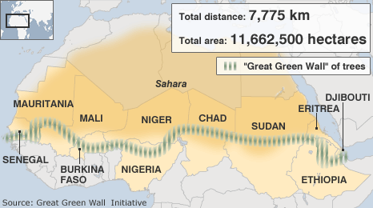
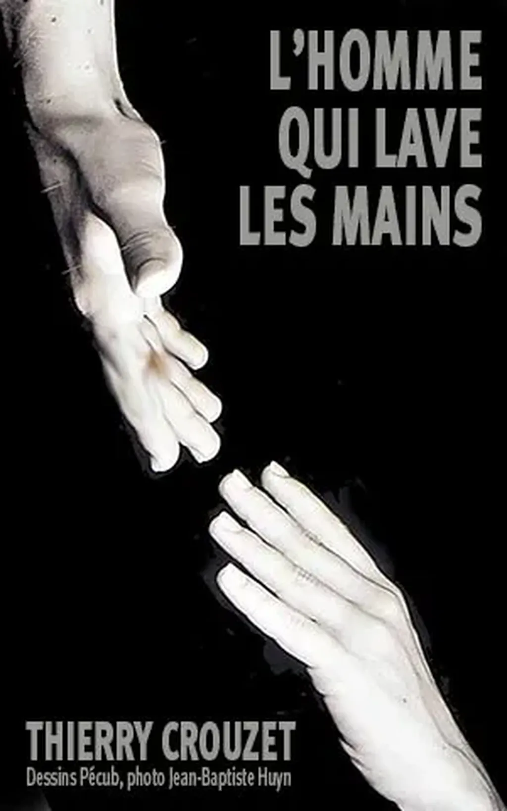

# Un simple geste et vous ?

J’aime depuis longtemps la célèbre phrase de Gandhi : « Soyez le changement que vous voulez voir dans le monde. » Pour réussir une telle prouesse à grande échelle, et non seulement dans son jardin, encore faut-il que le changement dépende de quelque chose de suffisamment simple, d’accessible, d’économique… pour que quiconque puisse agir.

Gandhi nous a offert la non-violence. Dans sa nouvelle [*L’homme qui plantait des arbres*](../../2010/7/le-petit-livre-de-la-revolution.md), Giono nous a proposé de planter des arbres pour altérer le climat. La fiction devient depuis réalité avec [The Great Green Wall](http://en.wikipedia.org/wiki/Great_Green_Wall) ou avec [Allan Savory qui crée des pièges à carbone naturel](http://permaculturenews.org/2013/05/17/allan-savory-reversing-global-warming-while-meeting-human-needs-videos/).

Dans tous les cas, point de technologie complexe. Sinon nous ne pouvons pas agir. La seule technologie nécessaire est la communication : témoigner, former, raconter…

Avec *[L’homme qui lave les mains](../../page/homme-qui-lave-les-mains)*, je raconte un nouveau geste qui changera le monde bien au-delà du cadre hospitalier. C’est ma théorie, une idée défendue dans ce récit qui sera libéré sous licence Creative Commons-BY-SA au début de l’automne.

Le geste doit être simple.

Le geste doit être libre de droits.

Le geste doit être gratuit.

Le geste doit être versé dans la communauté.

Le geste doit être la propriété de tous.

Sinon il ne se passera rien.

Les technologies propriétaires, les œuvres propriétaires, les idées propriétaires ne changent pas le monde, elles en renforcent le modèle établi.

Internet change le monde, mais tous les sites propriétaires, toutes les applications propriétaires qui fructifient sur lui enraillent le changement. Ils nous empêchent de nous donner la main ou, pire, nous laissent croire que nous avons encore cette opportunité.

Je ne doute pas de notre capacité subversive, mais l’environnement propriétaire a le don de brimer la subversivité.

#giono #lhomme_qui_lave_les_mains #le_geste_qui_sauve #politique #dialogue #y2013 #2013-8-2-16h31
