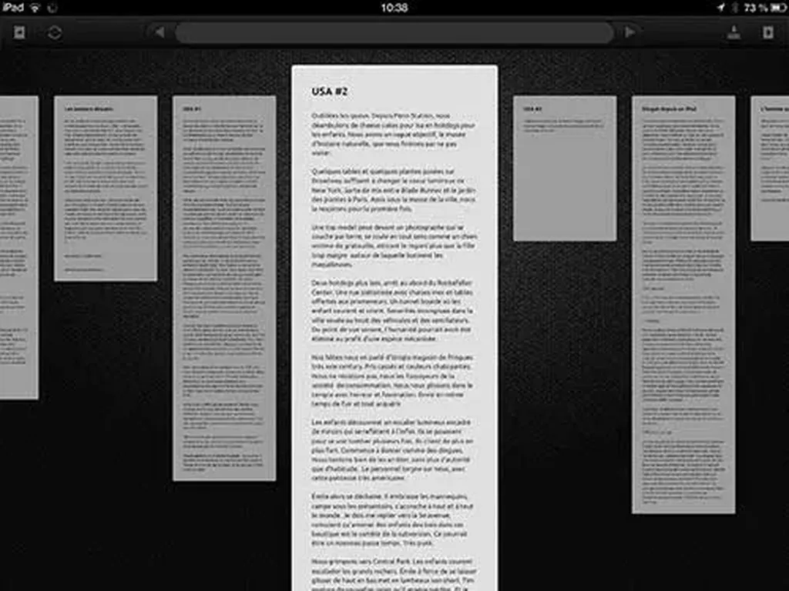
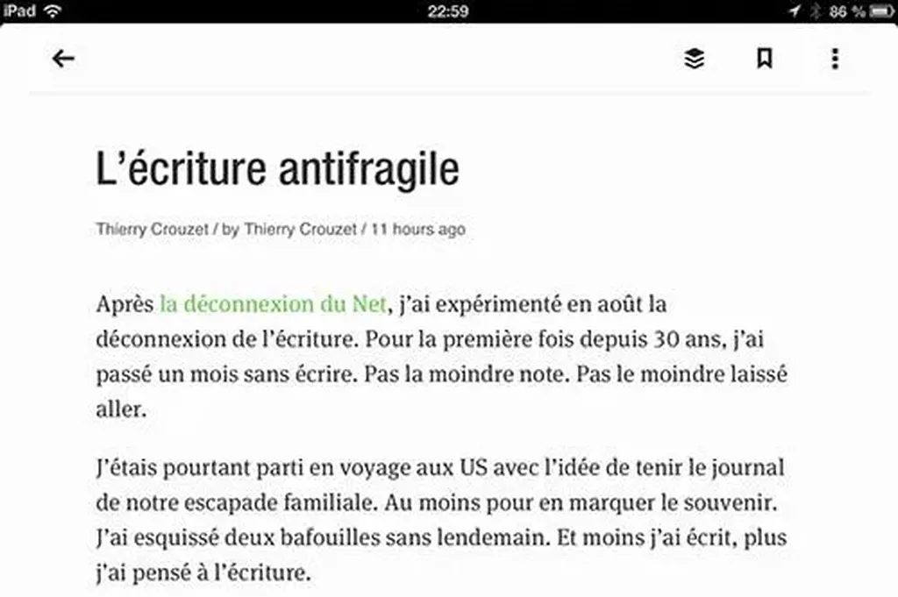
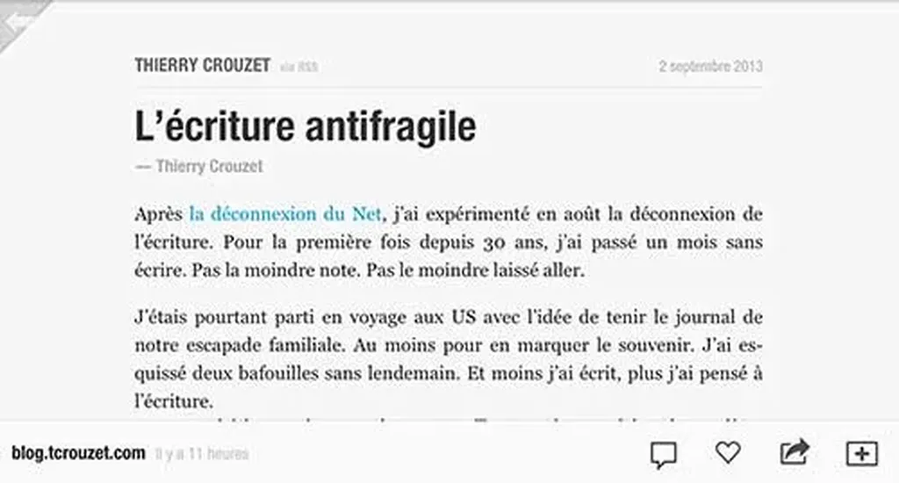
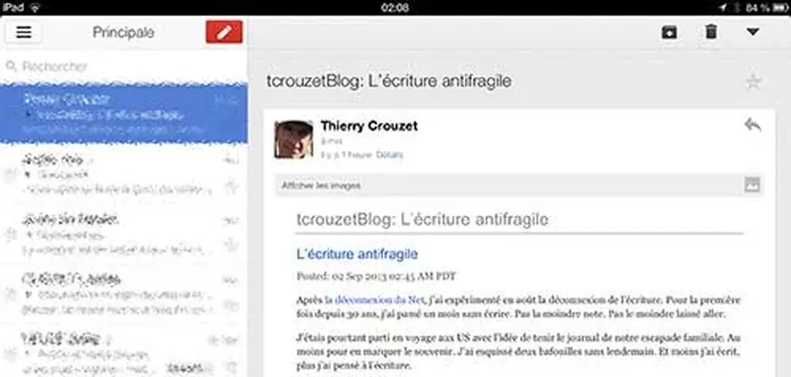
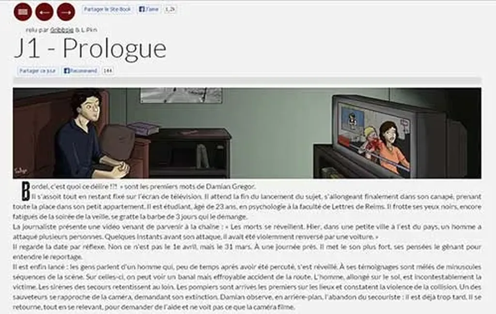

# Après le blog

Ne vous attendez pas à une révélation. Je mets mes idées en place au grand jour. Je cherche à comprendre ce qui dans la forme blog me limite aujourd’hui, et même me lasse.

Un blog : c’est un carnet antichronologique. Tel on le découvre en tout cas. Il est écrit chronologiquement au fil des jours mais présenté avec l’entrée la plus récente en avant, ce qui présuppose qu’elle se suffit à elle-même.

Ce présupposé pèse sur le blogueur. Ce syndrome de l’iceberg le pousse à écrire dans une certaine direction, qu’il le veuille ou non. J’ai souvent répété que la plupart de mes billets se suivaient comme les épisodes d’un feuilleton, rien n’y faisait, les lecteurs critiquaient un billet indépendamment du tout, ce qui est quelque peu problématique quand on développe une réflexion un peu longuette… ou une histoire, ou tout autre chapelet de petites perles.

La faute n’en revient pas au lecteur, mais à la forme, à ses conventions, à ce postulat qu’un jour efface l’autre. Ce qui dans un livre n’a aucun sens.

Au commencement, on avait des sites personnels. Avec leur arborescence. Les choses rangées à leur place, mais souvent introuvables. Le blog a introduit une gigantesque simplification, mais au prix de la notion de série, de feuilleton, de livre… une simplification contre laquelle se bat depuis longtemps François Bon avec [sa page d’accueil en forme de sommaire](http://www.tierslivre.net/).

J’ai jusqu’ici combattu l’antichronologie du blog en créant des ePub. Cette approche peut convenir pour synthétiser un travail achevé, mais elle ne convient pas pour le Work in Progress. Il faut donc repenser le blog, y greffer de nouvelles fonctions.

### La timeline

Je tiens à la journalisation. Au fil RSS qui dit ce qui vient d’être publié. Mais j’ai envie de lui ajouter les commentaires, ces injections de l’extérieur. Aussi des notes qui racontent le travail. Exemple : tel billet ancien a été remanié, telle page a été ajoutée à la structure… C’est un peu ce que nous offrent les réseaux sociaux. Le synopsis d’une vie et de ses interactions. Mon site vit aussi, il doit avoir sa timeline, mais la timeline n’est pas l’œuvre, juste son sismographe. Depuis trop longtemps la forme blog nous pousse à confondre l’une et l’autre (je veux dépasser cette confusion).

### Séries et feuilletons

François parle de Web-livres (on cherche à nommer). Quand j’écris des billets qui se suivent, j’aimerais que le lecteur le comprenne. Cela implique un sommaire. Avec la localisation du billet dans le corpus.

Numéroter les billets manuellement ne me convient pas. Je veux pouvoir séparer l’ordre de publication de l’ordre narratif. Je veux pouvoir ajouter des entre-deux. Je veux pouvoir réordonner.

Aujourd’hui, pour reclasser une catégorie ou un tag, je dois modifier la timeline. C’est absurde. Nous avons besoin d’un autre mécanisme pour distribuer les billets à l’intérieur de différents corpus. Il faut imaginer le blog comme un ensemble de feuilles volantes qui peuvent être ordonnées en différentes piles. La métaphore du traitement de texte [Daedalus](http://daedalusapp.com/) me paraît féconde.

### La home

Je ne suis pas journaliste ou chroniqueur. Plutôt que ressembler à la une d’un journal, ma page d’accueil doit mettre en avant les différents corpus, avec en complément éventuellement la timeline. Elle ne doit plus afficher les billets dans l’ordre antichronologique (ou peut-être seulement les billets d’humeur).

### Le look

Je ne lis pratiquement plus les blogs dans un navigateur web, sauf quand je remonte des liens. Je les lis en général sur une tablette avec Feedly ou Flipboard, ou parfois par mail quand je suis abonné. Chaque fois je suis face à un environnement dépouillé (mais totalement incompatible avec l’idée de corpus).

J’aime cette simplicité. De plus en plus, j’ai envie que le blog lui-même ne dispose que d’une colonne. Menus en haut et en bas, tout le reste pour le texte. Qu’on puisse le lire dans un confort maximal tout en profitant de ses particularités (et il doit en avoir, ce que nient les apps de lectures... c’est comme si tous les livres papier étaient composés avec les mêmes réglages typo).

Un blog doit en lui-même être une app de lecture. Peut-être doit-il devenir livre, justement comme sur une liseuse. On tourne les pages. L’idée alors d’être dans un corpus serait plus immédiatement perceptible.

### Des plug-ins

Tout cela exige des développements. Un plug-in pour la timeline (pas très compliqué et existe peut-être). Un plugin pour la création des corpus (besoin spécifique pour les auteurs). Je ne sais pas si je vais avoir le courage de me lancer. J’en sens la nécessité. Mon stylo numérique me bride en ce moment. Le next step ne peut s’accompagner que d’un next code.

#blog #netlitterature #dialogue #y2013 #2013-9-3-13h13
