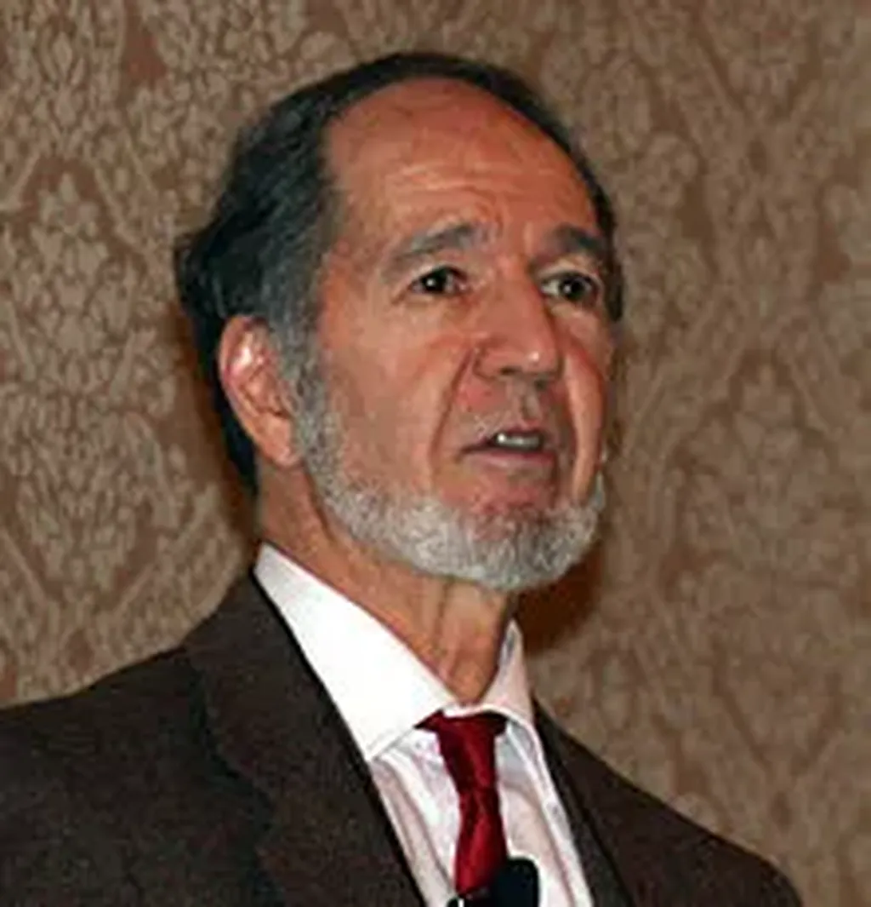

# La guerre ou quand les États s’amusent à la récréation

À [un journaliste qui lui demande](http://www.newscientist.com/article/mg21728990.400-what-westerners-can-learn-from-tribal-societies.html) pourquoi nous avons une vision romantique des sociétés tribales, [Jared Diamond](http://fr.wikipedia.org/wiki/Jared_Diamond) répond « There is a feeling among the general public—and some anthropologists—that traditional people are peaceful. But the reality is that the great majotity are not. **To have peace requires a central governement.** »

Cette théorie « Pour vivre en paix, il faut un gouvernement central. » est largement partagée. Je voudrais la discuter. Les arguments de Diamond :

1. Dans un groupe réduit, disons moins de cent personnes, on peut prendre les décisions démocratiquement, face à face. Pas besoin d’un gouvernement.

- Mais lorsque deux tributs se rencontrent. Si cents personnes sont d’accord pour faire la paix, il existera toujours quelques têtes brûlées qui désireront se venger et briseront l’armistice. Et la guerre reprendra.

- Contrôler les agitateurs exige une force centralisée. Les sociétés tribales sans leader puissant ne peuvent maintenir la paix. C’est pourquoi les sociétés-états se sont développées et pourquoi les fermiers ont toléré les parasites gouvernementaux.

- Quand nous avons un accident de voiture, nous n’exigeons pas réparation de l’autre conducteur. L’État prend pacifiquement en charge le litige [avec l’aide des assureurs qu’il nous impose]. C’est pourquoi les gens des sociétés traditionnelles basculent peu à peu vers les sociétés-états. Ils en reconnaissent les bénéfices.

Je suis dans les grandes lignes d’accord avec ce raisonnement. L’État est nécessaire dès que la population augmente. Voilà pourquoi je ne suis pas vraiment anarchiste, ni libéral au sens économique. Mais pourquoi l’État devrait-il être centralisé ?

D’abord les conséquences de cette centralisation. Plus l’État se centralise, plus il devient système. Le système finit par avoir une identité propre, indépendamment des gens qui le composent. Le système devient une entité méta-individuelle qui vit dans un monde de méta-individus. Les têtes brûlées réapparaissent qui vont alors s’entredéchirer. La société tribale se réinvente.

Ce phénomène est d’autant plus vif en temps de crise. Le méta-individu étant bien dans l’embarras pour rassurer ses atomes individuels tente une sortie vers l’extérieur. Plutôt que de se tourner en lui-même, il se donne des prérogatives qu’il n’a jamais eux. Il devient va-t’en-guerre.

À l’échelle individuelle, les enseignants, surtout du primaire, observent quotidiennement ce phénomène. Les élèves les moins mûrs, les moins doués avec les mots et les concepts, en viennent vite aux mains. Les méta-individus que sont nos gouvernements ne font que jouer bêtement dans une cour d’école, avec à la clé des morts innombrables.

L’État centralisé n’est donc une solution acceptable qu’en temps de paix entre les États centralisés, une situation qui dans la pratique est toujours provisoire. Pour sortir de ce dilemme, je vois deux possibilités.

1. La création d’un gouvernement mondial. Son rôle : remettre à leur place les méta-individus. Ce serait l’escalade du système répressif, avec toutes ses conséquences néfastes.

- L’invention des États décentralisés, des États non tentés par la systémisation, non tentés par la méta-indivualisation, des États dont les présidents ne se prendraient plus pour les rois omnipotents de la cour d’école planétaire.

Jared Diamond écarte cette possibilité un peu vite parce qu’elle n’est jamais advenue à grande échelle au cours de l’histoire. Pour cause, l’État décentralisé a besoin de technologies décentralisées pour opérer. Il se trouve que nous disposons de ces technologies.

Nous avons par exemple créé un Internet en grande part décentralisé. Et rien techniquement, sinon les États centralisés, ne nous empêcherait de le décentraliser totalement.

Quand allons-nous passer du primaire au secondaire ?

PS : Deux États décentralisés qui se rencontrent, faute de centre, sont peut-être condamnés à fusionner. Et on en arrive, non à un gouvernement planétaire, mais à un État planétaire.

#anarchisme #centralisation #decentralisation #netculture #breves #y2013 #2013-9-8-11h34
