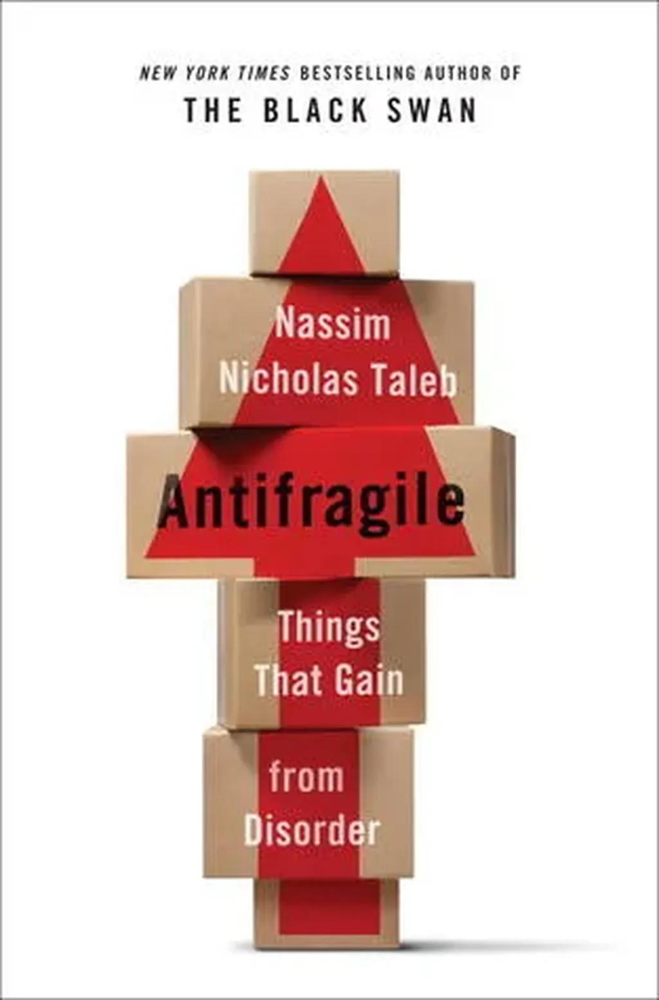

# L’écriture antifragile

Après [la déconnexion du Net](../../page/jai-debranche), j’ai expérimenté en août la déconnexion de l’écriture. Pour la première fois depuis 30 ans, j’ai passé un mois sans écrire. Pas la moindre note. Pas le moindre laissé aller.

J’étais pourtant parti en voyage aux US avec l’idée de tenir le journal de notre escapade familiale. Au moins pour en marquer le souvenir. J’ai esquissé deux bafouilles sans lendemain. Et moins j’ai écrit, plus j’ai pensé à l’écriture.

Je n’ai pas écrit parce que l’écriture demande de la disponibilité. J’en ai manqué. Les enfants, les retrouvailles avec les amis américains, les choses à voir, les sommets à escalader, les canyons à dévaler, les tentes à monter, les kilomètres à avaler…

L’écriture est une activité de solitaire désœuvré. Quand Isa me voit m’y abandonner avec trop de plaisir, elle ne manque pas de me rappeler que c’est un luxe d’homme blanc éduqué ultra-privilégié (tout comme le Net). Pour elle, quand je n’écris pas, quand je ne surfe pas, c’est une victoire, un retour à la vie bassement matérielle qu’en un autre temps de notre conjugalité elle aurait qualifié de « Changer les couches. »

Et oui, j’écris parce que l’écriture me procure du plaisir, victime sans doute d’une forme d’obsession ultra civilisée. Dans les époques archaïques, j’aurais chassé, violé, pourfendu mes ennemis. L’écriture est une façon de prendre des risques, d’approcher une limite existentielle. Je peux bien par intermittences me prélasser dans des régions moins sauvages, ou remplacer les mots par des pas sur des chemins de montagne.

### Le civilisé ne chasse pas

Parce qu’Isa est consciente de la dimension guerrière de mon écriture, elle aime me voir pactiser avec mes ennemis. Enterrer la hache de guerre.

Si l’art déplace les lieux de lutte, il ne les abolit pas. La pacifiste recherche un autre rapport aux choses et aux gens. L’interaction altruiste. La performance esthétique qui ne se rejouera pas. Tout un champ où je suis un piètre funambule. Et où j’ai pour devoir de me glisser, parce que déjà Isa et mes fils y jouent le plus souvent.

C’est tout simple. Pour être avec eux, parfois, je ne dois pas écrire. Et j’éprouve une autre forme de plaisir. Il ne me coûte pas car j’ai déjà trop écrit. Bien plus, il devient une autre écriture. Et je prends même conscience que « Ne plus être capable de vivre sans écrire, c’est avoir renoncé à écrire. »

### L’antifragilité

J’en arrive à ma seule lecture du voyage. [L’essai éponyme de Nassim Nicols Taleb.](http://www.amazon.fr/Antifragile-Things-That-Gain-Disorder/dp/1400067820) Vous savez définir ce qui est fragile : un choc, un séisme, un tremblement, un peu trop de temps qui passe... et patatras.

À l’opposé, Taleb voit l’antifragile. Des choses, des systèmes, des organismes qui se bonifient avec le temps, avec les surprises, avec l’aléatoire, les secousses de toutes sortes. Ce qui ne me tue pas me renforce. Songer à l’évolution biologique, à l’amour qui aurait trop vite tendance à somnoler et à mourir.

L’antifragile ne doit pas être confondu avec le robuste qui encaisse les coups mais ne grandit pas avec eux. Narvic me fait remarquer que Boris Cyrulnik définit ainsi la [résilience](http://fr.wikipedia.org/wiki/R%C3%A9silience_(psychologie)), mot que Taleb me semble un peu trop limiter à résistant pour mieux l’éloigner de son concept et le rendre plus marquant.

J’ai tout de suite pensé que l’écriture était antifragile. Elle a besoin de nouveautés, de [black swans](http://fr.wikipedia.org/wiki/Th%C3%A9orie_du_cygne_noir), du surgissement du tout autre, de staccato, de grandes envolées brutalement interrompues... Alors quand elle devient routine, parce que systématique, presque maladive, elle se fonctionnarise. Au mieux on peut la qualifié de robuste, sûre d’elle-même, au pire elle se fragilise à tel point qu’elle ne supportera aucun outrage, surtout pas celui du temps.

Alors ne pas écrire me paraît comme un haut acte d’écriture. Introduire un silence. Une suspension avant la reprise, un changement de rythme dans l’acte même qui devrait avoir un impact imprévisible sur le résultat.

### L’exercice du regard

Au fil du voyage, j’ai découvert des lieux neufs pour moi comme Grand Canyon, Sequoia National Park, Yosemite... et des endroits où j’ai jadis écrit : New York, Las Vegas, Sans Francisco, Seattle... Ces lieux de l’écriture m’étaient intimement présents. J’y étais chez moi, et cela indépendamment du temps que j’y avais passé. Le fait d’y avoir écrit les avait faits miens.

Nous écrivons en voyage parce qu’en écrivant nous voyons mieux, ne serait-ce que parce que nous nommons. Nos yeux suivent les lignes des paysages et des choses pendants que nos phrases les étreignent.

Écrire comme dessiner, c’est conscientiser, c’est donc vivre, ou tout au moins une façon de vivre que je trouve exquise, un temps de repli quasi mystique, avec des giclées extravoluptueuses que seule l’extase amoureuse ou les grands cris de joie familiaux procurent.

En n’écrivant pas, j’ai choisi une autre forme de voyage, tout en sachant que j’adore le voyage par l’écrit. À tel point que j’envisage de m’imposer un voyage hebdomadaire, ou quasi, autour de chez moi, rien que pour en faire le récit. Une façon d’injecter de l’aléatoire par le déplacement, un pas vers la secousse, vers la quête de la surprise... un pas vers plus d’antifragilité. Le systématique nous est nuisible. Nous devons devenir des black swans pour nous-mêmes.

#autobiographie #netlitterature #dialogue #y2013 #2013-9-2-11h45
