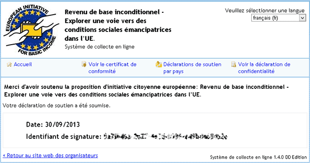
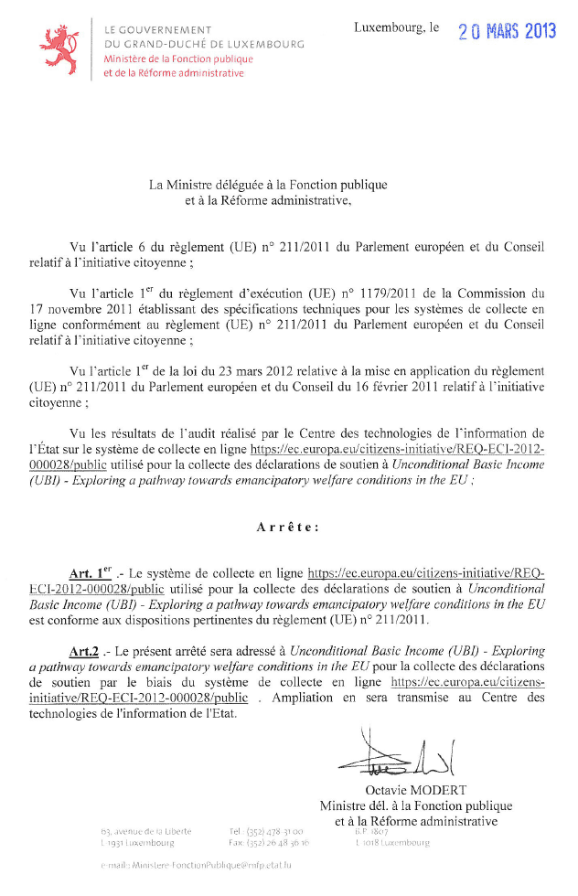

# Revenu de Base : j'ai signé

[J’ai fini par signer la pétition européenne en faveur du revenu de base.](http://basicincome2013.eu/ubi/fr/) Sans enthousiasme parce que je suis persuadé qu’une réforme de décentralisation aussi puissante ne passera ni par des États centralisés, ni par une Europe hypercentralisée. [L’espoir viendra plus probablement de Suisse](le-revenu-de-base-et-linstabilite.md) ou d’une nouvelle monnaie. Mais signer ne coûte rien, c’est un pas vers la prise de conscience. Imitez-moi par millions.

#revenu_de_base #breves #y2013 #2013-9-30-12h26
