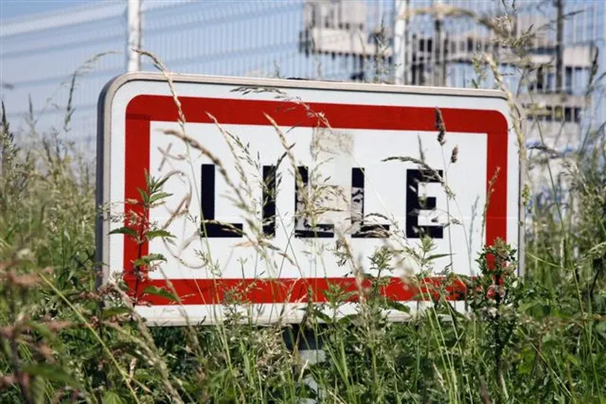

# L'île dans la plaine

Je ne suis pas venu sur la grande place lilloise depuis vingt-deux ans. J’avais à l’époque garé ma voiture derrière le Furet du Nord, devant leur sortie de service. Le lendemain matin en quittant l’hôtel, j’avais dû la récupérer à la fourrière.

Une chose attire mon regard : les panneaux happy hours devant tous les cafés. Les même signaux désagréables m’avaient alerté hier sur Paris, comme s’ils s’étaient soudain démultipliés. Des heures seraient plus heureuses que d’autres. Des choses à faire à un moment plutôt qu’à un autre. Et je m’oppose avec méthode à ces dictats. Je m’installe en terrasse, puis me relève.

Quelque chose ne colle pas. Peut-être les cigarettes que mon organisme ne digère plus à force de me tenir à distance d’elles. Ma gorge me pique. Je tousse. Quelle étrange coutume que d’ingérer de la fumée, une façon d’avouer sa soumission à quelques industriels et de se rallier au capitalisme.

Le centre de la ville avec ses enseignes, ses façades, sa foule bigarrée, ponctuée de femmes trop belles, m’indiffère. Une sorte de banalité consommée. Le règne du minéral et des voitures. L’absence d’arbre me trouble, m’éloigne du ciel et de la terre.

Je vais au hasard, ne trouve que des vermisseaux rabougris bien qu’encore gonflés par les mises en plis rougeoyantes de leurs frondaisons. Je n’ose les imaginer l’hiver quand les troncs chétifs noirciront avec la pluie poisseuse de goudron.

Lille souffre d’un mal commun aux villes de plaine qui manquent de grands arbres pour leur donner du relief. Avec un désespoir non feint, elles affichent des façades rococo pour tenter de nous duper, mimant miroitements marins, reflets carmin sur les sommets enneigés, carnations ardoise ou brique des toits révélés depuis une haute corniche.

Il me faudrait m’abandonner des jours dans ces rues sans étroitesses pour y deviner un génie réputé, peut-être plus par un effet marketing que par une énergie propre. Je me méfie instinctivement de ces lieux dont le gouvernement, par son ostentation, impose à tous une image déformée. Plus le bruit se fait vif, plus le cœur se dérobe.

Les grandes rues ressemblent à des artères gonflées de globules rouges. Le sol ne devrait jamais approcher cette teinte, pour ne pas renforcer la métaphore. Je me glisse dans ce flot vulgaire, sans aucune jubilation. Chaque vitrine, chaque mannequin, chaque invitation à la consommation me donnent envie de fuir vers la périphérie-dortoir, où quelques jardinets doivent apporter un peu de gaîté simple.

À tout choisir, je préfère les rues ouvertes à la circulation que les rues piétonnes, dangereusement pourvues des mêmes magasins que leurs semblables ailleurs dans le monde. Elles se déversent systématiquement sur la grande place avec ses cafés happy hours, créant un mouvement de convection sans surprises. Je dois dévier pour trouver des volets bleus sur façades blanches, des boutiques plus discrètes et non moins opulentes, quelques bistrots avec juste des tables et des clients ordinaires.

Et moi qui aime par-dessus tout découvrir les pâtisseries et les boulangeries, je me fais piéger encore et encore par ces Paul indigestes. Ils squattent toutes les devantures historiques pour s’attribuer un air suranné.

Je dévie à nouveau, enfin un beau point de mire sur un salon de thé art déco. Et mince, un empilement de macarons colorés comme je les adorais quand seul Mulot s’en faisait la spécialité rue de Seine à Paris. Ils ont dorénavant partout le même goût de cette recette prête au surgelé. Le faux domine, comme aux États-Unis, encore que là-bas avec une naïveté plus attachante.

#vagabondage #y2013 #2013-9-27-19h17
