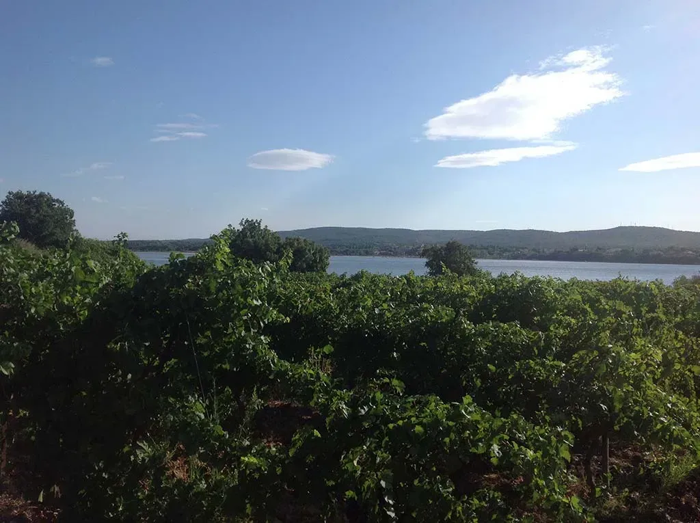

# Un des plaisirs de la chasse 

J’ai laissé les enfants à l’école et longé la côte nord de l’étang. Rien de très pittoresque. Je pédale sur une piste cyclable qui trouve presque par miracle un passage entre les pavillons et les routes. Pourtant, j’aperçois un homme dans un champ moissonné, avec en arrière-plan les toits cuivrés du village médiéval de Balaruc le Vieux. L’homme transporte une brassée de bois. Un chien le suit.

Si j’oublie la ligne haute tension qui sillonne le ciel, si j’insiste sur le moutonnement de verdure au pied des remparts, sur la haie de peupliers espacés, sur le clocher massif, avec ses trois baies en ogive, la centrale munie d’une cloche que je n’ai aucune chance d’entendre, si j’éradique de mon esprit le centre commercial que je viens de dépasser, je pourrais me croire en un autre temps.

L’homme dresse une cage de tissus. Il ne portait donc pas du bois mais cet attirail. Et c’est tout de suite moins bucolique. Il s’agenouille quelques mètres derrière. Immobile. Avec le soleil plus haut, je le vois mieux, en tenue de chasseur, son pantalon trop large pendouillant au creux de ses fesses. Le chien se poste en retrait, lui aussi attentif. Quelque chose va surgir. Un lièvre ? Une taupe ?

Une risée fait osciller la toile. Dans le lointain, un coup de feu. L’homme se tourne. Il balaie l’horizon. Un reflet. Il tient un fusil. Tout s’éclaire et je vois mieux. La toile est un paravent. L’homme se cache derrière et attend que des oiseaux passent entre lui et le village. Il s’est choisi une perspective ancestrale. Il contemple le même spectacle que ses ancêtres depuis des siècles. Il se lie à l’éternel. C’est peut-être un des plaisirs de la chasse.

Me suis éloigné vers un petit coin d’étang oublié. Des aigrettes picorent la vase. Des loups chassent à fleur d’eau. Et tout est bleu autour de la langue de terre et de végétation sur l’autre rive, ligne noire dentelée de cyprès et de toits.

J’aime sentir les gens travailler au loin. Le bruit d’une tronçonneuse. Une grue qui pivote. La fumée d’un feu de bois mort. J’ai l’impression qu’ils s’occupent de moi pendant que je vagabonde. J’ai ce loisir inestimable, je n’ai pas le droit de me plaindre.

Un champ d’herbes sauvages avec posé au milieu un bouquet de panaches gris. Une tentative de colonisation. Un pays avec ses coutumes et ses lois. Un monde dans le monde, un état de l’existence quasi interdit à nous autres innombrables humains. Autour des herbes vivaces, des fenouils sauvages, vestiges du silphium, plante magique des anciens Grecs à vertu quasi universelle.

Je remarque maintenant le figuier, le cactus en fleur. Ce champ au-dessus de l’étang a un jour été cultivé. Il subsiste un vestige de son âme. Qu’on pose ici une maison, elles approchent de toutes parts, et un karma antique sera définitivement rayé du monde. Nous sommes trop de vivants pour vivre avec les morts.

#vagabondage #y2013 #2013-9-12-13h49
