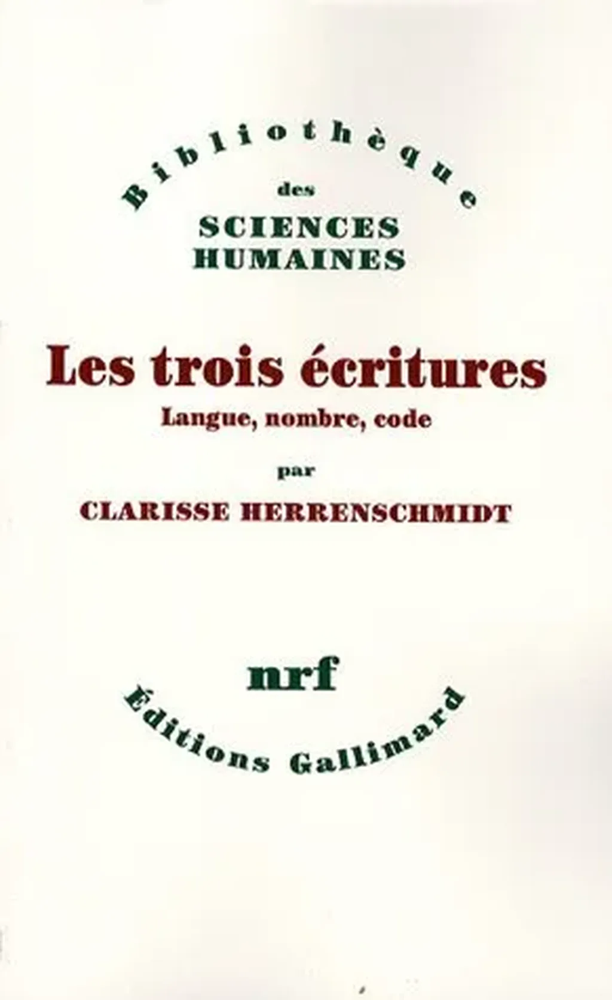

# Avec le rêve de libérer le code de la matière

J’aime les articles de [Rémi Sussan](http://www.internetactu.net/author/remi-sussan/), toujours branchés à la pointe du développement homo-techno-scientifique. Infatigablement, Rémi défriche pour nous tous. Cette fois, [il met en avant l’idée de Neil Gershenfeld selon laquelle l’informatique devrait devenir plus physique](http://www.internetactu.net/2014/01/24/quelles-sont-les-idees-scientifiques-a-abandonner/). C’est drôle parce que je pense tout le contraire.

Si on suit [Clarisse Herrenschmidt](http://www.amazon.fr/Les-trois-%C3%A9critures-Langue-nombre/dp/2070760251), et j’ai envie de la suivre très très loin, le code est la troisième écriture inventée par l’humanité après l’écriture des langues et l’écriture arithmétique. Est ce qu’on demande à l’écriture des langues d’être plus proche du monde physique ? Bien sûr que non, on l’admire d’autant plus quand elle nous transcende, nous élève loin de la matière et nous promène dans le monde des rêves.

Il va de même avec les mathématiques, toujours plus abstraites, toujours plus proches de l’art. Alors pourquoi donc l’écriture du code devrait-elle suivre une histoire inverse ? On ne peut l’envisager que si on ne considère le code que du point de vue utilitariste, que si on néglige sa dimension esthétique et même métaphysique. Ce n’est pas avec un code matérialiste que nous engendrerons des IA plus clairvoyantes que nous.

Notre ambition ultime devrait être de libérer le code de la matière. De le transformer en abstraction autonome et autorépliquante.

#netculture #dialogue #y2014 #2014-1-24-9h47
