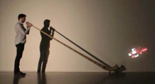

# Le code de l’art

À Genève, j’ai visité [un atelier d’artiste un peu particulier](http://www.sigmasix.ch/). Bourré de Mac, de caméras, de vidéo projecteurs. Les écrans remplis de lignes de code poussées par deux jeunes gars, Florian Pittet et Éric Morzier.

Florian a braqué une caméra sur moi, il a envoyé l’image sur l’écran, l’a projetée sur un cube, puis tout cela s’est mis à tourner, à clignoter, j’étais en train de danser. Tout a commencé dans le monde de la nuit. Avec des vidéos projecteurs montés sur rotules et reliés à des ordis. Désormais des capteurs réagissent aux moindres mouvements des spectateurs/acteurs.

Depuis des années, depuis toujours presque, je radote en disant que l’artiste contemporain doit être codeur, sinon rien. C’est fait. J’étais presque jaloux de les voir traduire leur inspiration en [Python](http://www.python.org/). Un « If Then Else » transformé en lumière et en musique.

Je me sens con derrière mes textes. Je les produis et les diffuse avec la technologie. Je suis dans le *[Send](#send)*, mais les textes eux-mêmes ne sont pas code, ils ne diffèrent en rien des textes plus anciens. Avec [IHL](http://ihl.tcrouzet.com/) par exemple, j’ai expérimenté, sans me convaincre moi-même. Le texte reste attaché au temps long. Contrairement à la lumière et aux sons, il ne jaillit pas en nous d’un bloc. Il s’écoule mot à mot, sur un rythme lent, prétechnologique. Nous ne savons pas encore écrire du code qui génère du texte émotionnellement fort.

J’ai vu des animations de haïkus, de mots abandonnés au hasard, rien avec du lourd, de l’immersif. Le texte n’est alors qu’accessoire, publicitaire. Je ne dis pas que c’est impossible de faire autrement, je doute... en attendant que les IA nous succèdent.

Le texte entre par le cerveau et non par les pores de la peau. Et voilà peut-être pourquoi il ne se prête pas à l’interaction. Alors que Florian et Éric promènent partout dans le monde leurs installations, nous continuons à publier des livres, voire des blogs, avec des textes comme au bon vieux temps. Sommes-nous ringards ? Ou bloqués au pied d’une barrière infranchissable ?

#netculture #netlitterature #dialogue #y2014 #2014-1-9-11h32
