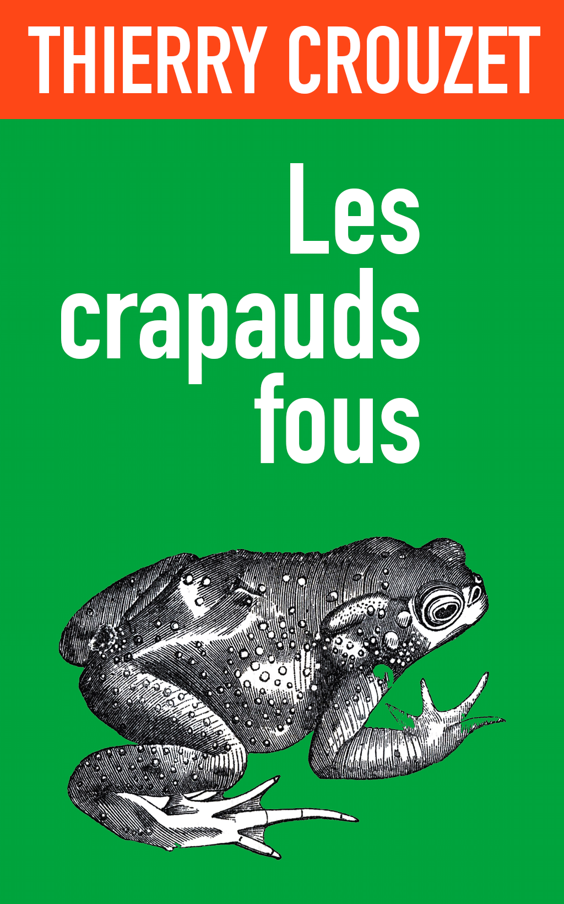

# Le retour des crapauds fous

En 2009, j’ai commencé un livre que j’ai laissé en plan pour m’attaquer à *[L’alternative nomade](../../books/alternative-nomade.md)*. Je me suis soudain souvenu de lui, d’autant qu’il est également une forme de prélude à mon éternel *[Ératosthène](../../page/eratosthene)*.

C’est un texte inachevé, dont j’avais publié des morceaux sur le blog, mais assez avancé pour constituer un tout organique. Je viens de le relire, le nettoyer et en faire [un petit ebook disponible dans toutes les librairies](../../books/les-crapauds-fous.md).

#crapauds #eratosthene #netculture #breves #y2014 #2014-1-16-8h49
