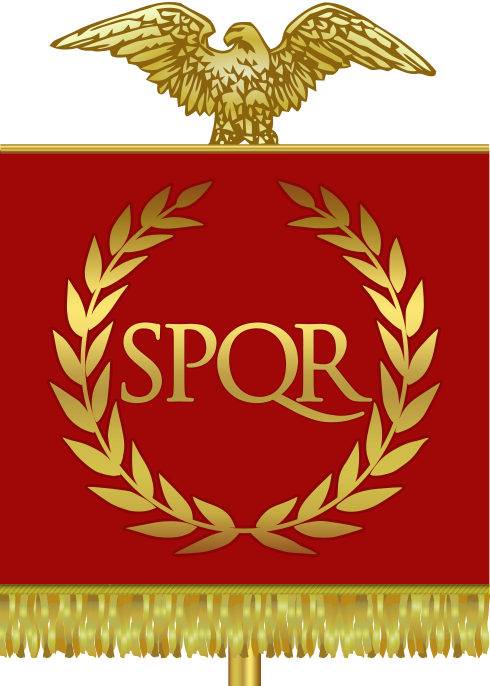

# Rappel aux nationalistes de tout front

Les empires naissent puis meurent sur leurs frontières. Ils commencent par avancer au-delà, les repoussant toujours plus loin, jusqu’à ce qu’un ennemi extérieur n’arrête cette expansion, puis exerce une force inverse.

Jules César étendit la frontière de l’Empire romain jusqu’au Rhin. Auguste tenta de la repousser jusqu’à l’Elbe, mais les Germains exterminèrent son armée en l’an 9 lors de la bataille de la forêt de Teutobourg. Auguste bâtit alors des fortifications le long du Rhin et la frontière n’évolua plus pendant quatre siècles.

En même temps que l’empire se figeait vers le nord-est, sa bureaucratie se centralisait. La moindre décision devait passer par Rome. Tout se compliquait. Peu à peu, les Romains perdirent leur esprit aventurier.

La fermeture extérieure correspondait à une fermeture intérieure grandissante. Rome mourait par étouffement. Les barbares beaucoup plus libres, beaucoup plus mobiles, ne lui laissèrent aucune chance.

L’ouverture est une condition nécessaire à l’expansion. Inversement, la fermeture préfigure la décadence.

La bibliothèque d’Alexandrie était ouverte aux savants du musée mais pas à l’ensemble des Alexandrins, encore moins à l’ensemble du monde hellène. Son ouverture profita à une élite pendant que les autres hommes, étrangers à ses bienfaits, plongeaient dans la barbarie.

Le même scénario est susceptible de se produire au cours de toutes les époques de transition. Périodes de reconstruction, elles inaugurent un nouvel âge d’or, mais un rien peut les abattre.

L’ouverture qui caractérise leur naissance, ouverture sur les frontières de toute nature, géographiques, spirituelles ou intellectuelles, apporte des connaissances nouvelles au plus grand nombre. Mais l’ouverture est fragile. La connaissance est un pouvoir et le pouvoir séculier ne l’apprécie pas. Pour se protéger, il se recroqueville souvent sur lui-même, oubliant que la force est dans la coopération de tous.

L’ouverture est un bien à préserver. Quand un ennemi se présente, il ne faut pas se cacher derrière des frontières de plus en plus hautes. Au contraire, il faut le regarder en face et l’affronter dans un esprit d’ouverture.

*PS : Parmi la montagne de textes écrits pour composer mon* [Ératosthène](../../page/eratosthene), *en voici un qui me semble de circonstance.*

#netculture #politique #dialogue #y2014 #2014-1-30-9h24
