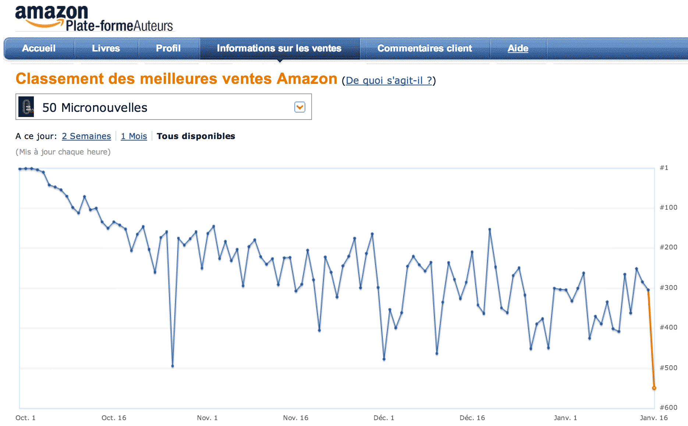

# Vendez-vous vos livres ?

Un petit rappel, destiné aux auteurs qui communiquent mal avec leurs éditeurs. Avec [Author Central](https://authorcentral.amazon.fr), Amazon nous propose une plateforme pour suivre nos ventes, ou tout au moins notre classement dans le top des ventes Amazon, ce qui revient un peu au même (si t’es pas dans le top 100, tu ne gagnes pas ta vie).

Je ne vais presque jamais sur le service Amazon, sinon [quand je publie un nouveau texte](../../books/les-crapauds-fous.md) pour le déclarer. Là, je découvre avec surprise que les [50 Micronouvelles](../../2013/4/50-micronouvelles-50-auteurs.md) ont été number one en octobre. OK, c’est un texte gratuit, publié par 50 auteurs. Mais ça donne une idée du score qu’il faut arracher pour grimper tout en haut. On en est aujourd’hui à 10 000 téléchargements, toutes plateformes confondues.

#cuisine #breves #y2014 #2014-1-16-12h7
