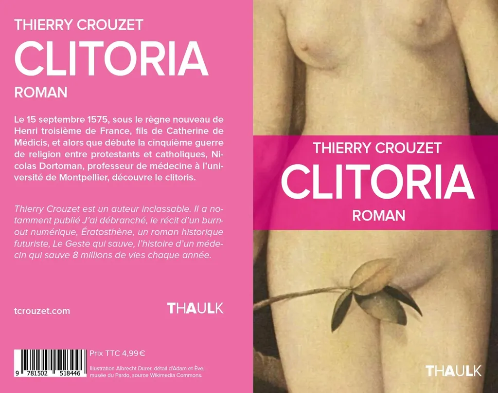

# Clitoria, du feuilleton en ligne au livre papier

À partir de lundi prochain, en partenariat avec [ActuaLitté](https://www.actualitte.com/chez-wam/a-lire-sur-actualitte-clitoria-roman-erotique-de-thierry-crouzet-53677.htm), je vous offrirai deux fois par semaine *[Clitoria](../../books/clitoria.md)*, un feuilleton coquin qui vous fera plonger dans le XVIe siècle, au cœur de la renaissance des idées et des passions.

Petit avant-goût :

> Archimède dans son bain. Newton sous son arbre. Einstein dans son ascenseur. On célèbre le lieu des découvertes à juste raison. L’inventeur seul ne se serait peut-être jamais enflammé sans une conjonction de forces historiques focalisées en un point précis de l’espace. Cet effet pèse d’autant plus quand la découverte exige le rendez-vous de deux êtres, un découvreur et une découvrée, comme dans le cas du précieux et discret clitoris.

Ainsi débute le chapitre 2 de *[Clitoria](../../books/clitoria.md)*, un petit roman de 80 pages, disponible dès aujourd’hui [en livre pour 4,99 €](http://www.amazon.fr/gp/product/1502518449/ref=as_li_qf_sp_asin_il_tl?ie=UTF8&camp=1642&creative=6746&creativeASIN=1502518449&linkCode=as2&tag=tcrouzetcom-21&linkId=YGPUDDZMS2APMF7E) et [en ebook pour 2,99 €](http://fr.feedbooks.com/item/951157/clitoria).

Si vous êtes pressé ou voulez soutenir mon travail, [achetez le texte](../../books/clitoria.md), sinon patientez. Les chapitres seront diffusés gratuitement sur mon blog et par [ActuaLitté](https://www.actualitte.com/) au fil des prochaines semaines, tous les lundis et jeudis.

Pourquoi cette double diffusion gratuite et payante ? Pour expérimenter. Pour ne pas obliger les lecteurs à payer mais pour les encourager à le faire s’ils aiment. C’est une façon de revenir aux feuilletons du XIXe qui étaient offerts dans les journaux avant de sortir en livre. La seule différence est l’immédiate disponibilité de l’ensemble. Alors chaque chapitre diffusé gratuitement sert de publicité pour l’ouvrage complet.

C’est aussi une manière de démontrer, s’il le fallait encore, qu’un auteur indépendant peut offrir ses textes à travers son blog, mais aussi les diffuser en papier ou ebook, à un prix très bas et sous licence libre.

Lisez tout de suite l’intégralité de *[Cliroria](../../books/clitoria.md)* [en commandant la version papier pour 4,99 €](http://www.amazon.fr/gp/product/1502518449/ref=as_li_qf_sp_asin_il_tl?ie=UTF8&camp=1642&creative=6746&creativeASIN=1502518449&linkCode=as2&tag=tcrouzetcom-21&linkId=YGPUDDZMS2APMF7E) ou [en téléchargeant la version numérique pour 2,99 €](http://fr.feedbooks.com/item/951157/clitoria).

#buzz #y2014 #2014-11-7-16h54
