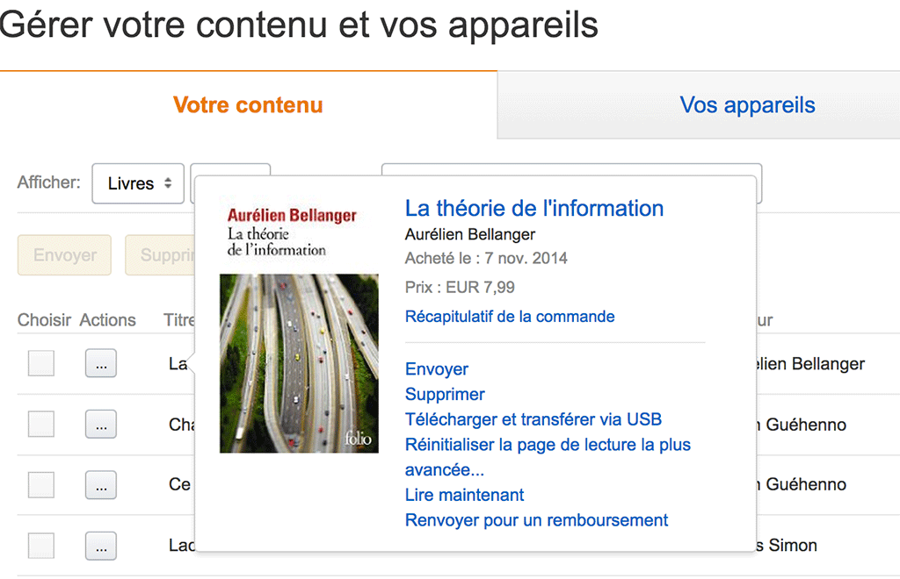
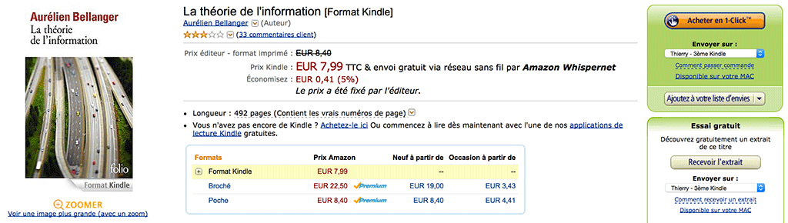
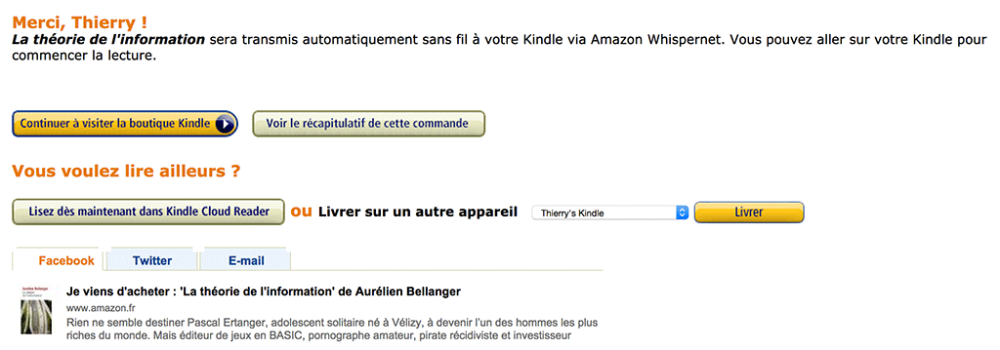
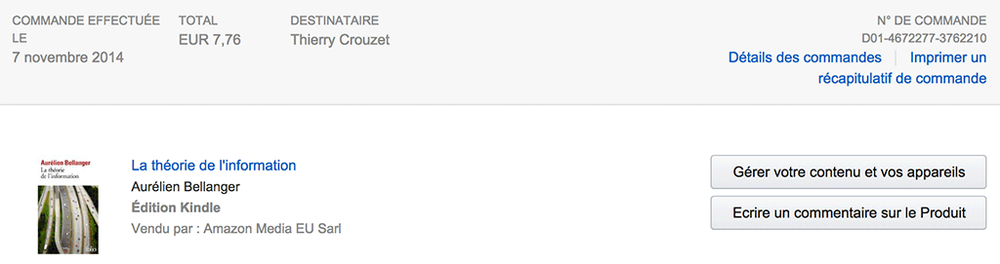
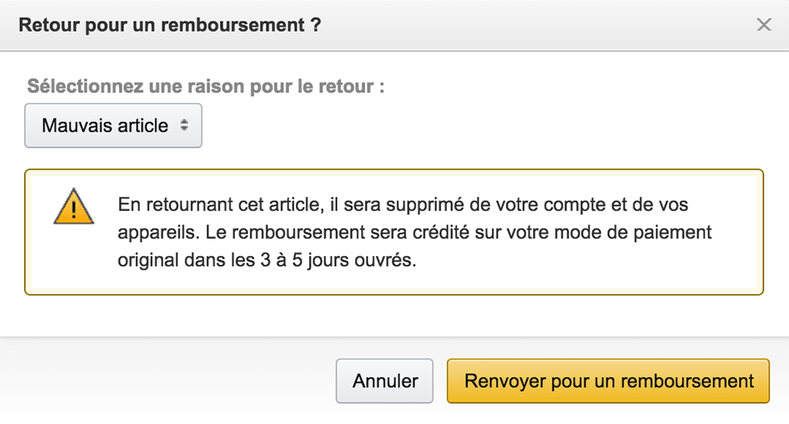
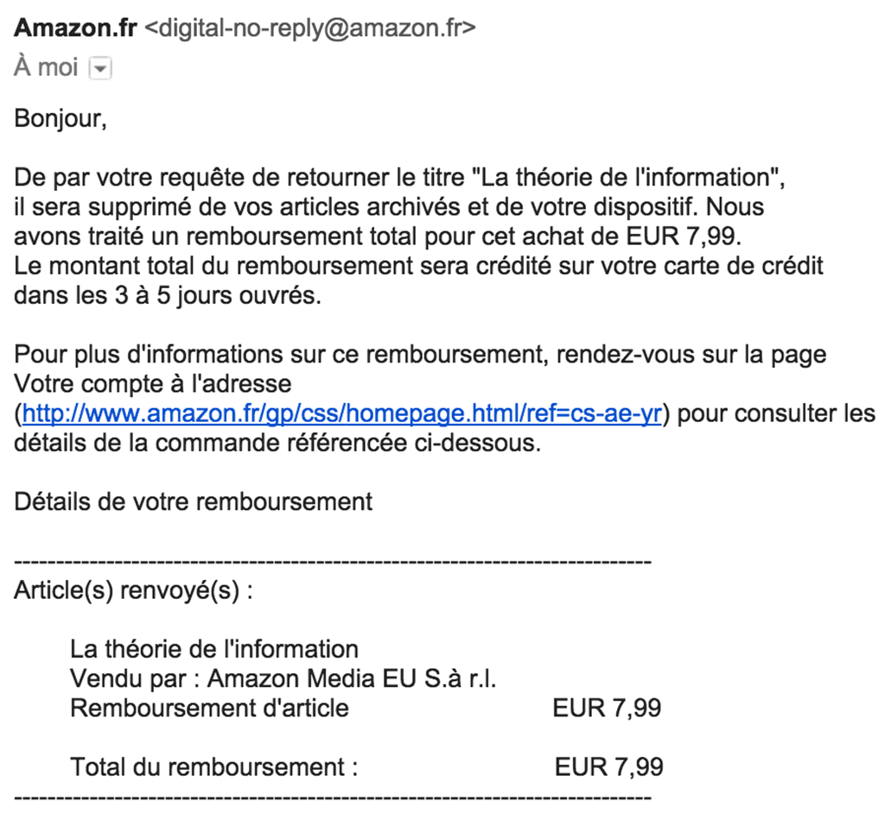

# Comment pirater légalement tous les livres

Je suis désolé, amis auteurs, j’ai une mauvaise nouvelle (et notamment pour moi qui sors aujourd’hui *[Clitoria](../../books/clitoria.md)*). J’ai découvert que notre avenir serait encore moins rose que nous ne le pensions, tout ça par le plus grand des hasards.

Hier soir, mon amie Line me raconte qu’elle lit désormais en numérique, mais qu’elle vient de se faire rouler par Amazon. Elle commande [la version Kindle de *City*](http://www.amazon.fr/City-Alessandro-Baricco-ebook/dp/B007S6VQL6/), le roman d’Alessandro Baricco. Tout heureuse, elle ouvre le livre, mince il est en italien. Furieuse, parce sur la page Amazon tout était en français, elle se dit qu’il y a tromperie. Après vérification, elle découvre la mention de la langue en petits caractères.

Sans réfléchir, je lui dis qu’elle aurait pu se faire rembourser le livre. « La vente de fichiers, c’est de la vente par correspondance, a priori tu as 14 jours pour demander le remboursement. » Une idée saugrenue germe en moi. « Si je peux me faire rembourser tous mes ebooks, ça veut dire que j’ai 14 jours pour les lire gratuitement. »

Ce matin, sans prendre la peine de consulter la législation, je tente une expérience. Après avoir lu [le terrible et sublime assassinat de notre Goncourt 2014](http://www.juanasensio.com/archive/2014/11/05/pas-pleurer-de-lydie-salvayre-ou-le-goncourt-de-la-vulgarite.html) par Salker, je vais chercher ailleurs, et pourquoi pas un roman plus ancien que je me promets de lire depuis longtemps *La théorie de l’information* de Aurélien Bellanger.

[caption id="attachment\_38031" align="aligncenter" width="600"] 1. Commander le livre sur Amazon.[/caption]

[caption id="attachment\_38032" align="aligncenter" width="600"] 2. Faire livrer le texte sur un Kindle ou une application Kindle.[/caption]

[caption id="attachment\_38035" align="aligncenter" width="600"] 3. Sous 14 jours, dans la gestion des commandes Amazon, sélectionner le livre, cliquer sur "Gérer votre contenu".[/caption]

[caption id="attachment\_38036" align="aligncenter" width="600"] 4. Afficher la fenêtre action, choisir "Renvoyer pour un remboursement".[/caption]

[caption id="attachment\_38037" align="aligncenter" width="600"] 5. Valider le remboursement.[/caption]

Amazon est donc désormais la plus grande bibliothèque publique du monde. Reste à espérer pour les auteurs que les lecteurs n’abuseront pas de cette petite combine.

Faut-il abroger la mesure « satisfait ou remboursé ». Bien sûr que non. Quand on achète à distance, cette possibilité de retourner les produits est vitale. C’est un lien de confiance. Faut-il la limiter aux produits physiques ? Pas plus, il me semble. Line avait toutes les raisons de se faire rembourser. Parfois les livres sont vraiment mal ficelés en version électronique et méritent qu’on les retourne. Idem pour les logiciels. Mais il est clair que notre droit de ne pas être satisfait implique une possibilité légale de tout pirater.

Nous ne nous en sortirons que par un sursaut de responsabilité. Que par un geste des lecteurs envers les auteurs qu’ils aiment lire. Parfois, je doute. Ce matin, avant même de me lancer dans cette expérience de piratage légal, en rentrant d’accompagner à vélo les enfants à l’école, je surprends une bonne femme qui dévide un distributeur de sacs à crottes pour les chiens. « Vous n’avez pas de complexe », lui dis-je. « Vous en avez, vous ? » me demande-t-elle tout en continuant à voler aux yeux de tous les sacs. Oui, j’ai des scrupules. Parce qu’avec des milliards d’humains sans scrupules, la planète ne résistera pas longtemps.

[caption id="attachment\_38048" align="aligncenter" width="600"] 6. Mail de confirmation de remboursement.[/caption]

*PS : Il paraît qu’il ne faut pas abuser de la technique, sinon Amazon peut fermer votre compte.*

#ebooks #edition #dialogue #y2014 #2014-11-7-11h29
