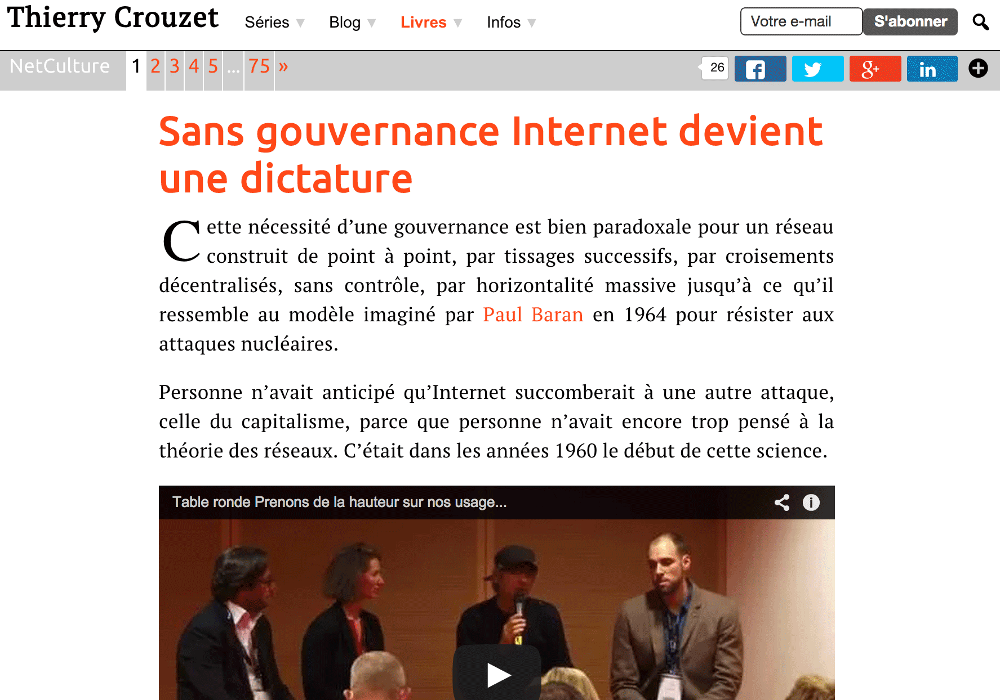

# Les réseaux sociaux ont confisqué la métaphore du blog

Quand le blog naît en 1994, c’est pour continuer *La Route* de Kerouak. Les articles se déroulent en un long rouleau antichronologique. Quand un lecteur arrivait sur la page d’accueil, la seule page d’un blog, il savait immédiatement qu’il entrait dans une œuvre en train de se créer. Le texte avait l’épaisseur des textes antérieurs. Tout cela a été oublié.

Le drame s’est produit autour de 2007, avec l’émergence des réseaux sociaux. À partir de ce moment, les lecteurs cliquent sur des liens de recommandation et débarquent directement sur les articles de blog (plutôt que sur la page d’accueil). Ils perdent immédiatement le sens de l’ensemble, sauf à rester fidèles aux fils RSS (mais cette technologie n’a jamais dépassé le monde des geeks).

En même temps, Google se fait le complice de cette transition. D’abord il pénalise les blogrolls, ces listes de sites amis qui facilitaient la navigation transversale de site en site (donc sans Google). Puis il s’efforce de devenir l’unique point de navigation du Web. On n’a plus besoin de connaître les adresses des sites, on atterrit directement sur l’information désirée. Sauf que, pour qui conçoit le blog comme une œuvre littéraire, la notion d’information n’a aucun sens. Une œuvre ne se cherche pas, elles se trouvent (comme disait Picasso).

L’émergence des réseaux sociaux concomitante à la toute-puissance de Google a donc fait basculer le blog de la métaphore du rouleau à la métaphore de l’article, et plus précisément à la métaphore de la presse. La plupart des pages d’accueil, où plus personne ne va d’ailleurs, se sont transformées en une de journal. Désormais, elles se contentent de pointer vers les derniers articles publiés avec plus ou moins d’emphase.

Mais la métaphore du rouleau ne s’est pas perdue pour tout le monde. Elle a été confisquée par les réseaux sociaux eux-mêmes, parce qu’elle est puissante et bien plus novatrice que la métaphore de la presse (ou celle du livre d’ailleurs). Elle a un pouvoir de contextualisation. Elle donne le ton, elle situe un corpus, elle coupe toute nécessité de navigation latérale (liste d’articles proches, mise à la une, tags, catégories… tous ces gadgets pour tenter de conserver maladroitement le lecteur). Elle nous fait plonger dans une rivière dont on peut descendre ou remonter le cours, sans se poser de question, dans l’ordre naturel de lecture.

Pour s’opposer à cette confiscation du rouleau, les blogueurs littéraires, qui travaillent en série, numérotent leurs articles, créent des sommaires… Ce n’est pas très efficace, pas très agréable pour le lecteur. Pourquoi devoir sans cesse remonter au sommaire ? Pourquoi cliquer alors qu’il devrait me suffire de lire ? Un journal n’est pas un rouleau, un journal Web n’est pas un blog.

Le passage par un sommaire conduit droit à la métaphore du livre, et d’ailleurs ces séries se retrouvent souvent ainsi encapsulées. Cette métaphore empêche l’auteur de penser une écriture vraiment numérique. Elle le pousse dans l’homothétique, dans l’utilisation du Web comme simple média de diffusion (souvent de substitution faute de mieux). Ça m’a longtemps dérangé [jusqu’à ce que j’entrevoie une solution technique pour me ramener sur la route](../10/ce-qui-manque-au-blog-ou-la-revolution-litteraire.md).

Pas question de revenir à la forme originale du blog. Pas possible d’obliger les lecteurs à remonter à la page d’accueil, et ce n’est même pas souhaitable. Pour autant, il me paraît nécessaire de repositionner dans leur ensemble natif les articles individuels sur lesquels les lecteurs déboulent. En résumé, j’ai ressenti le besoin pressant de revenir à Kerouac.

Un passage par le code s’est imposé. Parce que les CMS comme WordPress sont tombés dans le piège de la métaphore de la presse, ils ont enterré le rouleau, pourtant toujours là en substance dans leur base de données. Rien n’a changé de ce côté, c’est la restitution que j’ai dû transformer.

1. Quand le lecteur arrive sur un article appartenant à une série, je dois l’afficher à sa place chronologique, il suffit de quelques lignes de PHP dans WordPress pour le situer, mais j’ai mis pas mal de temps à les optimiser.
2. Pour autant, je ne peux charger l’ensemble d’un rouleau, comportant potentiellement des dizaines d’articles et pesant plusieurs mégaoctets. Trop lourd pour le serveur, comme lourd pour le navigateur.
3. D’autre part, je dois maintenir la validité des URLs. Quand on arrive sur la page d’un article, on arrive bel et bien sur cet article, c’est très important pour les moteurs de recherche et pour conserver l’historique dans la blogosphère (pour ce qu’il en reste).
4. C’est seulement quand le lecteur joue du scrolling haut ou bas que les autres articles du rouleau se chargent progressivement (et de manière transparente pour le lecteur). Cela impose pas mal d’Ajax combiné avec du jQuery.
5. À ce moment, il est nécessaire d’éliminer toutes les traces latérales, tous ces hors-texte, toutes ces marges qui nuisent à la lecture. Le texte et rien que le texte.
6. Avec cette idée du rouleau de Kerouac, j’ai aussi éliminé les pieds d’article habituels sur un blog (listes des tags, des catégories, commentaires, recommandations sociales…). J’ai utilisé un simple filet pour signaler les sauts entre les billets dans l’espoir de ne pas arrêter la lecture. J’espère qu’on ne me dira plus « Ça, tu ne l’as pas dit. » Maintenant, très souvent, le « ça » se trouvera plus bas. Parce qu’un blogueur n’est pas un journaliste qui doit tout dire dans chacun de ses papiers. Mon texte, c’est mon rouleau, jamais un article individuel.
7. J’ai rassemblé la navigation dans une barre qui se modifie automatiquement en fonction du billet en cours de lecture. Les commentaires ne s’affichent qu’à la demande, de même les tags et autres babioles.

Quand j’ai découvert mes [Vagabondages](../../2014/11/le-je-lappareil-photo-et-limprimante.md) affichés sur ce mode, j’ai pris conscience de leur totalité pour la première fois. Je sais déjà que cette seule vision influencera ma façon d’écrire. J’aurais davantage tendance à penser à l’ensemble, et sans doute à une forme de narration. Le rouleau impose la route du récit, un temps long dans l’écriture couplé au temps fragmentaire et bref du Web.

Un exemple en action.

1. [Premier billet de la série Clitoria](../../books/clitoria.md), avec tous les autres qui se déroulent dans l’ordre naturel de lecture.
2. [Un billet au cœur de la série](../../books/clitoria.md), avec des billets qui peuvent apparaître au-dessus ou au-dessous.
3. [Le dernier billet de la série](../../books/clitoria.md), avec tous les autres qui apparaissent au-dessus.

Je dois encore coder, débuguer, lisser, créer un sommaire des séries pour la page d’accueil, mais ça prend forme. Et je pense à une histoire que je n’aurais pas pu envisager sur le blog avant, et qui paradoxalement aurait été mieux à sa place sur le rouleau de Facebook, question d’interface. Je vais pouvoir rester chez moi et me réapproprier ce qui m’a été volé bien malgré moi.

#netlitterature #y2014 #2014-12-1-8h56
