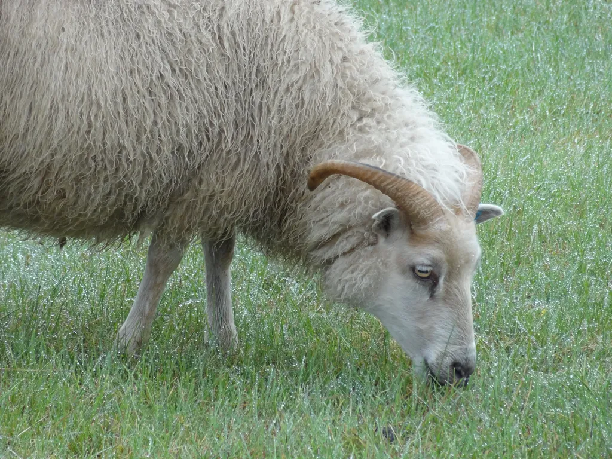

# Lecteur = mouton

Je ne parle pas de toi qui es arrivé jusqu’ici, [mais du lecteur tel que nous le décrivent les statistiques](la-desintegration-du-marche-du-livre.md). Ce lecteur acheteur des mêmes livres que les autres lecteurs, il faut bien qu’il existe pour engendrer des best-sellers de plus en plus retentissants, tout en laissant les seconds couteaux exsangues.

Alors, oui, toi, peut-être, tu n’es pas moutonnier, tu es curieux, tu explores, tu prends des risques, mais tu appartiens à une infime minorité. Il faut que tu l’acceptes, et que moi même j’en convienne, en un acte de lucidité.

On ne peut pas continuer de penser un monde d’humains responsables quand cet humain s’empresse de mimer le comportement des autres humains. Vous savez où conduit cette folie : à des excès abominables. Et le Net que j’aime tant renforce peut-être ce vieux travers dénoncé par René Girard dans *Mensonge romantique et vérité romanesque*.

Le marché du livre m’inquiète moins que le comportement de mes semblables. Sa lecture nous aide à lire leurs travers. Moins de livres vendus au total et plus de best-sellers vendus, ça implique tout simplement un manque de curiosité croissant pour la chose écrite. On ne lit plus que ce qui doit être lu, que ce qui est qualifié de divertissant par le plus grand nombre. Si le même comportement se répète dans tous les domaines, c’est inquiétant.

Faut pas s’étonner après de la montée du racisme, des extrémismes, des théories bidon et des blagues sexistes. Le contentement dans le best-seller traduit la peur de l’autre. C’est une nouvelle constante de notre temps.

Ne croyez pas que les best-sellers soient les produits du marketing. Les éditeurs sont nuls dans ce domaine. Un lecteur curieux est a l’origine de tout best-seller. Il aime un texte que personne n’a encore lu, il le dit autour de lui et la viralité se met au travail, aujourd’hui avec plus de force que jamais.

J’ai ainsi été un des premiers lecteurs du *Da Vinci Code*. J’en porte une petite part de responsabilité, étant allé jusqu’à souffler à un éditeur français de le signer bien avant que le livre ne devienne un best-seller aux US.

Peu importe qui publie un livre, éditeur ou auteur. Le mécanisme est le même. Un embrasement du désir mimétique. La volonté de savoir ce que les autres ont découvert, ce qu’ils ont ressenti, la volonté d’être à minima comme eux, et ne pas passer à côté de ce qui les excite. Les réseaux sociaux portent leur responsabilité dans cette amplification désormais vertigineuse.

J’ai toujours voulu être différent des autres. Adolescent, je ne lisais pas les mêmes livres, je n’écoutais pas la même musique… et quand trop d’amis me rejoignaient sur un terrain de jeu, je m’empressais d’en changer. J’ai du mal à comprendre la puissance du désir mimétique, mais je suis obligé d’admettre sa prégnance amplifiée par le Net.

Bien sûr il permet à qui le veut de travailler son individuation. J’en ai fait le sujet de *L’alternative nomade*, mais nous ne sommes pas très nombreux à nous éloigner des pas de Panurge. En tout cas, les statistiques le disent, et elles m’inquiètent.

J’ose espérer que notre suivisme se fissure de temps à temps pour de petites incursions vers l’inconnu. Une curiosité à minima vaut mieux que pas de curiosité du tout. D’ailleurs, sans cette curiosité au rabais, nous ne verrions pas sans cesse surgir de nulle part de nouveaux best-sellers. Alors espérons qu’elle sera suffisante pour irriguer de rêves la mer de la banalité.

#best-sellers #edition #dialogue #y2014 #2014-2-20-15h37
