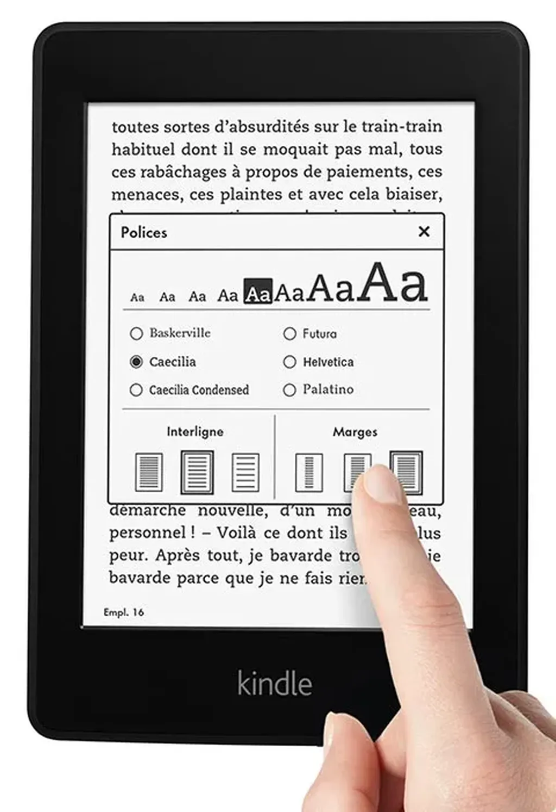

# Lire sur tablette, c’est lire sans culpabilité

Il ne vous est jamais arrivé de cacher la couverture d’un livre, de honte ou de peur de choquer ? Je me souviens de ma lecture des *Onze mille verges* alors que j’avais onze ans. J’avais glissé le livre au milieu d’un Tintin. Mais tout cela est bien terminé. Quand je lis dans le TGV *Fifty Shade of Gray* sur mon Kindle, personne s’en rend compte.

Comme la lecture est une activité souvent publique, j’imagine que la lecture numérique décomplexe bien des lecteurs. Réticents à se montrer fervents de pornos ou de best-sellers, ils s’en donnent désormais à cœur joie sans que personne ne fronce les sourcils dans leur direction. Et ce n’est pas pour rien si l’érotisme connaît un grand boom populaire. Né dans les alcôves du numérique, puis consacré par de fantastiques chiffres de vente, ces livres peuvent se répandre en suite dans les rues et les wagons de train sans que plus personne n’y trouve à redire.

Lire en numérique, c’est lire dans l’intimité, même quand on est au lit avec quelqu’un d’autre. On peut s’envoyer un porno et prétendre lire un essai de Crouzet. Cette lecture secrète ne peut que favoriser les best-sellers et les textes jadis tendancieux. « Même plus de scrupule. Personne ne le saura. »

Le numérique loin de pousser le lecteur à l’exploration l’inciterait à assouvir sa curiosité de ce qui excite les autres, et donc de lire les mêmes textes qu’eux. Le numérique n’est que potentiellement une machine à diversifier. C’est une possibilité théorique qui ne peut advenir que si nous nous en saisissons en grand nombre.

#best-sellers #ebook #edition #dialogue #y2014 #2014-2-22-14h18
