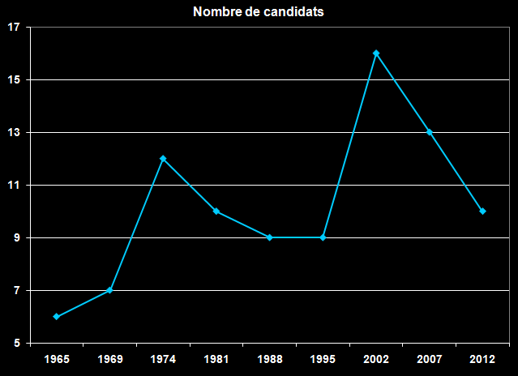

# Mediapart n’est pas mort

Des internautes qui se croient très malins se moquent souvent de mon article de juin 2008 titré « [Mediapart mort-né](../../2008/6/mediapart-mort-ne.md) ». Je me suis bien planté sur le coup. Mediapart est toujours là, et bien là. Si ma seule erreur avait été de me tromper sur l’avenir d’un site de news, ce serait sans grande importance. Qui ne se trompe pas à ce jeu de la bourse ? Mon plantage est beaucoup plus grave, et presque dramatique.

C’est toute une vision d’internet qui est tombée en lambeaux ces dernières années. La vision des utopistes. Le succès de Mediapart, c’est l’échec d’un internet décentralisé, open source, non-marchand. Depuis 2008, et la crise, nous avons connu une inversion de l’histoire. Concentration, recentrage, consolidation. Haro aux petits. « Plus j’ai de tunes, plus j’ai de chance de survivre. Quand je suis petit, indépendant, libre, je sombre. »

Paradoxalement, [j’avais commencé à prendre conscience du danger dès 2007](../../2007/7/hypercentralisation.md), mais je n’avais pas à l’époque compris que le processus de recentrage allait s’accélérer et gagner le moindre recoin du Net.

Pour tout vous avouer, je n’aurais pas écrit cet article contre Mediapart, si je n’avais pas croisé fin 2006 Edwy Plenel lors d’une conférence donnée à Science Po Paris. J’étais venu présenter ma théorie de [la longue traîne politique](../../2006/12/la-longue-traine-politique.md), exposée dans *[Le cinquième pouvoir](../../page/le-cinquieme-pouvoir)*.

Je défendais l’idée que plus le nombre de candidats est grand au premier tour d’une élection, mieux la démocratie fonctionne, offrant aux électeurs une variété sans cesse grandissante d’options politiques. J’observais alors, avec enthousiasme, que même la République française se démocratisait peu à peu [au vu des courbes](../../2012/3/la-democratie-de-la-rarete.md). Selon moi, la longue traîne médiatique se développait en même temps que la longue traîne politique. La multiplication des médias ne pouvait qu’entraîner la promotion d’une multitude d’idées alternatives et donner des envies de représentation à de plus en plus de citoyens.

Par ses propos ce jour-là, Edwy Plenel m’est tout de suite apparu comme un ennemi d’internet, de cet internet des utopistes épris d’auto-organisation et de décentralisation, cet internet de la gratuité et du non-marchand où professionnels et amateurs se côtoient. Dans les annales de la table ronde de Science Po, Plenel déclare :

> Ce mouvement démocratique [le journalisme citoyen] qui nous bouscule tous me paraît légitime. Gardons-nous cependant de tomber dans certains pièges. […] Aujourd’hui, le modèle de l’audience et de la gratuité voudrait s’imposer comme modèle unique de l’univers médiatique, ce qui conduit à une perte de qualité et à un journalisme sans journalisme […]

Après cette annonce programmatique de Mediapart, nous avons vu le site se lancer et [mon sang s’est mis à bouillonner](../../2008/3/le-ridicule-a-la-francaise.md). Je n’ai pas été très perspicace. Plenel n’avait pas tourné sa verse. Bien au contraire. Avec d’autres partout ans le monde, il avait décidé de renverser internet, et avec lui un processus régénérateur de la société. D’ailleurs, lors de la conférence de Science Po, il avait avoué son intention :

> Nous devons tout simplement refaire de notre pays une démocratie.

Cette déclaration survient alors même que la démocratie ne s’est jamais portée aussi bien (selon mon analyse d’utopiste). Et patatrac ! Dans toutes les élections qui ont suivi en France, la longue traîne politique s’est évanouie. Recentrage du nombre de candidats en même temps que recentrage médiatique. Objectif atteint par Plenel et ses amis. On ne gagne du fric et du pouvoir que dans la concentration.

La longue traîne médiatique a fait long feu. Avec le succès de Mediapart et ses avatars, payants ou non, nous gagnons une centralisation médiatique néfaste pour la démocratie. Ce n’est pas ainsi que nous dépasserons la crise de la complexité dans laquelle nous sombrons peu à peu.

Beaucoup de partisans de Mediapart se félicitent de son existence. Ce site serait presque le défenseur de la moralité politique. Mais il faut bien voir que son existence ne se justifie que dans un système politique véreux à l’extrême, un système enkysté, un petit monde qui tourne en vase clos et qui s’est fermé depuis longtemps aux pensées neuves.

Le succès de Mediapart est donc pour moi une mauvaise nouvelle, non pas parce que je me suis trompé en 2008, mais parce que tout un internet auquel je crois encore s’éloigne tous les jours plus loin de nous. Plutôt qu’aller vers l’abondance politique, médiatique, intellectuelle, quitte à ce qu’elles soient vertigineuses, nous revenons à la rareté propre à la société de prédation.

Le succès de Mediapart, Rue89, Huffingtonpost, c’est l’échec de millions de blogs, l’échec de la société ouverte, l’échec de la démocratie. C’est encore une fois la victoire du capitalisme sur l’individuation. Un Mediapart ne peut réussir que dans une société simple, où les camps se dessinent comme dans une belle histoire digne d’un JT de TF1. Et les grands partis s’en félicitent. Ils préfèrent se faire étriller de temps à autre par les fous du roi assermentés que prendre des volées de bois vert par des millions d’anonymes incontrôlables.

*PS : Comme la plupart des autres « grands » sites de news, Mediapart héberge des blogs, stratégie logique de recentrage, d’enfermement, d’emprisonnement, et aussi stratégie de référencement en multipliant les contenus (le gratuit a soudain des vertus).*

#netculture #breves #y2014 #2014-2-27-11h4
