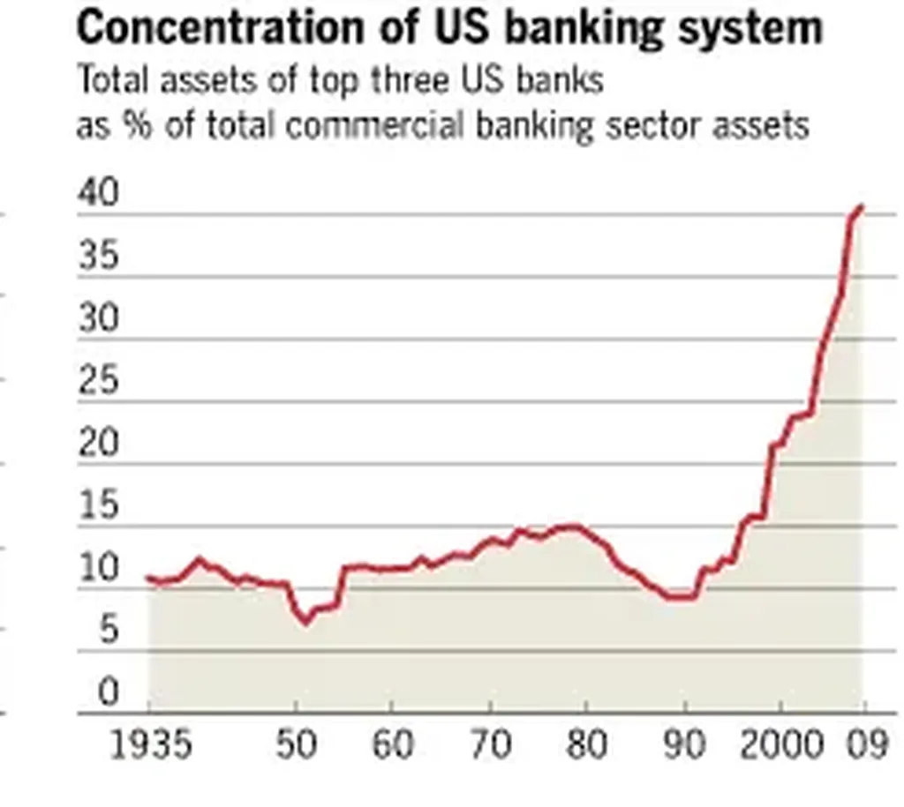

# Pour en finir avec la Net dictature

Suis-je pessimiste ? J’ai plutôt fait preuve d’un excès d’optimisme durant les années 2000. Fin 2011, je suis revenu de mes six mois de déconnexion avec un regard différent sur la chose numérique. Plutôt que de prétendre, par un abus de volonté de puissance, que nous allons vers une nouvelle humanité, j’essaie désormais de regarder la réalité sociale.

Mon espoir, lui, n’a pas changé. Mais je suis souvent obligé de constater qu’il ne coïncide en rien avec les faits. Il ne suffit pas d’imaginer une belle théorie pour que les foules l’adoptent. Les foules font ce qu’elles veulent, elles inventent leur propre théorie.

Je n’ai jamais joué au futurologue. Je suis plutôt un auteur SF qu’un essayiste. J’ai décrit des possibilités avec l’envie qu’elles adviennent sans avoir aucune certitude ni sur le moment ni sur le lieu. Je constate que la plupart des acteurs du numérique confondent la SF avec la réalité. Nous avons tendance à généraliser ce qui est valable pour nous à l’humanité. Pire, nous tentons de l’imposer. Et chaque nouvelle vague de jeunes aficionados surgit avec le même travers.

De quel droit ? Nous ne sommes que des prétentieux. La sociologie et l’histoire exigent que nous nous intéressions aussi à la réalité du terrain. Nous ne pouvons pas nous enfermer dans un constructivisme dangereux, comme nous le faisons souvent avec le revenu de base. Des idées peuvent nous sembler géniales, mais si nos contemporains n’en veulent pas, elles restent des chimères, aussi belles soient-elles. Un jour viendra peut-être pour elles, mais cela n’a guère d’intérêt pour nous. Nous avons effectué un travail préparatoire en les mettant à jour, c’est tout. Ainsi marche l’humanité. [Ératosthène](../../page/eratosthene) pense la géographie terrestre avec 1800 ans d’avance sur les savants de la renaissance. Son œuvre n’a pas été inutile, il a eu raison avant tout le monde, mais son monde n’était pas prêt.

Je pense que la plupart de nos utopies n’auront pas aussi longtemps à attendre. Pour autant, elles ne sont pas toutes en train de se déployer autour de nous en ce moment même. Le Web apparut comme une promesse de décentralisation ne cesse de se centraliser. Les médias aussi. Et les blogueurs restent des marginaux. Avec certes un peu d’influence, mais presque à la mode ancienne des intellectuels. Rien ne neuf, sinon en pire, avec plus de puissance que jamais entre quelques mains.

Alors [quand j’analyse le marché du livre](#best-sellers) et en tire des conséquences sur le comportement d’ensemble de mes contemporains, on peut m’accuser d’être inutilement alarmiste, c’est vrai par rapport à notre rêve, mais malheureusement pas en regard des faits. Je me borne à constater le décalage entre le rêve et la réalité.

J’ai d’ailleurs émis l’hypothèse que le marché du livre n’était plus indicateur pertinent de la curiosité sociale. Où regarder ? La topologie sans cesse plus concentrationnaire du Web ne va malheureusement pas dans un autre sens. De même que toutes les analyses des flux que je découvre au fil des études. Les riches deviennent plus riches. Et pourquoi ? Parce que nous diversifions de moins en moins nos dépenses. Nous donnons notre travail et notre confiance à un nombre d’acteurs toujours plus réduit. De la finance à la culture, nous assistons au même spectacle.

Oui, il existe une sphère non marchande. Nous y sommes en ce moment même sur ce blog. La vérité, quand je donne un texte gratuitement, il est moins lu qu’un texte payant. L’idée du non marchand est une de nos utopies, un privilège pensé par des fonctionnaires ou des rentiers, ou pseudo rentier comme moi. Les gens, dans leur grande majorité, préfèrent accroître la richesse des riches plutôt qu’aller renflouer un pauvre. Dans le livre ça donne, j’achète un best-seller plutôt qu’un texte dont personne ne parle, tant bien même il est gratuit.

Nous ne cessons de nous battre pour qu’existent d’autres possibilités. Nous devons persister. Un jour, ce travail aura un sens. Aujourd’hui, nous nous contentons de tracer des chemins empruntés par des charrettes et gardons nous de croire que nous travaillons au chantier d’une autoroute.

Si nous refusons de regarder la réalité, nous nous préparons de graves désillusions. Ou pire, par un effet terroriste de notre volonté de puissance, nous risquons d’agir en potentat. À vouloir le bien d’autrui, on finit souvent son tortionnaire.

Pour ma part, je me borne à donner à penser, même en contre, et que chacun construise son jardin et que tous ces jardins s’interconnectent. Personne ne doit se prétendre le grand organisateur de leur interconnexion.

[caption id="attachment\_34522" align="alignnone" width="246"] Concentration du système bancaire américain[/caption]

#netculture #coup_de_gueule #y2014 #2014-2-23-11h45
