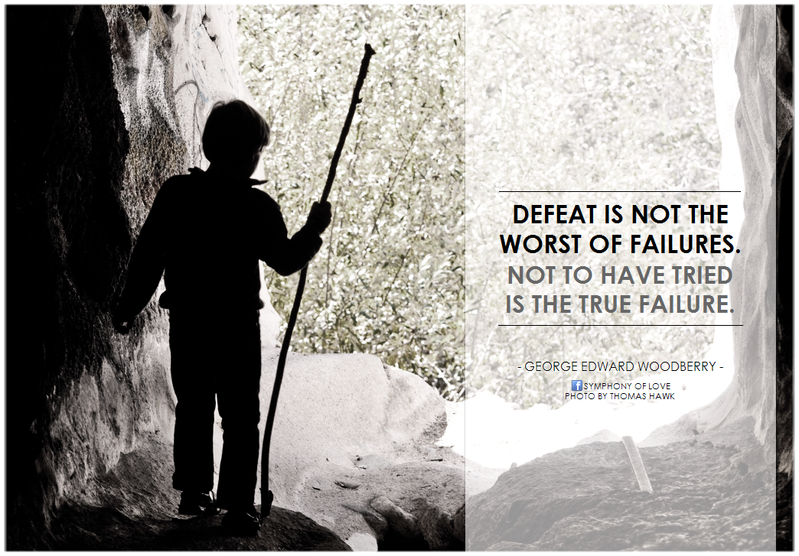

# Défaite

Quand tu perds une élection nationale tout en restant au pouvoir, tu n’as plus rien à perdre, tu devrais tout tenter, l’innovation la plus folle. Malheureusement, en politique, le conservatisme l’emporte même dans la défaite.

#aphorisme #y2014 #2014-3-30-22h13
