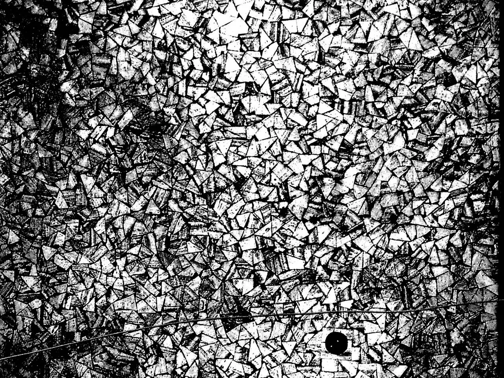

# Complexité

L’ordinateur est à la complexité ce que le télescope est à l’infiniment grand ou le microscope à l’infirment petit. Mais là où le télescope et le microscope ne nous permettaient que d’observer, l’ordinateur transforme. Il engendre par lui même la complexité.

#aphorisme #y2014 #2014-3-19-19h20
