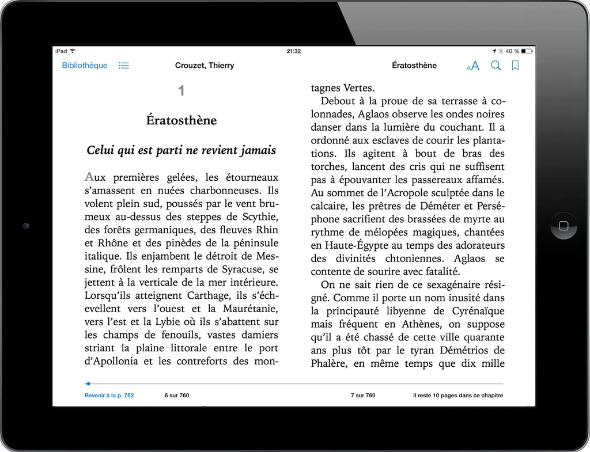

# Pourquoi j’aime lire en numérique

Quand j’ai dit à Isa que je voulais prendre le contre-pied de notre [Lorenzo national](http://www.idboox.com/infos-ebooks/tribune-libre-pourquoi-les-liseuses-mont-decu/), elle m’a dit à quoi bon répéter pour la millième fois les mêmes arguments. Ma réponse : « Pour faire mes gammes, je n’ai rien écrit aujourd’hui. » Alors, oui, j’aime lire en numérique, sur liseuse, tablette, ordi, portable… Ces écrans ne forment plus qu’un vaste continuum, les textes passant des uns aux autres.

### 1

J’aime lire les textes que je ne pourrais lire nulle part ailleurs.

### 2

J’aime lire ce que les éditeurs ne veulent pas ou ne peuvent pas publier.

### 3

J’aime me sentir en position de subversion de la pensée dominante.

### 4

J’aime croire que lire c’est changer le monde, et alors la façon de lire à son importance.

### 5

J’aime lire la nuit sans déranger Isa qui dort à côté de moi.

### 6

J’aime lire dans mon lit [Neil Jomunsi](http://page42.org/), [Lionel Dricot](http://ploum.net/), [Seb Musset](http://sebmusset.blogspot.fr/)… Ils deviennent soudain littéraires, parce que je les partage avec des morts.

### 7

J’aime copier-coller des passages.

### 8

J’aime envoyer les textes que j’aime à mes amis.

### 9

J’aime qu’ils m’en envoient.

### 10

J’aime quitter un livre pour un autre, quand sa beauté me submerge.

### 11

J’aime me lever sans trébucher sur des piles de livres empoussiérés depuis des années.

### 12

J’aime les gros caractères et les interlignages larges, mais pas trop.

### 13

J’aime la légèreté qui m’épargne toute fatigue musculaire.

### 14

J’aime caresser la page électronique, la tordre dans l’espace imaginaire.

### 15

J’aime pouvoir lire un livre sur un coup de tête, parce que je le vois évoqué dans un autre.

### 16

J’aime ne plus prendre d’antihistaminique pour me protéger de l’acidité du papier, de l’odeur trop chimique de l’encre, de la puanteur des colles et des vernis des couvertures.

### 17

J’aime me curer les dents dans le reflet de mes écrans, mais mes liseuses préférées sont désormais aussi glabres que le papier, même en plein soleil.

### 18

J’aime savoir combien de minutes ou d’heures il me reste avant d’achever un texte, ou un chapitre.

### 19

J’aime les métadatas qui projettent dans mon esprit le livre sous une forme multidimensionnelle en fonction des opportunités d’interaction offertes.

### 20

J’aime lire gratuitement, et ne payer qu’après, ma façon de pirate d’imposer la société du don.

### 21

J’aime les arbres.

### 22

J’aime voyager avec ma bibliothèque.

### 23

J’aime la non-linéarité du lien hypertexte.

### 24

J’aime les DRM pour avoir le plaisir de les craquer.

### 25

J’aime savoir à quel pourcentage d’un texte j’en suis pour qu’il se matérialise en moi dans toute son épaisseur.

### 26

J’aime lire un texte plus qu’un livre, une œuvre plus que l’objet qui l’enferme.

### 27

J’aime parcourir mes notes, sauter de marque-page en marque-page pour rejouer, en un éclair, une lecture abandonnée des semaines plus tôt.

### 28

J’aime feuilleter des centaines de couvertures, et choisir sur un coup de tête le texte du soir.

### 29

J’aime tourner les pages en silence, sans le moindre froissement irritant.

### 30

J’aime lire dans la pénombre mystérieuse de la nuit.

### 31

J’aime le face à face solitaire avec rien d’autre que les mots qui flottent dans le vide.

### 32

J’aime lire en numérique parce que j’aime publier en numérique en étant mon seul censeur.

### 33

J’aime me délester des objets superflus.

### 34

J’aime les fichiers texte pour leur éternité cristalline et la beauté de leur minimalisme.

### 35

J’aime protéger du feu, archiver partout, chez moi comme dans les nuages.

### 36

J’aime mon mur de livres, mais les étagères débordent déjà de mes lectures de jeunesse.

### 37

J’aime les fichiers, car ils m’aident à lutter contre la tentation onéreuse de la collection.

### 38

J’aime lire dehors et voir la nuit tomber sans m’arrêter de lire.

### 39

J’aime tant lire en numérique que lire sur papier me devient pénible.

### 40

J’aime trop les livres objets pour me satisfaire des tirages commerciaux sur mauvais papier.

### 41

J’aime lire des textes porno sans que ça se voit.

### 42

J’aime que le livre ne se referme pas sur mes mains à cause de sa reliure pourrie.

### 43

J’aime lire en numérique parce que c’est moins cher (si les éditeurs jouent le jeu).

[caption id="attachment\_34850" align="alignnone" width="600"] Première page d’Ératosthène[/caption]

#ebooks #edition #dialogue #y2014 #2014-3-22-21h48
