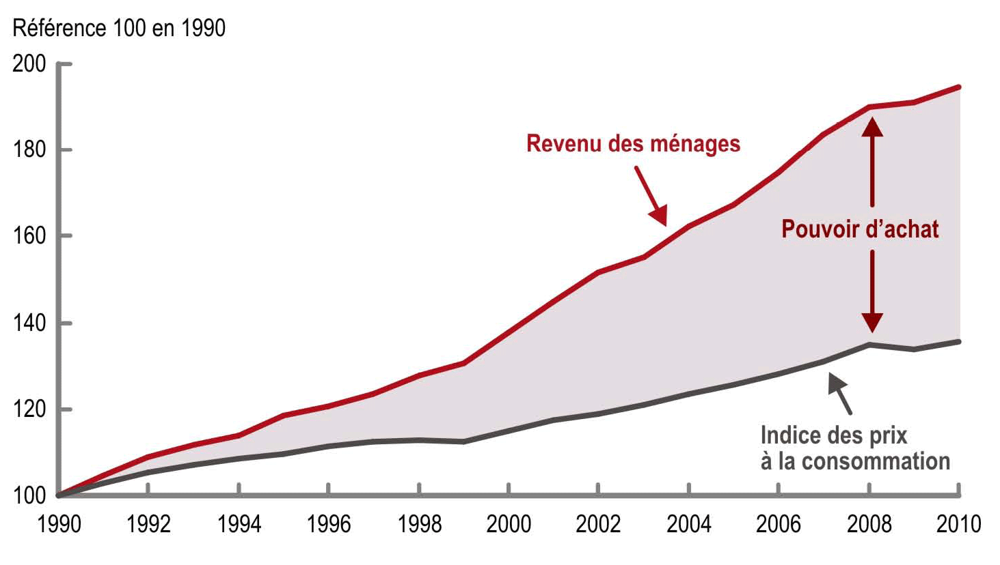
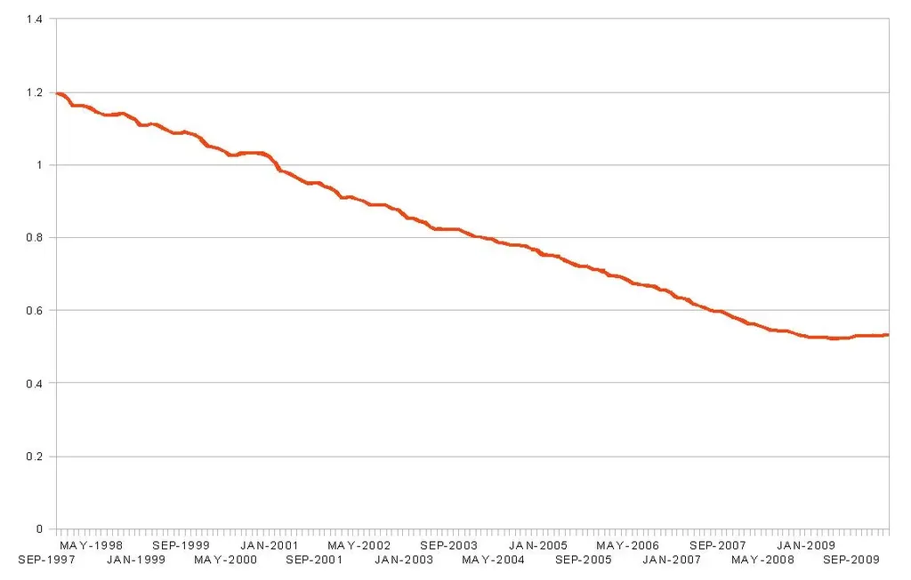
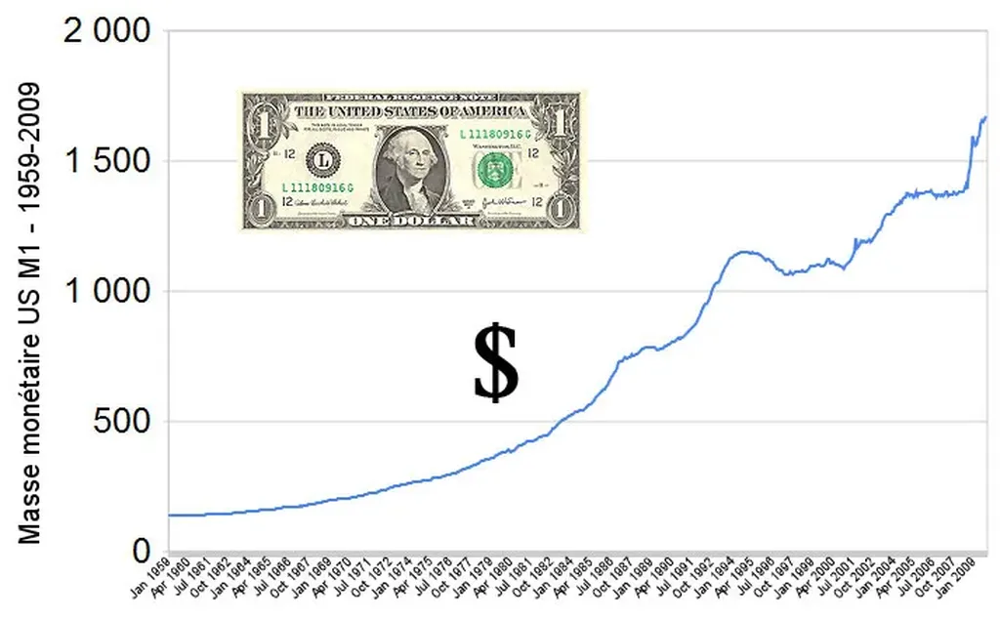
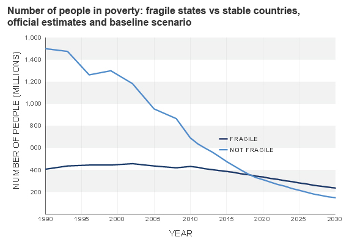

# Pourquoi la pauvreté augmente, n’en déplaise à la Banque Mondiale

C’est une question importante surtout quand [les uns prétendent qu’il y a de moins en moins de pauvres](http://www.banquemondiale.org/fr/news/press-release/2013/04/17/remarkable-declines-in-global-poverty-but-major-challenges-remain) et [les autres de plus en plus](http://www.michelcollon.info/La-pauvrete-a-t-elle-diminue-dans.html). Pour commencer, personne ne s’entend sur la définition de la pauvreté.
1. **Définition objective.** Fixer un seuil de revenu quotidien minimum. Exemple 1,25$ comme le fait la Banque Mondiale. Cet étalon bien que pratique ne veut pas dire grand-chose. Il vaudrait mieux faire débuter la pauvreté [quand on consacre 80 % de ses revenus à se nourrir](../../2008/12/la-pyramide-ne-decolle-pas.md), ce qui souvent exige bien plus de 1,25$ (et il reste à se loger, se soigner…).
2. **Définition subjective.** Si je suis obligé de marcher à pied et que tout le monde roule en voiture, je me sens pauvre, même si je mange à ma faim. Inversement, quand le soir j’assiste à un merveilleux coucher de soleil, je me sens plus riche que l’homme le plus riche du monde enfermé, au même moment, dans une salle de réunion.

Les cartésiens évacuent un peu vite la subjectivité, sous prétexte qu’on ne peut pas l’étudier et la représenter graphiquement. Ainsi il devient très facile d’éliminer la pauvreté ressentie. En France, peu de gens consacrent plus de 80 % de leurs revenus/aides à se nourrir, pourtant nombreux se considèrent comme pauvres. La souffrance d’être pauvre fait pour moi la pauvreté au moins autant que le la faiblesse du revenu.

Il existe peut-être un moyen de synchroniser les études objectives et le ressenti subjectif. Pour cela, il faut cesser de mesurer la pauvreté selon la perspective de la Banque Mondiale et [des faux-monnayeurs](http://www.agoravox.fr/actualites/economie/article/scoop-la-banque-d-angleterre-149472). Comme je ne suis pas économiste, je vais me contenter d’esquisser le raisonnement (au risque d’avancer des évidences). [Stéphane Laborde](http://www.creationmonetaire.info/) m’a appris à penser l’économie comme un einsteinien et non plus un newtonien.

[Newton mesure les vitesses et les accélérations par rapport à un repère qui serait fixe. Einstein remarque que rien n’est fixe. Les vitesses ne peuvent qu’être relatives les unes aux autres et à c, la vitesse de la lumière invariable dans le vide.]

L’économiste newtonien fixe en dur un seuil de pauvreté : 1,25 $. Et il tente de tenir compte de l’inflation pour corriger ce 1,25 $ dans le temps. Pour cela, il a besoin d’étalons invariants : le MacDo, la baguette, le kilo de riz. Il néglige que dans une société sans smartphones, 1 kg de riz n’a pas la même valeur que quand il existe des smartphones. Combien de kilos de riz vaut un iPhone avant l’invention de l’iPhone ? Le problème avec les étalons physiques : ils ne sont pas durables.

On peut voir les choses autrement. La valeur réelle du kilo de riz peut être estimée, à un instant t, comme un pourcentage de la masse monétaire (masse monétaire qui devient l’équivalent de c pour Einstein). Sa valeur est relative. [Quand Laborde s’amuse à mesurer le pouvoir d’achat selon cette perspective](http://www.creationmonetaire.info/2010/04/pouvoir-dachat-de-leuro-de-1997-a-2010.html), il découvre une baisse de 60 % entre 1997 et 2010, baisse que les newtoniens transforment en une augmentation selon leur perspective.

[caption id="attachment\_34828" align="alignnone" width="600"] Évolution du pouvoir d’achat en France selon les newtoniens (insee)[/caption]

[caption id="attachment\_34829" align="alignnone" width="600"] Évolution du pouvoir d’achat selon l’approche relativiste[/caption]

Cela signifie qu’il faut de plus en plus de milliards de kilos de riz pour représenter la masse monétaire, donc que, relativement à cette masse en augmentation, le kilo de riz perd de la valeur. Si en 1980 et 2014, j’ai les moyens de m’acheter 10 kilos de riz, je suis plus pauvre en 2014 qu’en 1980 parce que la masse monétaire a augmenté entre temps (oublions les optimisations de l’agriculture productiviste). Cette dégringolade correspond étrangement au ressenti des gens, habitués à se comparer les uns aux autres plus qu’à se mesurer dans l’absolu.

### Pourquoi la pauvreté s’accroît ?

[Les banquiers fabriquent constamment de l’argent](http://www.agoravox.fr/actualites/economie/article/scoop-la-banque-d-angleterre-149472) et cet argent va dans leurs proches et celles des très riches qui deviennent encore plus riches. Chaque fois que 1$ est fabriqué, la part du 1,25$ dans la masse globale diminue. Il est donc mécaniquement logique que le nombre de pauvres selon la Banque Mondiale ne cesse de diminuer quand on mesure la pauvreté à l’aune du 1,25 $, un étalon qui fond peu à peu relativement à l’ensemble (il se dilue comme un glaçon dans la masse monétaire). C’est une conséquence mécanique. Le 1,25 $; même corrigé par l’inflation, représente une part de plus en plus infime du gâteau. Cela revient à baisser le seuil de pauvreté continument.

[caption id="attachment\_34831" align="alignnone" width="600"] Évolution de la masse monétaire en dollars[/caption]

[caption id="attachment\_34832" align="alignnone" width="576"] La diminution de la pauvreté selon la Banque Mondiale est symétrique par rapport à l’augmentation de la masse monétaire[/caption]

L’écart entre les riches et les pauvres se creuse parce que les riches profitent de la création monétaire, pendant que les pauvres se contentent de miettes. L’écart n’est autre chose qu’un indicateur de la pauvreté relative, celle-là même éprouvée subjectivement par de plus en plus de gens.

Tout en étant capables de mieux se nourir qu’avant, les pauvres sont de moins en moins capables d’accéder aux biens et aux services auxquels accèdent les riches. Si cet écart de potentiel existentiel n’est pas de la pauvreté, je me demande comment on peut bien l’appeler.

Quand la masse monétaire augmente, mon pécule constant en valeur monétaire indexé sur l’inflation me donne accès à un nombre de plus en plus restreint de biens et de services. Ma pauvreté augmente si dans le même temps je n’augmente pas mon pécule à la même allure que la masse monétaire (qui peut s’accroître plus vite que l’inflation). Et c’est bien ce qui se passe pour la plupart des gens, puisque les riches deviennent plus riches au détriment des pauvres. Les riches captent une part de plus en plus grande de la création monétaire empêchant les autres de suivre leur croissance, donc en les appauvrissants relativemenr à eux.

Je ne vois pas comment cette nouvelle masse de pauvres dans une perspective relativiste pourrait engendrer tout en bas moins de pauvreté. C’est bien le contraire qui se produit. Les riches laissent les pauvres avec leur misère et s’éloignent d’eux à une vitesse vertigineuse [quitte à ce que notre civilisation s’écroule sous son propre poids](aphorisme-2.md).

Le revenu de base permettrait de partager entre tous la croissance de la masse monétaire, donc réduirait mécaniquement l’écart entre les riches et les pauvres. En attendant, je défends l’économie non-marchande, le don, la libre contribution parce que l’économie dans laquelle nous achetons et vendons dépend d’un système monétaire qui mécaniquement crée de la pauvreté tout en donnant l’illusion qu’elle diminue. Si un monde avec moins de pauvreté existe, c’est le monde que nous sommes en train d’inventer, pas le monde de la Banque Mondiale.

Dans une perspective relativiste, le seuil de pauvreté devrait être défini comme un pourcentage de la masse monétaire. À cette seule condition, il serait significativement stable dans le temps.

[caption id="attachment\_34833" align="alignnone" width="600"] Un moment qui vaut des milliards[/caption]

#mrdb #revenu_de_base #dialogue #y2014 #2014-3-21-20h44
