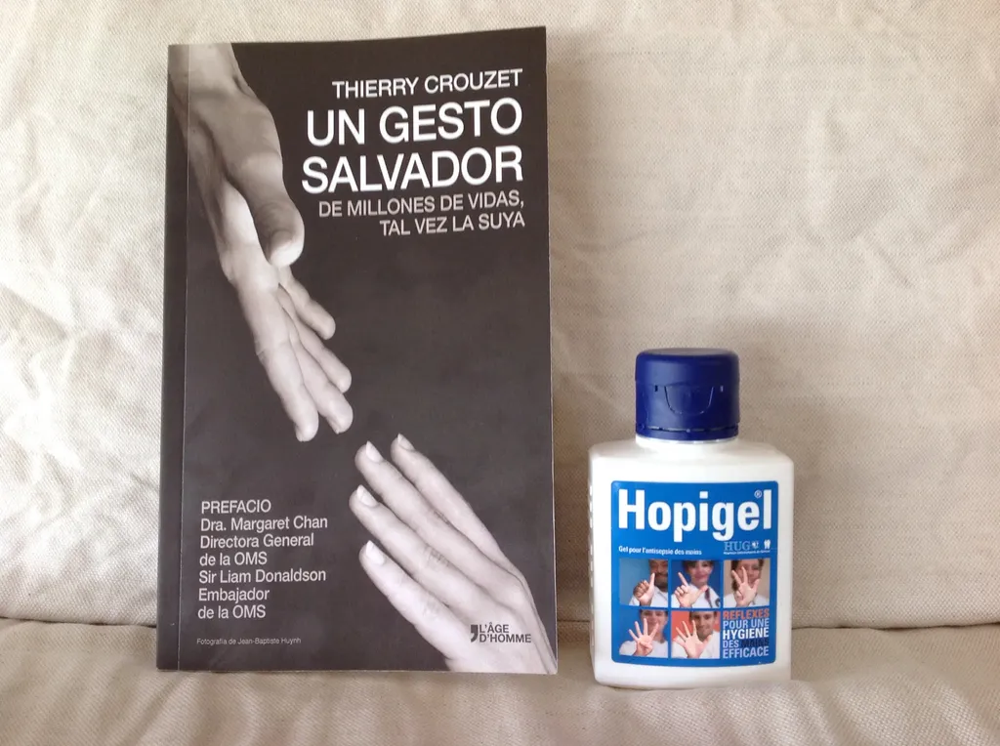
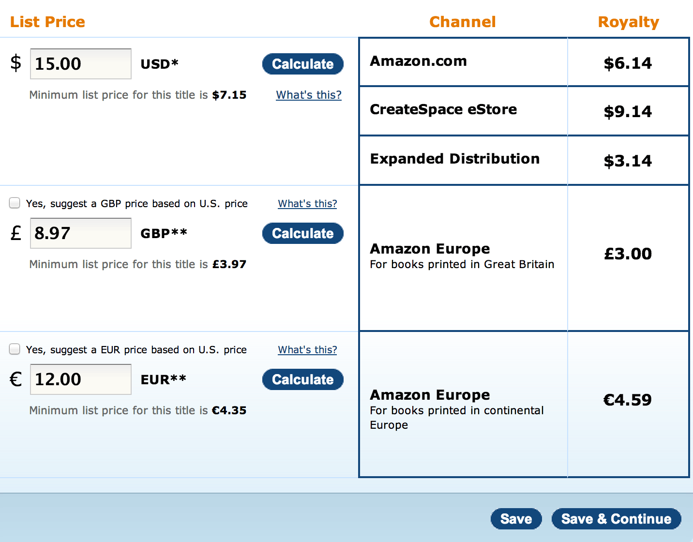

# Quand édition se combine avec autopublication

*[Le Geste qui Sauve](../../page/le-geste-qui-sauve)* sort en fin de semaine à l’occasion du Salon du livre de Genève. Comme ce matin un article l’évoque dans *La Tribune de Genève*, j’ouvre dès aujourd’hui [la page d’accès au texte, version payantes et gratuites,](../../page/le-geste-qui-sauve/downloads) dans toutes les langues, et cette page mérite quelques explications, car elle montre que l’édition se transforme plus rapidement que la plupart de nos éditeurs ne l’imaginent.

Tout d’abord petit résumé du projet. Dans *Le Geste qui Sauve*, [une narrative non-fiction](../../2009/3/narrative-nonfiction.md), je raconte la vie et l’œuvre de Didier Pittet, l’apôtre de l’hygiène des mains qui a su généraliser son innovation tant technique que sociale grâce à l’open source. Résultat : en dix ans, tous les hôpitaux de la planète ont adopté les gels antiseptiques, sauvant annuellement 8 millions de vies.

Pour rester en accord avec le sujet du livre, je ne pouvais adopter un copyright classique et [j’ai choisi une licence Creative Commons by-nc-nd](http://blog.tcrouzet.com/le-geste-qui-sauve/#cc). Le livre sera donc en même temps gratuit et payant, et mes droits sur les exemplaires payants seront reversés au fond [CleanHandsSaveLives](http://www.cleanhandssavelives.org/). Pour un livre acheté, un flacon de gel sera envoyé dans les pays les plus pauvres.

J’en reviens au processus éditorial que les Anglo-saxons découpent judicieusement en deux parties *Editing* et *Publishing*. J’ai débuté l’editing, c’est-à-dire le travail sur le texte, avec Lilas Seewald, mon éditrice-agent, puis je l’ai bouclé avec avec Suzanne Jamet chez [L’âge d’homme](http://www.lagedhomme.com/), ainsi qu’avec le concours des traducteurs.

Pour le publishing, j’ai tenu a garder la main sur les versions électroniques. J’autopublie les versions gratuites [grâce à de simples liens vers box.com](../../page/le-geste-qui-sauve/downloads) (tentez d’utiliser les mêmes liens si vous voulez diffuser les ebooks). Pour les versions payantes, je diffuse grâce à [Immatériel](http://www.immateriel.fr/), qui m’assure un accès aux principales plateformes, même hors de France. Je suis habitué à leur offre, je n’ai pas jugé bon d’expérimenter avec [SmashWords](https://www.smashwords.com). Ma marge est alors de 60 % sur le prix hors taxe. En attaquant en direct Amazon, Apple, Kobo… je n’aurais gagné que 10 % en plus, au prix de beaucoup de tracas et je n’aurais jamais réussi à être présent sur autant de points de vente.

Pour le publishing papier, les choses se compliquent. L’âge d’homme diffuse les versions françaises en libraire. [L’éditeur a aussi imprimé les 26 000 exemplaires en français, anglais, allemand et japonais qui ont été précommandés par les laboratoires soutenant le projet.](comment-financer-un-livre-en-creative-commons.md) Mais L’âge d’homme n’est pas un éditeur international. Il n’a pas de diffuseur anglais, américain, brésilien, allemand… J’ai pris en charge cette partie de la diffusion. C’est là que les choses deviennent surréalistes. Moi, l’auteur, j’ai la capacité de publier un livre partout dans le monde, avec plus de souplesse qu’un éditeur traditionnel.

### Non, je ne me renie pas

J’ai choisi la plateforme d’autopublication [CreateSpace](http://www.createspace.com) d’Amazon. D’après mes quelques investigations, elle offre aujourd’hui les prix les plus bas et maximise les marges. J’en vois déjà qui vont dire que je suis incohérent. Que je défends l’économie de paix, puis que je m’allie au diable pour diffuser mon texte. Que les choses soient claires.

1. Ma priorité est que le texte soit lu parce qu’il porte des idées nobles et généreuses, tant médicales que politiques, et bien plus importantes que le destin économique d’Amazon.
2. Amazon pour moi n’est pas pire qu’une autre multinationale. Toutes les structures centralisées me paraissent dangereuses. Mais Amazon, bien que centralisée, me permet de me décentraliser. C’est l’effet plateforme.
3. Je ne suis pas responsable de la tournure plateforme que prend le Net. Je suis le premier à la dénoncer. La meilleure façon de lutter contre cette dérive, c’est parfois d’utiliser les plateformes pour diffuser des idées qui vont contre elles. Ce que j’appelle la tactique du judoka.
4. Grâce à un service comme CreateSpace, je suis capable de mettre potentiellement un livre papier entre des centaines de millions de mains. Sans rien demander à personne. C’est quasi magique, une forme d’émancipation pour l’auteur.
5. À nous d’œuvrer maintenant pour que de telles solutions de diffusion existent en P2P, mais ne renonçons pas à la décentralisation individuelle sous prétexte qu’elle passe aujourd’hui par des acteurs centralisés. Pour créer leurs successeurs libres, nous avons besoin de communiquer, donc ne nous appuyer sur les acteurs criticables pour demain les dépasser.

### Les chiffres, maintenant

CreateSpace me propose de commander les livres pour 2 €/exemplaire. Quand un éditeur traditionnel passe par un imprimeur, qu’il commande plusieurs milliers de livres, il arrive sous la barre des 1 €/exemplaire, mais quand il commande quelques centaines de copies, il n’obtient guère mieux qu’avec CreateSpace.

Je dois tenir compte du transport. Pour un seul exemplaire, le port est excessif, 3,3 € au minimum avec 40 jours de délais et 10 € pour une livraison express via DHL. Quand on prend 100 exemplaires, le port express tombe à 1 €/exemplaire. Le coût de revient réel est donc de 3 €/exemplaire, ce qui est honnête, mais à vrai dire sans grand intérêt. Je n’ai pas l’intention de commander des livres pour moi. Les lecteurs internationaux les achèteront directement sur Amazon, Barnes & Nobles, BAM…

L’âge d’homme commercialise le livre papier à 12 €. J’ai choisi de pratiquer la même tarification. Mais comme les TVA varient d’un pays à l’autre, j’ai fixé le prix HT en Europe à 12 € et 15 $ ailleurs.

[caption id="attachment\_35265" align="aligncenter" width="600"] Marge sur CreateSPace[/caption]

Ma marge est alors d’environ 4,5 € par exemplaire, soit 37 %. Les éditeurs traditionnels n’obtiennent guère mieux. Aucun auteur édité ne reçoit 37 % de royalties.

Cela signifie qu’en quelques clics, sans aucun engagement, je peux commercialiser des livres à un prix compétitif. Et la qualité ? Elle est tout simplement stupéfiante. Avec une couverture mâte et un papier crème, le résultat est supérieur à beaucoup de livres diffusés dans nos librairies. Un seul bémol, CreateSpace impose de folioter toutes les pages, même les pages de garde ou les belles pages.

Les éditeurs doivent-ils paniquer ? Non. Ils ont deux métiers. Le premier, l’editing, reste fondamental. Le second, le publishing, doit être repensé. Si j’étais à leur place, je traduirais immédiatement tous mes textes en anglais. Entre la version ebook et la version en impression à la demande de CreateSpace, je couvrirais au minimum 60 % du marché anglo-saxon, soit des centaines de millions de lecteurs potentiels. Je crois qu’il est urgent pour l’édition de s’internationaliser.

J’imagine même qu’un éditeur français pourrait se spécialiser dans l’international. Voilà une idée de business pour une start-up. Prendre les meilleurs livres français, les faire traduire, les diffuser à l’aide des canaux numériques dans le reste du monde. L’édition et l’autopublication loin d’être opposées peuvent s’unir. C’est pour quand la French Touch Littéraire ?

[caption id="attachment\_35266" align="aligncenter" width="600"] La version espagnole imprimée par CreateSpace.[/caption]

#edition #le_geste_qui_sauve #dialogue #y2014 #2014-4-28-9h29
