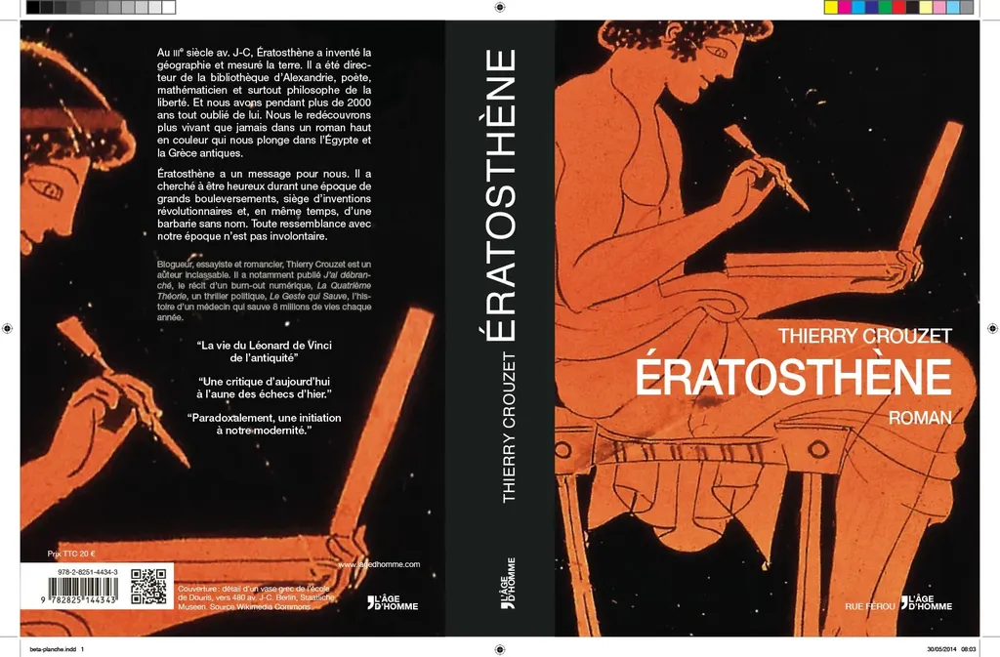
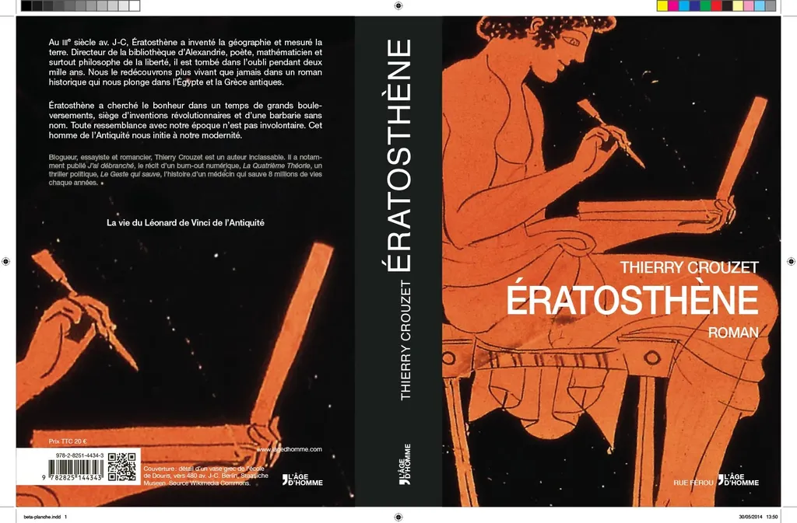

# Ératosthène, planche de couverture

Quand je réussis à ouvrir mon atelier sur le Net, à travailler avec des dizaines de voix anonymes ou familières, je me dis chaque fois que nous avons beaucoup de chance. C’est stimulant, excitant, et j’ai l’impression que les choses prennent plus de sens. Grâce à vous, la couverture et la quatrième de couverture de mon roman gréco-égyptien sont en train d’être finalisées.

[caption id="attachment\_35864" align="aligncenter" width="600"] Ératosthène, planche de couverture.[/caption]

#eratosthene #breves #y2014 #2014-5-30-8h22
