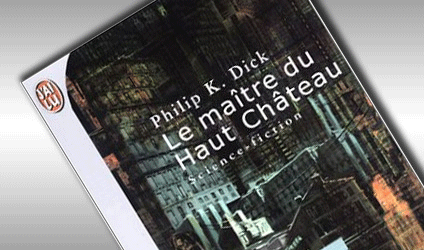

# La métaphore du Net et du château

Imaginez nos paysages. Vastes campagnes ponctuées de fermes isolées, de villages, de villes, de capitales régionales et de mégalopoles. Avec des routes qui les relient. Des frontières naturelles, mers, montagnes, déserts, de moins en moins de frontières administratives. Dans cet espace, nous jouissons d’une relative liberté de mouvement. Beaucoup d’endroits étant publics. Et nous trouvons à peu près tout n’importe où.

Le Net est une sorte de paysage, avec aussi des fermes isolées cultivées par des blogueurs farouchement indépendants, des villages qui regroupent les sites communautaires, des villes, qui offrent des services, des capitales qui hébergent les grands médias, des mégalopoles aux mains de quelques entités transnationales.

L’analogie commence alors à se troubler. Quand je veux acheter du sucre sur le territoire géographique, il me suffit d’entrer dans la première supérette venue. Sur le territoire numérique, je dois aller jusqu’à la mégalopole des mégalopoles. Elle ressemble à une gigantesque forteresse, peut-être pas imprenable, mais je souhaite bien du bonheur à ses assaillants.

Pourquoi ne pas aller ailleurs ? Les mégalopoles ont construit de merveilleuses autoroutes qui mènent droit à elles. C’est comme si je pouvais me téléporter. Les nationales et les départementales ont été négligées. Les chemins communaux abandonnés aux ronces. On les appelle encore liens hypertextes. [Les maîtres des hauts châteaux n’encouragent plus leur ouverture](un-livre-na-pas-dadresse-lapres-web-non-plus.md), ils auraient même tendance à punir ceux qui useraient de leur machette pour se frayer de nouvelles voies dans une jungle de plus en plus dense, où seuls des robots automatisés réussissent à se faufiler. Et ce n’est pas pour rien qu’on les appelle spider.

Sur le Net, nous les internautes ressemblons aux serfs qui se rendaient en longues processions à la ville du châtelain pour vendre leurs maigres surplus. Pouilleux, grelottants sous la neige, ou exténués sous un soleil de plomb. Alors nous doublent des carrosses d’or où festoient les bouffons des maîtres.

Tous les jours nous reprenons la route, chaque fois contrôlés, traqués, identifiés, fichés. Rien de plus facile, car nos mouvements sont prévisibles. Nous n’avons pas le choix, car nous avons besoin de sucre et on ne le trouve plus que dans l’entrepôt principal de la mégapole des mégalopoles.

Des entrepôts concurrents apparaissent de temps à autre. Personne ne les trouve faute d’autoroutes qui mènent à eux. Leurs spiders se font dévorer dans la jungle. Les serfs pourraient même être punis pour trahison si on les surprenait à découcher.

Alors des gens décident de quitter ce territoire numérique pour revenir habiter dans la géographie aux mœurs plus permissives. Ils abandonnent le fils qui les relie au château. Ils marchent dans la ville, flânent en terrasse de café, puis s’éloignent dans les champs et les chemins de traverse. Et ils éprouvent une sensation de vivre insurpassable. Ils goûtent la liberté de boire un verre quand ça leur chante sans avoir à courir à la seule pompe à bière de la planète. Ils parlent avec qui ils veulent, quand ils veulent, sans avoir à se précipiter dans la seule citadelle où les débats sont autorisés. Ils se disent que l’existence était jadis plus simple, plus naturelle, plus harmonieuse.

Parmi eux certains des plus âgés éprouvent un malaise grandissant. Ils ont connu le Net à ses débuts, quand les bistrots aussi y étaient ouverts à tous les coins de rue, et ils comprennent qu’ils ont laissé la dictature s’installer. La culpabilité les taraude comme elle taraude les habitants des régions ravagées par l’urbanisation sauvage.

« Nous sommes responsables. Nous n’avons pas été vigilants. »

Ils souffrent d’autant plus que le Net leur est devenu indispensable. Il ne leur reste plus qu’une possibilité : inventer un espace numérique parallèle, et puis encore un autre, en feuilles successives, comme des multivers. Que la dictature s’installe dans l’un, on saute dans l’autre, en veillant à fermer la porte derrière soi, pour ne pas être suivi par les démons et leurs robots fouineurs.

#netculture #dialogue #y2014 #2014-5-28-13h33
