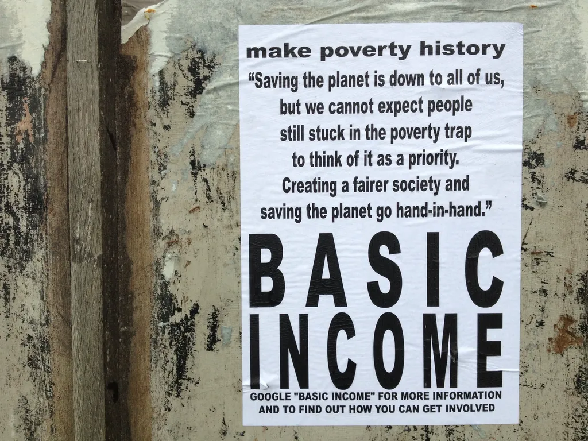

# La nécessité logique du revenu de base

Pour justifier la nécessité du [revenu de base](#revenu-de-base) certains invoquent des raisons éthiques, d’autres des principes philosophiques, d’autres des positions politiques, tous posent des postulats ou des croyances. Une méthode moins discutable est peut-être tout simplement d’invoquer une logique situationniste.

Je voudrais discuter la proposition suivante :

> Prix tendent vers zéro => Revenus tendent vers zéro => Revenu de base

### Prix tendent vers zéro

Prix de la copie des informations, de leur diffusion, de leur stockage. Tout le monde a compris ce point. D’autres prix tendent vers zéro de façon moins apparente. Prix de la production avec la robotisation et les imprimantes 3D. Prix des services avec les algorithmes de plus en plus intelligents. Prix de l’énergie avec le développement inévitable des énergies renouvelables. OK, la technologie ouvre de nouveaux champs, mais eux-mêmes vite dévolus à la dégringolade tarifaire. Certains domaines resteront étrangers à ce mouvement mais ils contribueront à une part de plus en plus réduite de l’économie réelle.

### Revenus tendent vers zéro

La possibilité de copier gratuitement les biens culturels implique que de moins en moins de gens les achètent. Donc les créateurs gagnent de moins en moins d’argent. C’est le cas dans un domaine que je connais bien : l’édition.

La gratuité ou quasi gratuité n’implique pas obligatoirement la ruine du créateur, ses fans pouvant comprendre la nécessité de le rémunérer pour qu’il continue à travailler, mais les fans eux-mêmes voient leurs revenus baisser, ou s’évanouir parce que des machines ou des algorithmes les remplacent peu à peu.

La libre copie ne ruinerait pas la création si le reste de la société n’était pas en même temps soumis à une perte massive du pouvoir d’achat, pouvoir d’achat qui se concentre dans les mains des possesseurs de machines et d’algorithmes.

### Revenu de base

Ford a jadis compris qu’il devait payer ses ouvriers pour qu’ils puissent se payer les voitures qu’ils fabriquaient. Aujourd’hui, on remplace les ouvriers par des processus automatisés qui n’ont pas à être rémunérés, juste upgradés.

Si la masse de ceux qui ne travaillent pas pour un salaire (artistes, développeurs de solutions libres, parents qui s’occupent de leur famille, bénévoles…), masse vouée à croître démesurément, ne possède aucun revenu, les possesseurs de machines aussi verront leurs recettes diminuer. Ils doivent donc repenser à Ford. Comme ils n’ont plus guère d’employés humains, ils doivent rémunérer d’une autre façon leurs clients potentiels.

Le revenu de base s’impose. Il reconnaît que dans une société évoluée tout travail joue un rôle politique, tant bien même il n’est pas directement rémunéré. Il serait temps de prendre conscience, sinon les crises n’ont pas fini de se répéter, en même temps que se creusera le fossé entre ceux qui reçoivent un salaire et les autres, toujours plus nombreux, toujours plus désespérés, et prêts un jour ou l’autre à user de la violence.

Aujourd’hui, toutes les politiques tentent d’enrayer le changement. En interdisant la libre copie par exemple, comme jadis certains moines copistes ont tenté de faire interdire l’imprimerie. Combat naturels mais perdu d’avance. Alors dans un monde dominé par la machine, l’homme doit être payé pour vivre, c’est-à-dire pour créer.

### Post-scriptum

J’ai écouté [Bernard Stiegler débattre en bon avocat de ces idées](http://romainelubrique.org/bernard-stiegler). Il en parle comme si lui et ses amis d’[Ars Industrialis](http://arsindustrialis.org/) les avaient inventées. Et beaucoup de journalistes et de lecteurs en France le croient. On me dit souvent « C’est une idée de Stiegler. » Et je dois m’efforcer d’expliquer « Non, c’est une idée aussi défendue par Stiegler. » Ce qui n’est pas tout à fait la même chose. Et la nécessité de cette explication suffit à démontrer que ces idées n’ont pas encore percolé dans la société (ce n’est pas une raison pour les copyrighter).

#mrdb #revenu_de_base #dialogue #y2014 #2014-5-24-12h52
