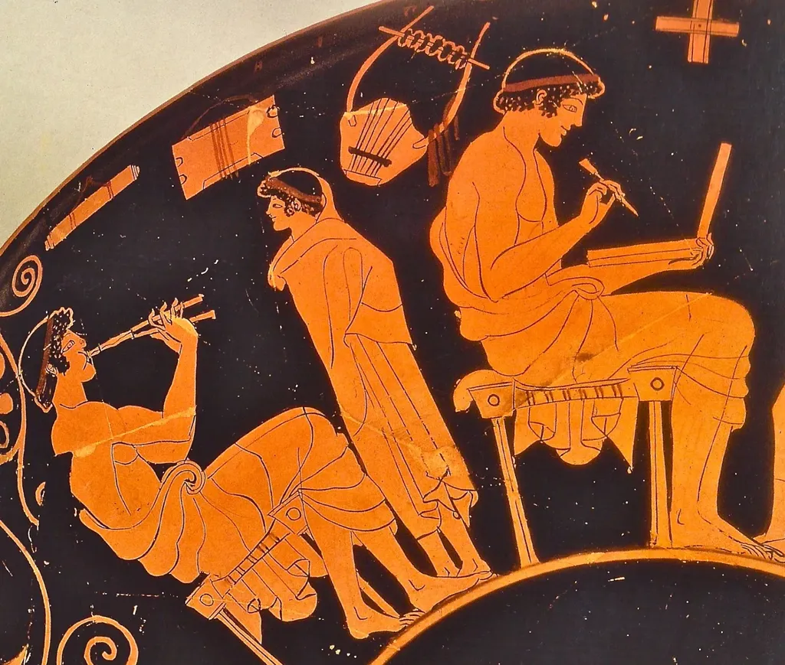
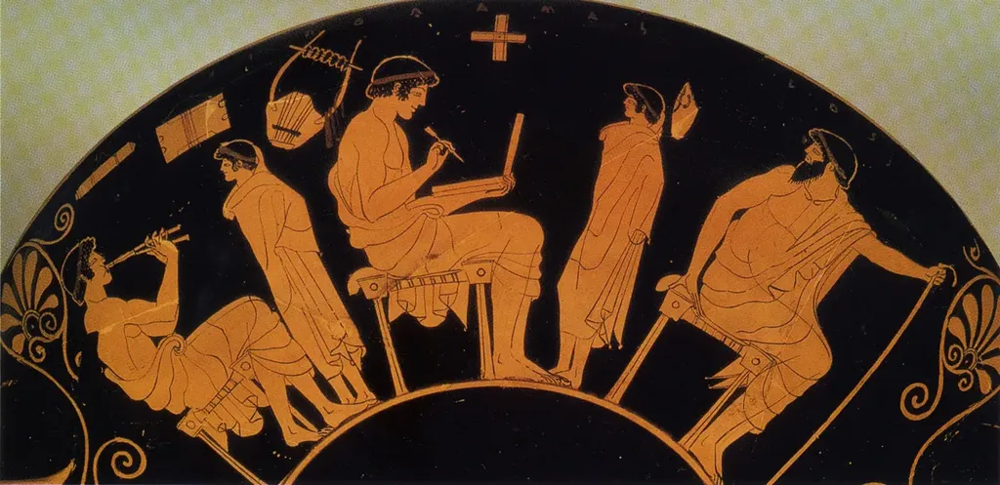
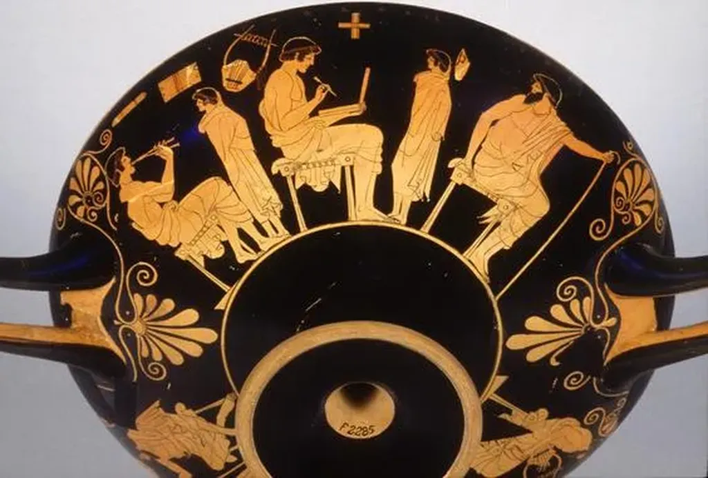
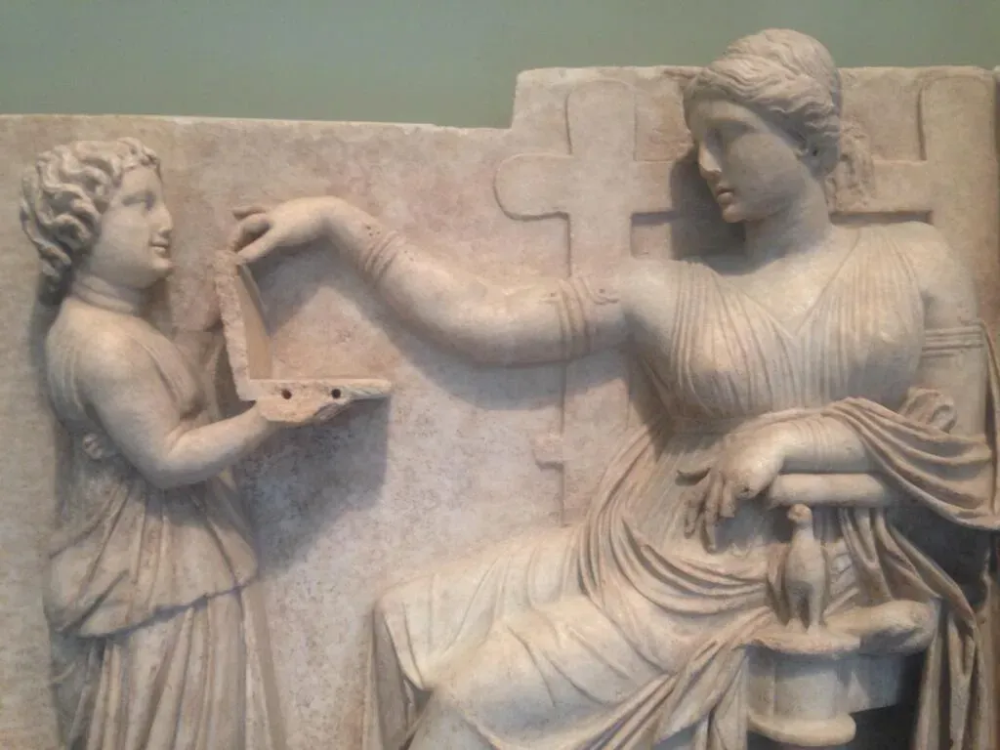

# Les Grecs anciens ont inventé le notebook

En cherchant une image qui pourrait convenir pour la couverture de mon *[Ératosthène](../../page/eratosthene)*, je suis tombé sur un étonant vase de -500/-460 où on voit un jeune homme écrire sur une tablette de cire.

[caption id="attachment\_35709" align="aligncenter" width="564"] Vue du vase.[/caption]

[caption id="attachment\_35921" align="aligncenter" width="600"] Marbre grec, 110 av. J-C.[/caption]

#eratosthene #breves #y2014 #2014-5-19-11h47
