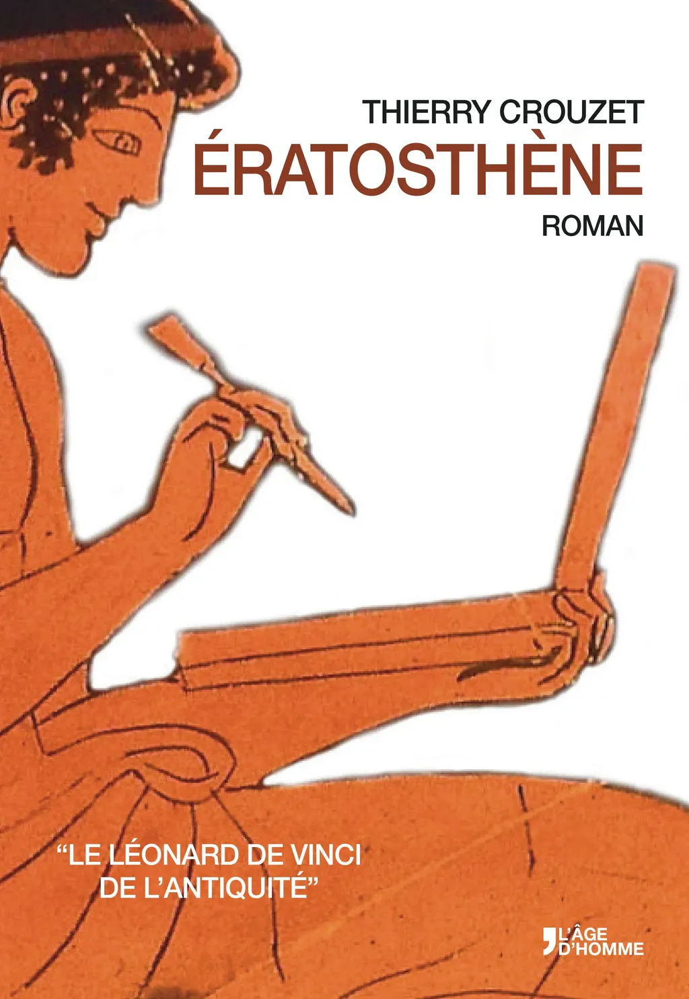
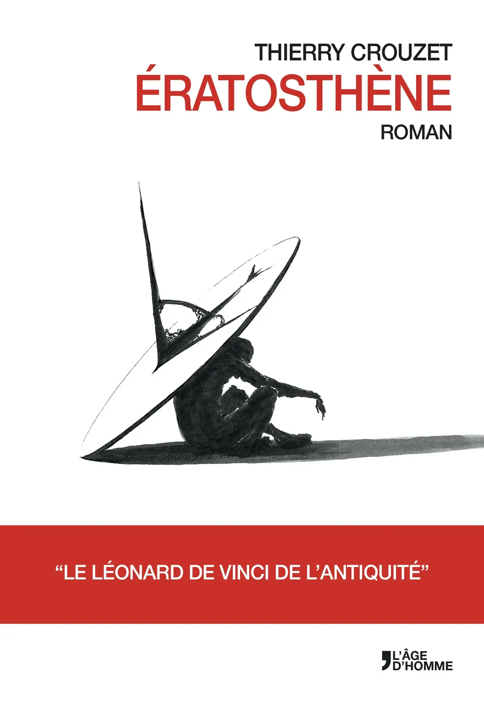
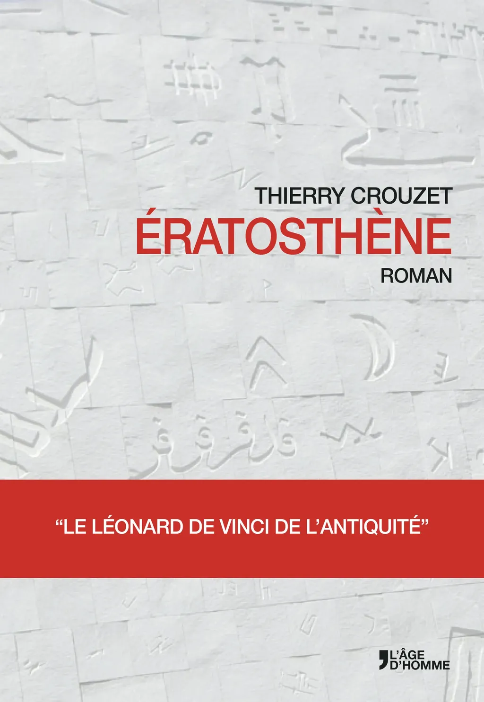

# Trois couvertures, votre avis

Ça me fait bizarre d’en être là. Il y a quatorze ans exactement François Bourin, après avoir lu un de mes carnets de voyage qui traînait sur la table d’une amie, me suggérait d’écrire un roman classique, pourquoi pas un roman historique, pour prouver que je maîtrisais l’art romanesque, avant de prétendre à pouvoir publier des textes plus expérimentaux (mes carnets par exemple).

Je partais alors vivre à Londres, et je me suis dit pourquoi pas regarder du côté de la double vie de Newton, et je suis tombé sur un Grec, et je me suis pris de passion pour lui, et je n’ai pas pu m’empêcher d’écrire un roman expérimental, repris au moins une dizaine de fois, avant de peu à peu lui donner une forme minimaliste. Et aujourd’hui, on est au stade de la couverture. Code typo contractuel de L’âge d’homme. Trois possibilités. Avec slogan ou non. Tout reste possible. Vous pouvez critiquer, suggérer.

[caption id="attachment\_35700" align="aligncenter" width="400"] [L’homme de Douris](http://www.perseus.tufts.edu/hopper/artifact%3Bjsessionid=79B63DFDEEB187321BD0E7ECFACA55E2?name=Berlin+F+2285&object=Vase).[/caption]

[caption id="attachment\_35701" align="aligncenter" width="400"] Un homme à l’ombre d’un gnomon ([image trouvé sur le Net](http://negativefeedback.deviantart.com/art/Gnomon-The-time-eccentric-In-the-shadow-438652217)).[/caption]

[caption id="attachment\_35702" align="aligncenter" width="400"] Mur de la nouvelle bibliothèque d’Alexandrie.[/caption]

#eratosthene #breves #y2014 #2014-5-21-10h24
