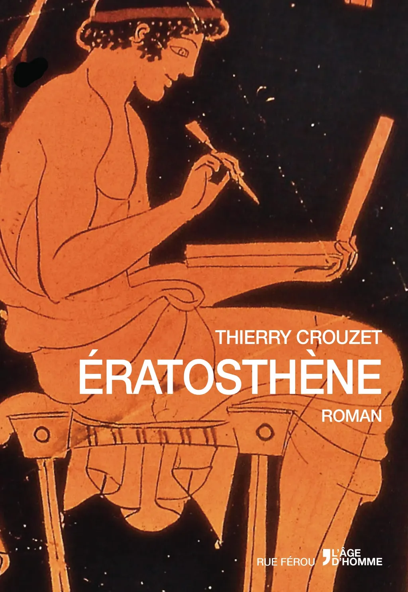
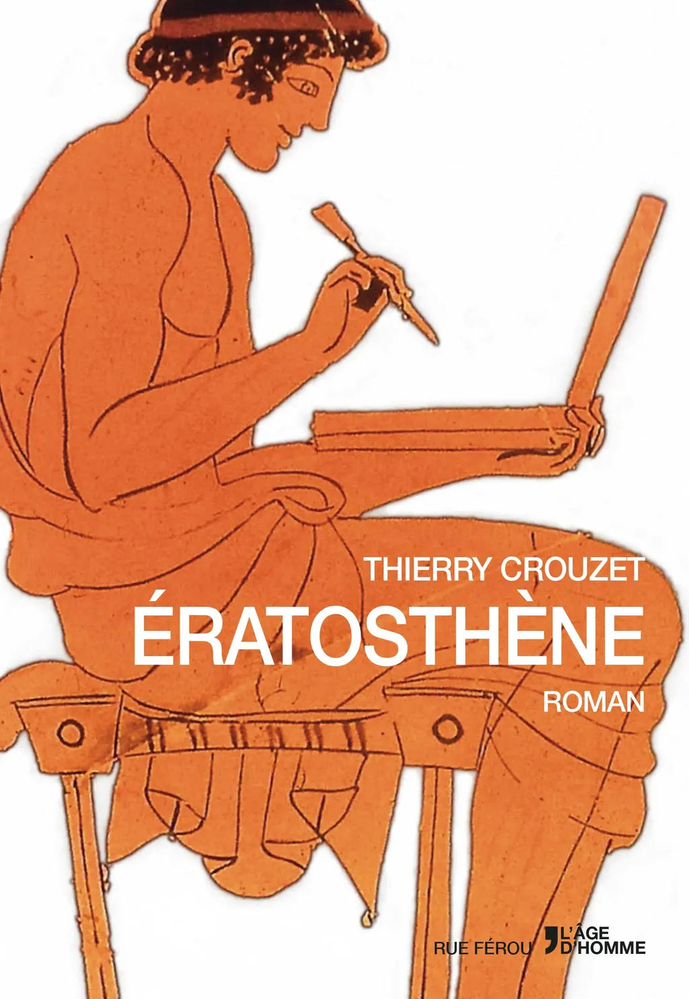
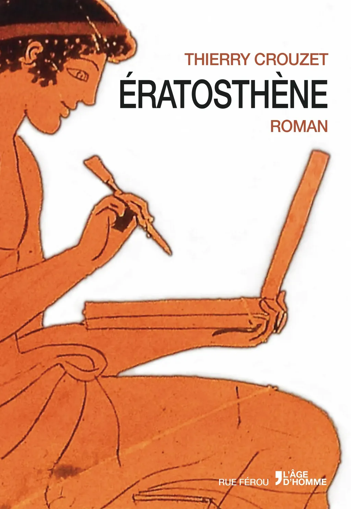
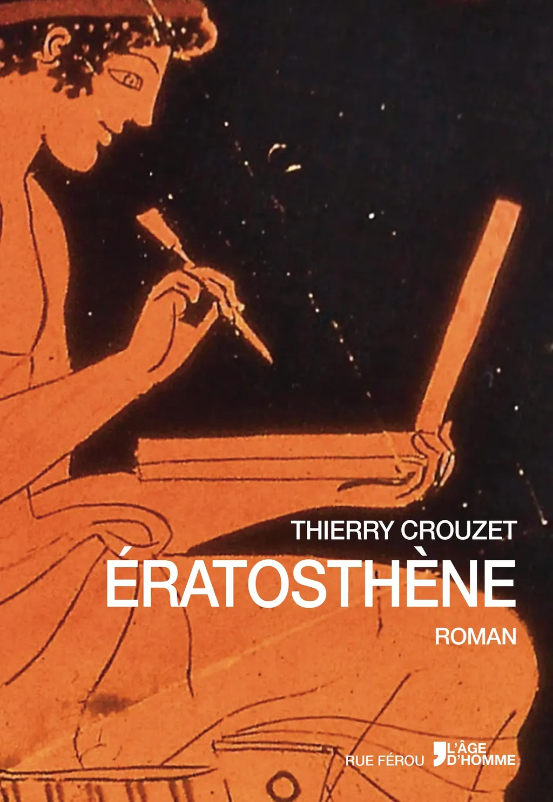
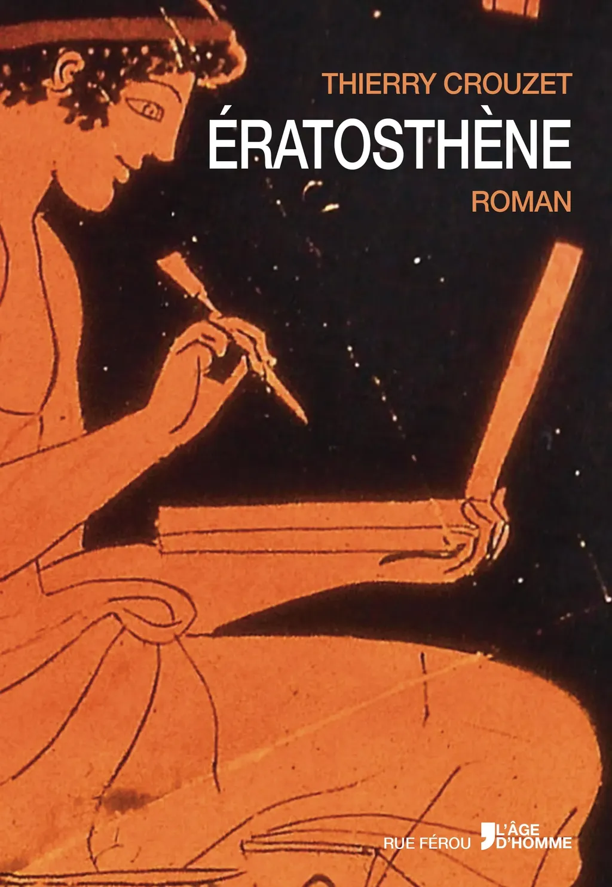
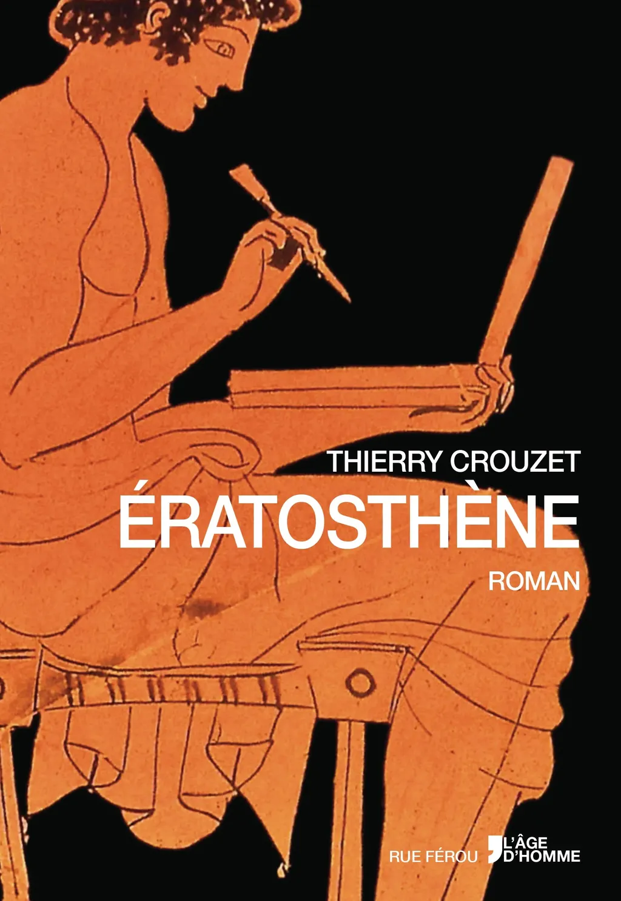
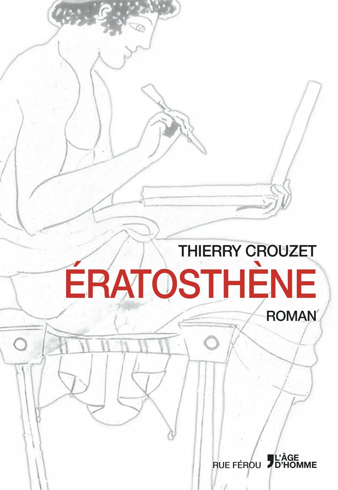

# Variations sur l’homme de Douris, j'ai toujours besoin de vos avis

J’ai passé hier une bonne journée à discuter avec vous tous et [à proposer des variantes de couvertures](trois-couvertures-votre-avis.md) pour *[Ératosthène](../../page/eratosthene)*. J’aime cette façon de travailler en toute ouverture, proposer, modifier, recevoir des conseils et suggestions, ce qui est possible avec l’image et malheureusement pas avec le texte, une image se juge en un instant, un texte exige un engagement long (et presque laborieux en comparaison).

La métaphore proposée par [l’homme de Douris](les-grecs-anciens-ont-invente-le-notebook.md) est trop magnifique pour ne pas s’en saisir. Elle résume le roman, de l’antiquité à la modernité. C’est mon sujet.

Suite aux recommandations de [Dominique Aussage](https://www.facebook.com/dominique.aussage.7), j’ai pivoté le personnage, j’ai aussi repris mes expérimentations sur fond noir, qui rendent le côté poterie plus évident tout en maximisant le contraste (mais ça fait moins littérature blanche). On comprend alors mieux que cette image est effectivement antique.

[caption id="attachment\_35716" align="aligncenter" width="400"] Propal 1, fond blanc, respecte 100% charte.[/caption]

[caption id="attachment\_35722" align="aligncenter" width="400"] Propal 2, fond noir, respecte 100% charte.[/caption]

[caption id="attachment\_35719" align="aligncenter" width="400"] Propal 3, zoom blanc, titre en haut.[/caption]

[caption id="attachment\_35720" align="aligncenter" width="400"] Propal 4, zoom noir, titre légèrement vers le bas.[/caption]

[caption id="attachment\_35721" align="aligncenter" width="400"] Propal 5, zoom noir, titre en haut.[/caption]

### PS 14:30

On doit en rester à la charte, donc titre en bas comme sur proposition 1. Voici une variante sur fond noir, avec personnage plus grand.

[caption id="attachment\_35728" align="aligncenter" width="400"] Propal 6, charte OK.[/caption]

### PS 23 mai

Une variation plus minimaliste d’après [une proposition de David Bosman](https://twitter.com/david_bosman/status/469767471600500736).

[caption id="attachment\_35753" align="aligncenter" width="400"] Propal 7, minimalisme.[/caption]

#eratosthene #breves #y2014 #2014-5-22-9h59
