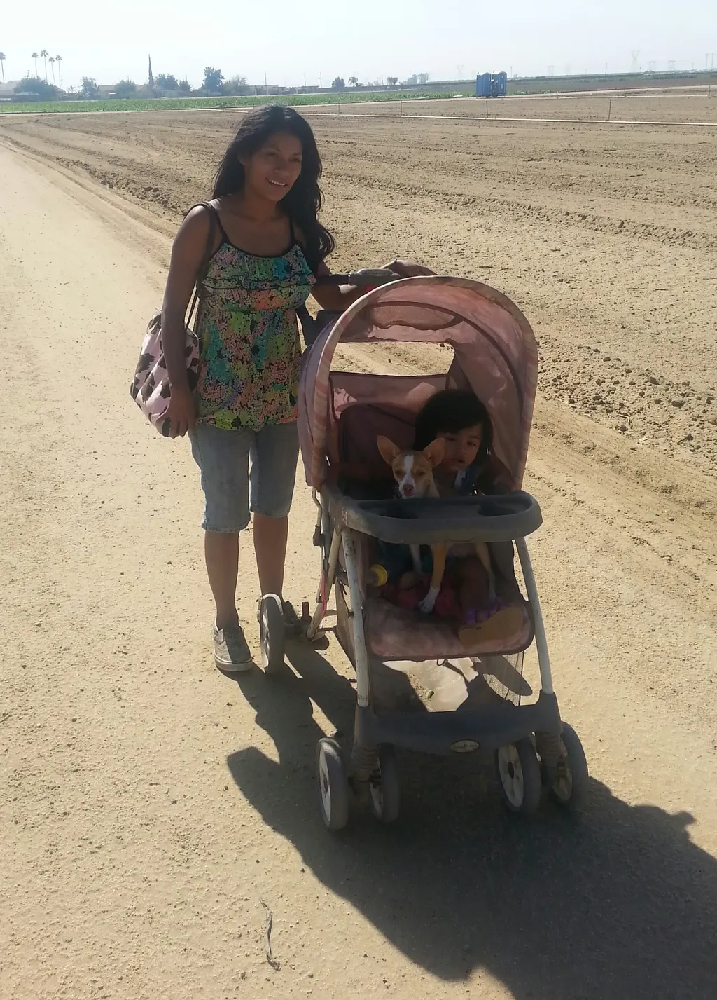

# Chroniques au temps du revenu de base

L’idée du [revenu de base](#revenu-de-base) progresse, mais elle reste moins défendue que les vieilles approches corporatistes et défensives, [comme en témoigne la crise des intermittents](crise-des-intermittents-une-belle-opportunite.md). Nous devons donc poursuivre les explications théoriques, sans oublier les métaphores.

Et pour commencer, nous devrions inventer un futur proche où le RdB serait instauré et tenter d’y imaginer la vie, tout simplement et avec réalisme. Construire une simulation littéraire. On me suggère de plus en plus souvent d’écrire un roman ou une nouvelle sur ce thème (aller plus loin qu’avec *[La tune dans le caniveau](../../page/tune-caniveau)* en 2010). J’évoque cette idée et immédiatement [Neil Jomunsi](https://twitter.com/NeilJomunsi/status/477410627527671809) propose d’écrire aussi une nouvelle, puis [Lionel Dricot](https://twitter.com/ploum/status/477411068047015936). Alors oui, pourquoi ne pas construire un recueil.

Postulat de départ : la zone euro verse un revenu de base à tous ses ressortissants avec une solution de type [OpenUDC](http://www.openudc.org/) (création monétaire décentralisée). Nous sommes en 202X. Les autres zones monétaires n’ont pas encore basculé. Elles observent, durcissent leur politique de contrôle, certaines interdisent l’émigration… on peut tout imaginer, avec l’objectif de décrire la vie quotidienne, les changements induits, au positif comme au négatif.

Et pourquoi en prime ne pas en faire un projet d’écriture. Travailler dans le même univers, que chaque nouvelle viendrait sculpter, sur le mode de la série, avec une trame globale. Il faudrait qu’on soit douze pour la saison 1 (en respectant la parité).

Participants, par ordre alphabétique :

1. [Lilian Bathelot](http://lilian.bathelot.free.fr/)
2. [Louis Boël](http://sortirdelacriseparlehaut.overblog.com/)
3. Thierry Crouzet
4. [Lionel Dricot](http://ploum.net/)
5. [Carole Fabre](http://www.reglesdejeux.com/)
6. [Neil Jomunsi](http://page42.org/)
7. [Armèle Malavallon-Carlier](https://www.facebook.com/armele.malavalloncarlier)
8. [Agnès Maillard](http://blog.monolecte.fr/)
9. Mooshka
10. [Pouhiou](http://pouhiou.com/)
11. [Muriel Romana](http://www.muriel-romana.com/)
12. [Maud Saintin](http://maudsaintin.blogspot.fr/)

[caption id="attachment\_36029" align="aligncenter" width="600"] Migrant Mother, 2013 - Weedpatch par juliejordanscott (j’imagine une migrante qui déboule dans la zone Rdb et à qui on confie de sales boulots, genre faire le ménage).[/caption]

#revenu_de_base #dialogue #y2014 #2014-6-14-9h48
