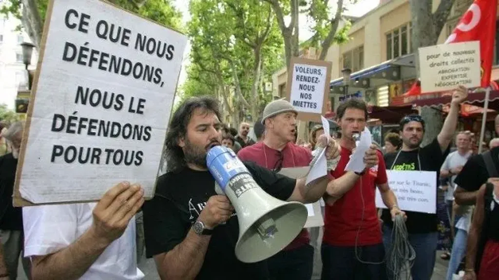

# Crise des intermittents, une belle opportunité

Un peu agacé de voir les intermittents faire leur diva. Un peu jaloux de leurs privilèges. Je suis écrivain à temps plein, pas même un intermittent et [je gagne bien moins qu’eux](http://www.bfmtv.com/economie/combien-gagne-un-intermittent-spectacle-497974.html). Alors les voir hululer pour leurs seules fesses me dégoûte, et me donnerait presque envie de me ranger dans le camp de ceux qui veulent voir tous les privilèges corporatistes abolis.

Bon sang, vous ne pouvez pas ouvrir les yeux sur le monde, [lire Piketty](piketty-excite-les-liberaux.md) : l’écart entre riches et pauvres se creuse. Vous êtes dans le camp des pauvres, j’en conviens, mais vous n’êtes pas les seuls. En luttant pour vous, vous vous attirez la haine de tous les autres maltraités, et qui n’ont pas comme vous, ou comme les agents de la SNCF, les moyens de prendre en otage les citoyens.

Que les écrivains s’arrêtent d’écrire, les peintres de peindre ou les musiciens de jouer, personne ne s’en soucie, parce que toujours d’autres écrivains, peintres ou musiciens viendront prendre leur place. Vous avez été fonctionnarisés depuis longtemps, et ce n’est pas un hasard si vous avez un pouvoir immédiat sur la vie de la cité. Ce pouvoir justifie vos avantages et les explique. Prenez garde, dans un monde qui se dématérialise, tout cela pourrait partir en fumée, vos spectacles n’être plus que sur YouTube, sans vous.

En défendant votre seul statut, vous ne formez qu’une bande de petits égoïstes. Vous avez le chômage, nous autres artistes n’avons rien. Nous sommes livrés au marché. Ça ne vous choque pas que l’auteur qui a écrit le spectacle que vous montez n’ait lui aucune sécurité de l’emploi ?

Vous devriez changer de stratégie. Vous avez des scènes ouvertes, des spectateurs à l’écoute, proposez-leur une véritable solution de société, valable pour vous, pour les autres artistes et qui pourrait être étendue à tous.

Il ne s’agit pas de défendre votre statut d’intermittent, mais reconnaître que [nous sommes de plus en plus nombreux à être intermittents](jai-un-travail-je-cherche-un-revenu-de-base.md). C’est une conséquence technique de l’automatisation. Le plein emploi n’est plus qu’une anomalie propre à la révolution industrielle. Nous vivons la révolution numérique, une révolution cognitive.

On ne peut pas s’opposer à cette évolution-là. On peut en revanche chercher à y adapter la société. Exigeant par exemple [un revenu de base inconditionnel](#revenu-de-base) pour tous les artistes et intermittents, avant de plus tard le généraliser à tous. Ce serait un vrai pas en avant. Un revenu de base ne serait pas un chômage, en rien lié à la hauteur des revenus antérieurs. Ce serait un fixe pour vivre et créer, auxquels s’ajouteraient les autres revenus. Une ligne de vie. Oui, pour libérer, pour créer.

Battez-vous pour demain, pas pour prolonger encore un jour ou deux les acquis d’hier. Si vous gagnez votre bataille actuelle, c’est la société entière qui perdra une chance d’aller de l’avant. Vous avez raison de vous révolter, mais armez-vous d’une idéologie contemporaine. C’est l’idée même de chômage qui doit être abolie et celle d’intermittence généralisée.

[caption id="attachment\_35999" align="aligncenter" width="600"] Un slogan un peu rassurant.[/caption]

#mrdb #revenu_de_base #coup_de_gueule #y2014 #2014-6-13-8h14
