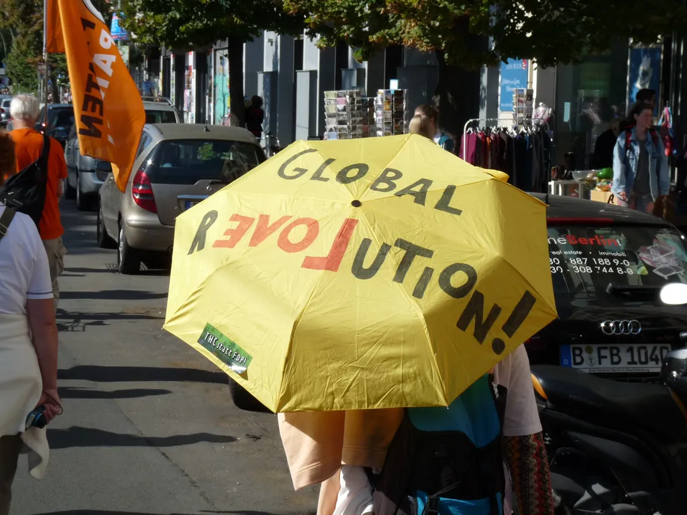

# J’ai un travail, je cherche un revenu de base

Les musiciens, les écrivains, les peintres, les développeurs de logiciels libres, les parents qui restent à la maison pour s’occuper de la famille, les bénévoles dans une multitude d’associations, les élus municipaux… tous ont un travail, ils n’en cherchent pas. Nous sommes de plus en plus nombreux à nous vouer à des tâches non rémunérées (qui représenteraient 70 % du travail total effectivement fourni). C’est en même temps une envie, née d’un plus haut degré d’éducation et des nouvelles opportunités offertes par le numérique, et une nécessité économique, les machines et les algorithmes prennent notre place, les coûts de production tendent vers zéro et les revenus avec.

Cette double tendance nourrie par l’envie et la nécessité se développe, entraînant un flux du « travail rémunéré » vers le « travail volontaire ». Quand on dit que le chômage augmente dans les pays industrialisés, on stigmatise ceux qui pourraient s’épanouir dans l’économie contributive.

Sans changements de notre organisation économique, seuls les propriétaires des robots et des algorithmes, et quelques artistes vedettes et fonctionnaires réussiront à gagner leur vie. Tendance déjà manifeste quand on voit se creuser l’écart entre les pauvres et les riches. Pour nous sortir de cette impasse, nous devons bannir l’usage du mot chômage et instaurer un [revenu de base inconditionnel](#revenu-de-base).

Nous serons alors libres de ne pas travailler pour un salaire et coopérerons, créerons et innoverons davantage, motivés par nos désirs profonds et non par les seules contraintes du marché. Les plus défavorisés refuseront les métiers indignes ou exigeront de plus hautes rémunérations. Ce renversement s’imposera comme la conséquence de [l’automatisation des processus physiques et cognitifs](http://www.internetactu.net/2014/06/17/travail-et-automatisation-la-fin-du-travail-ne-touche-pas-que-les-emplois-les-moins-qualifies/). Nous n’allons pas vers une société d’oisifs, mais une société de travailleurs indépendants.

*PS : Texte écrit pour lancer le débat sur [RSLN](http://www.rslnmag.fr/post/2014/06/03/Comment-travaillerons-nous-demain-.aspx), sur une idée originale d’Olivier Auber.*

[caption id="attachment\_35903" align="aligncenter" width="600"] Basic Income Demonstration in Berlin par stanjourdan.[/caption]

#mrdb #revenu_de_base #dialogue #y2014 #2014-6-3-19h15
