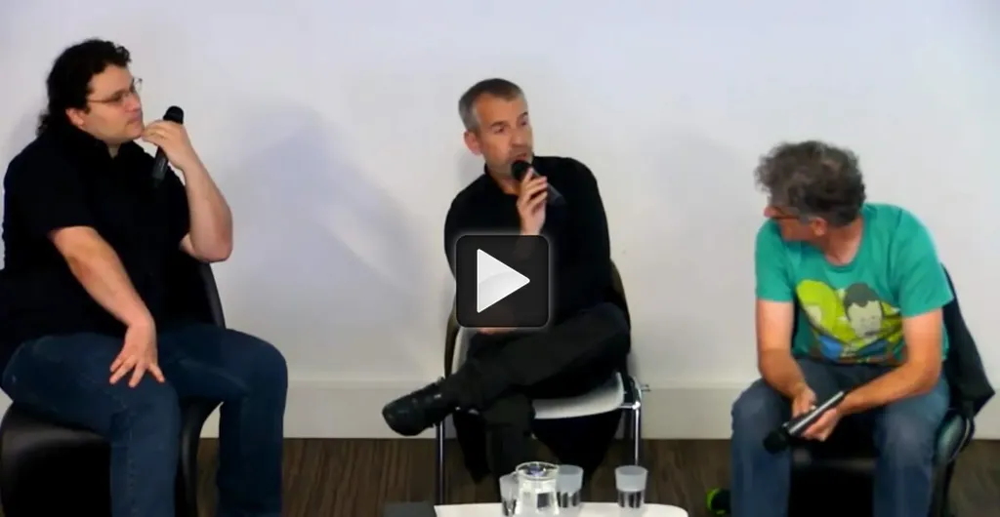

# Je défends les auteurs contre le tout partage

[Débat avec Éric Walter et Lionel Maurel](la-legalisation-des-echanges-non-marchands-est-elle-constitutionnelle.md) où je joue à l’auteur qui aimerait continuer à remplir son frigo tout en défendant la liberté.

#conf #edition #breves #podcasts #y2014 #2014-6-30-16h24
