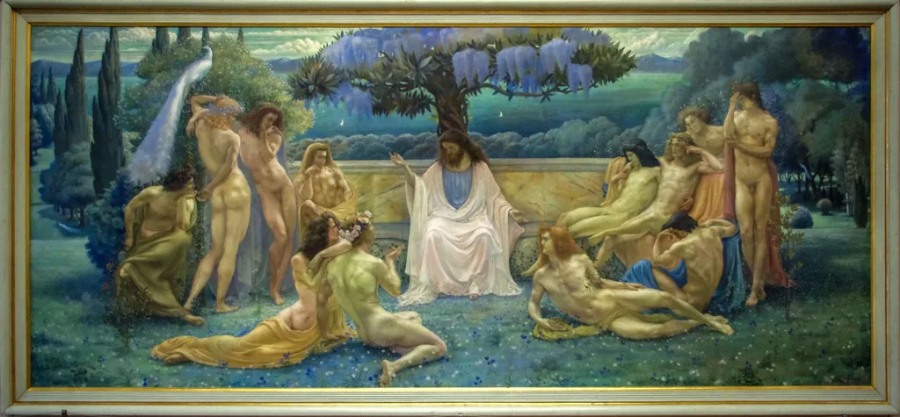

# La liberté exclut l’économie mathématique

Les ultralibéraux sont friands de l’économie mathématique, dont ils font une sorte de déesse qui vivrait dans une réalité supérieure et intouchable. 1/ Ils postulent la liberté. 2/ Ils postulent des lois invariantes. La contradiction ne les choque pas.

Si je suis libre, totalement libre, totalement libéré des contingences, je suis capable de ne pas obéir aux lois économiques, donc j’ai la possibilité de les invalider. La liberté réfute toute théorie sociale déterministe. On ne peut avoir en même temps l’une et les autres.

La liberté implique l’inconnu, la non-causalité, l’imprévu. Elle implique un monde humain, imprécis, chaotique, fou. Toujours renouvelé. Elle implique l’humilité.

Alors pour se tirer d’affaire, les libéraux doivent admettre l’existence de deux réalités. Celle où ils sont libres, celle des lois invariantes, autrement dit de la Vérité. Cela s’appelle le platonisme, une liberté sous tutelle religieuse.

Je ne suis pas athée puisque je crois à la liberté, mais cette croyance interdit tout déterminisme (et donc toute divinité).

[caption id="attachment\_35983" align="aligncenter" width="600"] L’Ecole de Platon par BruceHM.[/caption]

#liberte #politique #dialogue #y2014 #2014-6-11-12h25
