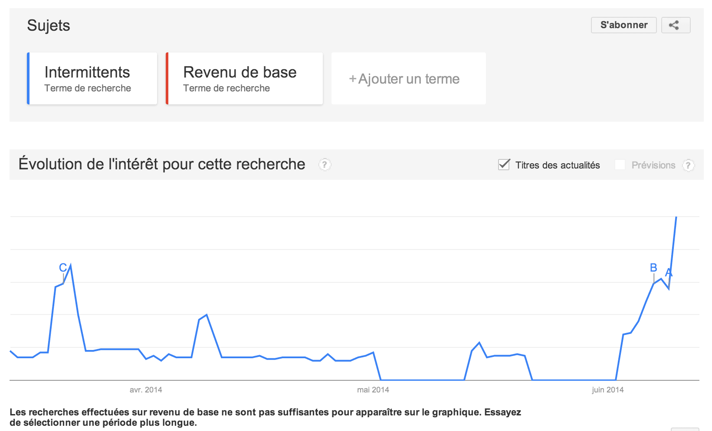

# Non les intermittents ne parlent pas du revenu de base

Après [mon coup de gueule](crise-des-intermittents-une-belle-opportunite.md), on me dit que suis un ignorant, que tous les intermittents connaissent le revenu de base, en parlent dans leurs réunions, même dans leurs comptes rendus. Je trouve ça très bien, mais alors ce n’est vraiment pas efficace, et ça n’arrive pas à mes oreilles. Et pas étonnant.

Ce graphique Google trends montre que les intermittents font parler d’eux, beaucoup plus que le revenu de base (et même inversement).

Et quand on zoome sur les 90 derniers jours, on ne relève aucun bruit autour du revenu de base. Je vous promets que s’il était une revendication des intermittents pour rénover leur statut ce serait le cas. Et ce n’est pas la faute des médias, qui emploient presque tous des intermittents, c’est tout simplement parce que si des choses se disent dans l’intimité, elles n’ont jamais été communiquées ni vers le grand public ni vers l’underground via le Net. Les défenseurs du revenu de base devraient donc lancer une campagne d’information à destination des intermittents.

#revenu_de_base #coup_de_gueule #y2014 #2014-6-13-11h10
