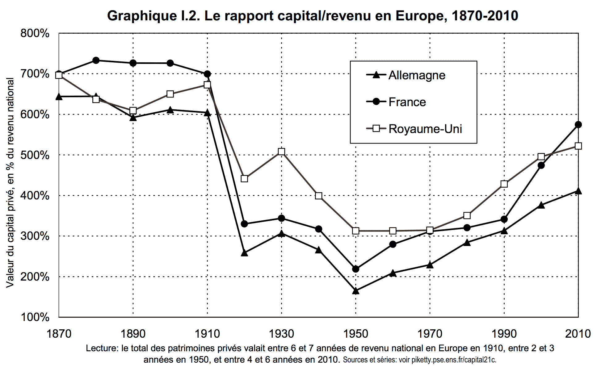

# Piketty excite les libéraux

Il m’a suffi de quelques tweets où je disais lire Piketty pour attirer vers moi une meute de rentiers affamés. Je ne vais donc pas me gêner pour évoquer ma lecture du [*Le capital du XXIe siècle*](http://piketty.pse.ens.fr/fr/capital21c), lecture peu exaltante, mais passionnément descriptive.

J’aime Piketty quand il bouscule les économistes qui piétinent l’histoire, qui construisent des modèles idéalistes juste séduits par leur beauté mathématique. Je l’aime surtout pour [ses graphiques](http://piketty.pse.ens.fr/files/capital21c/Piketty2013GraphiquesTableauxLiens.pdf) que [personne n’a réfutés à ce jour](http://www.lesechos.fr/idees-debats/editos-analyses/0203542003376-le-mauvais-proces-fait-a-thomas-piketty-1009450.php).

Voici comment [un libéral interprète Piketty](http://institutdeslibertes.org/piketty-ou-quand-un-oint-du-seigneur-se-prend-les-pieds-dans-le-tapis/) :

> Si R représente la rentabilité du capital investi et si G est le taux de croissance de l’économie, comme R>G , les profits croîtront plus vite que les autres revenus, ce qui veut dire que les riches deviendront plus riches et donc les pauvres plus pauvres. […] voila qui est idiot. Ce n’est pas parce que les riches deviennent plus riches que les pauvres deviennent plus pauvres.

Si, justement. La pauvreté est relative. Elle se vit, se ressent, s’éprouve. Sortir de la pauvreté ne se résume pas à manger à sa faim et à posséder un portable. Les libéraux se satisfont [d’une définition de la pauvreté à minima](../3/pourquoi-la-pauvrete-augmente-nen-deplaise-a-la-banque-mondiale.md) totalement inacceptable, et ils s’en gargarisent parce qu’elle les confirme dans leur opulence. Que les pauvres aient une espérance de vie inférieure à la leur, ce qui s’aggravera avec les progrès technologiques, ne les dérange pas le moins du monde.

Si Piketty commet une erreur, c’est de ne pas prendre en compte la monnaie, ses mécanismes de création. Pour lui la monnaie est juste un étalon du capital et des revenus. Il écrit :

> Revenu national = revenus du capital + revenus du travail

Où range-t-il la création monétaire ? Ce revenu de la fausse monnaie qui n’est ni un revenu du capital ni du travail. Je sens le bug (et je ne suis pas économiste, juste un intuitif de ces choses). De même :

> Revenu mondial = production mondiale

Non, il faut ajouter la monnaie créée au revenu mondial. La production n’est pas tout. Piketty lit l’économie d’aujourd’hui avec les indices d’hier, PIB par exemple. Il devrait adopter [le point de vue relativiste](../3/pourquoi-la-pauvrete-augmente-nen-deplaise-a-la-banque-mondiale.md). Ses courbes seraient corroborées et amplifiées. Quand le pouvoir d’achat diminue constamment, les pauvres ne s’enrichissent pas. Et ses solutions seraient bien évidemment toutes autres, et bien plus novatrices que suggérer des augmentations d’impôts. Il est temps de dépasser le socialisme, avec le revenu de base par exemple.

#critique #dialogue #y2014 #2014-6-11-11h13
