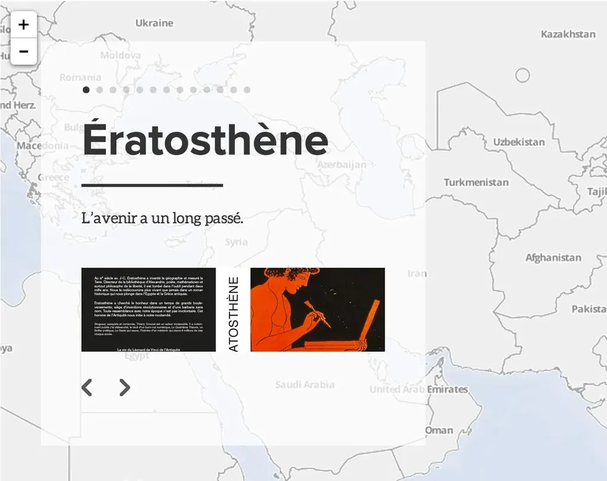

# Promouvoir un roman avec une carte

Dans beaucoup de textes les lieux jouent un grand rôle, d’autant plus dans mon *[Ératosthène](../../page/eratosthene)*, un roman sur l’inventeur de la géographie. En découvrant [Odyssey](http://cartodb.github.io/odyssey.js/), un service qui se propose de créer des présentations géographiques, je me suis dit qu’il pourrait aussi être un service de promotion pour les auteurs.

La prise en main ne prend que quelques minutes pour qui est familier du langage Markdown. Le résultat amusant. [J’ai publié une démo pleine page.](../../page/eratosthene/eratosthene-vivre-sur-une-carte) On peut aussi les intégrer dans des posts, mais le rendu est moins intéressant, car la zone texte masque la carte.

Je vous conseille de sauvegarder régulièrement votre code dans un fichier texte. Plantages à prévoir, c’est un prototype.

#cuisine #eratosthene #dialogue #y2014 #2014-6-20-13h6
