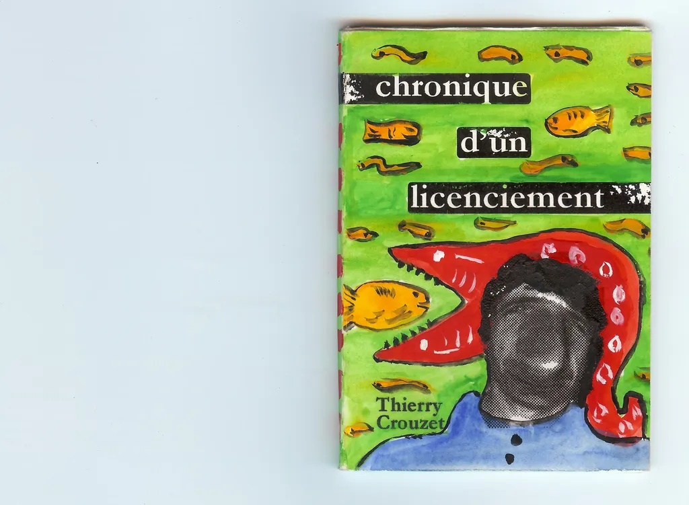
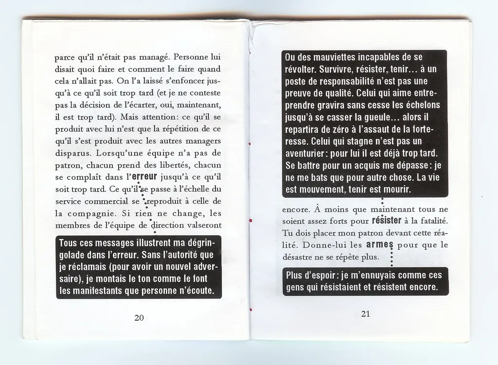

# Vintage : Chronique d'un licenciement

Pour fêter les Noëls 1994 à 2000, j’ai cousu de petits livres que j’ai offerts à mes amis. Il me semblait que plus le numérique se développait, plus la matérialité devait prendre de l’importance, et en conséquence le livre d’artiste. En découvrant [*Pourquoi travailler ?*](http://www.liamgillick.info/home/texts/pourquoi-travailler) de Liam Gillick, je me suis dit que je pouvais m’amuser à simuler des livres d’artiste web.
*Chronique d’un licenciement* est mon opus 1995. J’ai tenté d’y expérimenter une forme d’hypertexte, sur le modèle déjà utilisé pour *[Genius locus](../../page/genius-locus)*. Il y est question de mail, de littérature, de trahisons… (pour ce dont je me souviens... je déteste relire des textes aussi anciens sans avoir la possibilité de les retoucher).

#autobiographie #dialogue #y2014 #2014-6-9-15h20
