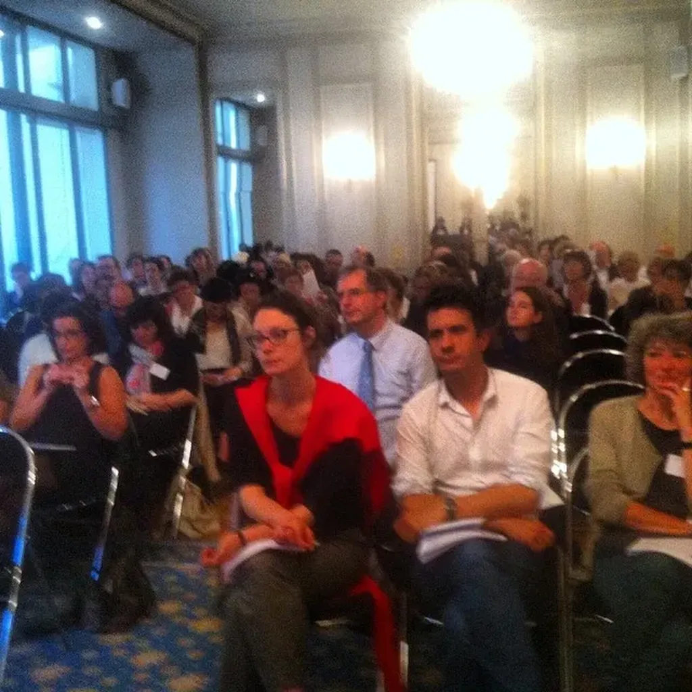

# De la difficulté du sur le vif

Lors de la présentation d’*[Ératosthène](../../page/eratosthene)* aux libraires en juin, la librairie Molat m’a placé à l’improviste devant sa caméra pour me faire parler du roman. Quelques secondes pour résumer ce qui ne peut l’être.

Je ne m’étais pas encore, et toujours pas, préparé au format court à la France info. Le résultat est hésitant, avec une fin étrange. Je souhaite au lecteur un bon dépaysement, alors que je n’ai jamais eu cette intention, ou alors c’est un dépaysement mental, l’envie de provoquer l’ébriété intellectuelle, de mettre dans la peau d’un créateur à la frontière entre deux époques.

Après mes [bandes-annonces sur *Ératosthène*](des-book-trailers-pour-les-non-lecteurs.md), il faut que je m’entraîne à dire des choses intéressantes sur mon roman en une minute trente. Voilà des travaux pratiques pour les vacances.

[caption id="attachment\_36451" align="aligncenter" width="600"] Libraires épuisés après la présentation de dizaines de romans.[/caption]

#buzz #dialogue #y2014 #2014-7-25-8h29
