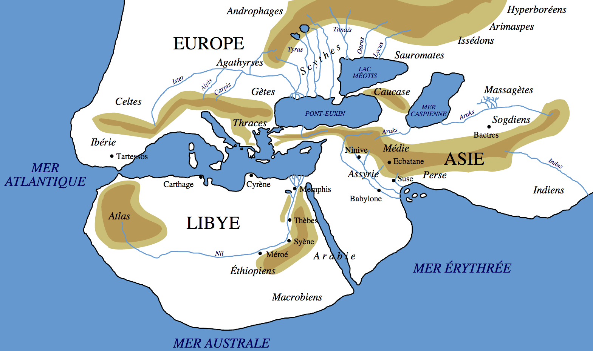
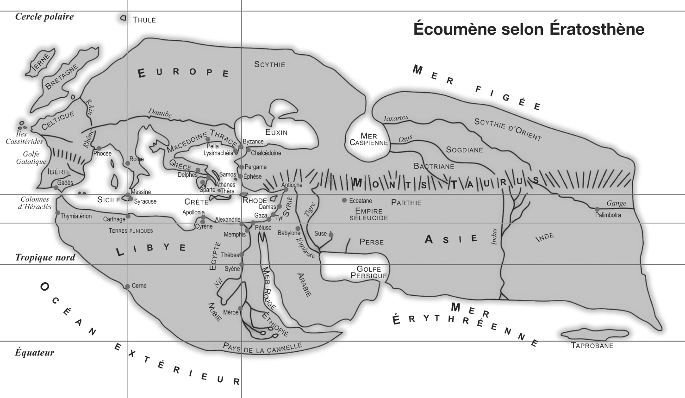

# D’Hérodote à Ératosthène

[L’histoire de mon Grec sort exactement dans un mois.](../../page/eratosthene) Occasion d’un clin d’œil de plus. Je prépare un supplément pour la version ebook, un journal qui rassemblera des notes puisées au fil de l’écriture et justifiera mes choix historiques.

Quand on écrit sur un personnage dont on sait peu de choses, c’est comme résoudre un système d’équations. Il existe sans doute plusieurs solutions, mais pas une infinité.

Durant des années, je n’ai cessé de me poser des questions ignorées ou négligées par les historiens. Du genre pourquoi Ératosthène devient chef de la bibliothèque d’Alexandrie alors qu’avant il ne vit pas en Égypte, pays de courtisans et d’intrigants ? Pour son mérite intellectuel ? Guère crédible. Et surtout, comment Ératosthène réussit-il par la suite à conserver sa charge durant sa longue vie dans un temps de grands bouleversements ?

Alors le roman, en tant que simulation, a son rôle à jouer. En traçant une vie, il doit adopter une continuité qui résout le système d’équations. Elle implique des passions, des amitiés durables, des inimités éternels. Elle implique de croiser de nombreux destins et de tenter à comprendre ce que pensaient ces gens si loin et si proche de nous.

Exemple. Comparez la carte du monde qui peut être tracée d’après l’histoire d’Hérodote (484 - 420 av. J.-C.), carte qu’il n’a pas tracée a priori, et la carte d’Ératosthène, qu’il a tracée et que les historiens ont reconstituée d’après les citations antiques.

[caption id="attachment\_36480" align="aligncenter" width="600"] Carte du monde décrit par Hérodote dans ses Histoires[/caption]

[caption id="attachment\_36324" align="aligncenter" width="600"] Carte d’Ératosthène[/caption]

Ératosthène est plus précis, comme le seront ses successeurs, mais surtout il ajoute des longitudes et des latitudes, et connaît l’échelle de l’ensemble. On passe d’un croquis à une carte. C’est une gigantesque transition intellectuelle. Un changement radical dans la représentation du monde, malgré les similitudes graphiques.

Un roman peut aussi parler de cela, de l’histoire intellectuelle d’un homme, de ses idées, de sa philosophie, de son irréductibilité.

#eratosthene #dialogue #y2014 #2014-7-28-9h15
