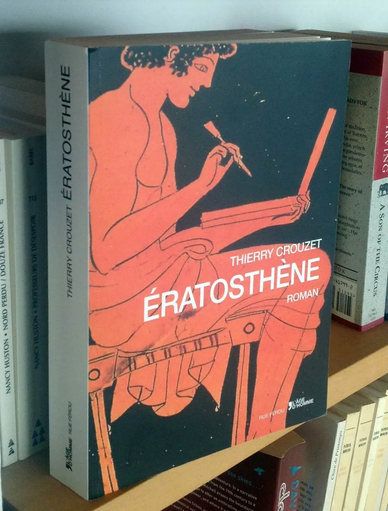

# La vie d’auteur (à la veille de la rentrée)

Que se passe-t-il pour un auteur quand un livre sort ? Le plus souvent rien. C’est assez déprimant, assez désespérant, surtout quand le texte proposé au public a nécessité des années de travail et que l’auteur est persuadé d’avoir capturé quelque chose de rare et parfois même de neuf.

J’ai connu un lancement en fanfare avec *[J’ai débranché](../../page/jai-debranche)*. Courir de radio en radio le jour de la sortie. Recevoir des dizaines d’invitations et avoir l’illusion quelques instants d’être important. Rassurez-vous, ça passe vite. Même pas d’ailleurs. J’ai toujours eu l’impression d’être important et ce n’est pas un petit emballement médiatique qui m’a fait changer d’avis (oui, il faut rire).

Ce qui est dur, justement, c’est que mon importance, évidente pour moi, ne soit pas reconnue par les autres. L’incompréhension est la pire des choses pour un auteur. On se sent vite moins que rien et inutile. On se dit « À quoi bon », on pense tout arrêter, puis les mots sont plus forts, ou notre importance trop outrageuse, elle déborde, nous pousse à dire.

Quand on sort un essai, on a une chance d’attirer l’attention, parce qu’on est peut-être un des premiers à traiter d’un sujet, à présenter une théorie ou une analyse. Pour peu qu’elle ne soit pas trop éloignée du bruit médiatique ambiant, on a une bonne chance de s’y glisser quelque temps.

Mais publiez un livre de cuisine et vous êtes ignorés si vous n’êtes pas déjà une star du domaine (ou d’un autre domaine ce qui est, en soit, une aberration, comme si un joueur de foot avait quelque chose de profond à nous dire sur la cuisine). Dans l’esprit des critiques, un livre de cuisine est un livre de cuisine. Un roman est un roman, avec une forme et une histoire canoniques, et peut-être quelques personnages piquants, mais pas de quoi faire l’actualité (à moins qu’il ne s’agisse du roman d’un footballeur ou d’un romancier qui a déjà vendu beaucoup de romans).

Là où un essai peut émerger avec une *baseline* du genre « Trop d’Internet conduit à l’asile », un roman reste un roman, par nécessité un objet difficile à résumer.

Quand je sors un essai, j’aime préparer l’interview type pour France Info. Une minute trente pour peindre mon idée centrale. Dans quatre jours sort *[Ératosthène](../../page/eratosthene)* et je n’ai rien préparé.

Si je dis que j’ai passé quatorze ans à écrire et réécrire ce texte, les auditeurs penseront que je suis un besogneux, dans une époque où on privilégie les choses faites à la va-vite. Si je prétends raconter l’histoire du plus grand des génies oubliés, les auditeurs supposeront que génie implique prise de tête.

Évoquer l’art de vivre lors d’une époque de transition me paraît tout aussi dangereux. L’art de vivre n’est plus de circonstance quand la plupart des gens ont l’impression, erronée bien sûr, qu’ils n’ont plus que la possibilité de survivre.

Faire l’éloge de la littérature, c’est trop prétentieux. La beauté, c’est ringard. Les personnages, ça me gonfle, ils font tous ça les romanciers, c’est à pleurer de rire. « Mon personnage… » Je tremble quand j’entends parler d’un roman de cette façon. En plus, Ératosthène a vécu. J’ai cherché à le réinventer avec véracité. Je n’ai jamais eu l’impression qu’il était MON personnage, pas plus qu’Isa n’est MA femme. Mon ami peut-être, mon compagnon de route durant toutes ces années.

Vous me voyez dire sur France Info qu’*[Ératosthène](../../page/eratosthene)* raconte mon amitié avec un Grec d’Alexandrie mort il y a plus de deux mille ans ? On me prendra pour un fou. Et si, en prime, je postule qu’il a changé ma vie, je risque de quitter les studios dans une camisole de force.

Affirmer « C’est un *Game of Thrones* antique. Avec des guerres et des morts, du sexe et des trahisons, le tout avec une dimension philosophique. » Ce n’est pas tout à fait faux, mais ça serait tout de même tromper le lecteur sur la marchandise. Je n’ai pas écrit un roman de fantasy.

Je ne peux pas, non plus, me contenter de dire « Lisez mon putain de roman et vous prendrez la plus grande baffe de votre vie. Après, vous ne serez plus le même qu’avant. » Je peux dire ça d’un livre que j’aime, mais pas d’un des miens. Je suis donc condamné à des hésitations ou à des pitreries stéréotypées.

Il me restera les salons pour me consoler. On m’installera derrière une table à côté d’autres auteurs tout aussi ridicules et nous regarderons les lecteurs défiler devant nous, prenant avec hésitation nos livres, et les reposant avec dédains. Il m’arrive souvent de me faire insulter à cette occasion. Il suffit des quelques mots inscrits sur mes quatrièmes de couverture pour éveiller une haine irrépressible à mon encontre.

Alors auteurs non-publiés, estimez-vous heureux. Vous pouvez continuer à vous dire que les éditeurs sont des ânes et ne comprennent pas votre génie. C’est une position paradoxalement assez confortable. Parce qu’une fois publié, il faut un orgueil démesuré pour étendre cette proposition à l’ensemble des lecteurs potentiels, c’est-à-dire à l’humanité.

Non, les lecteurs ne sont pas des cancres, pas plus que les éditeurs. Ils sont tout simplement peu nombreux et nous autres auteurs sommes innombrables. Il n’y a pas de place pour tous dans le marché du livre. Il nous reste donc à écrire ce qui nous semble important, à le diffuser par toute méthode qui nous paraît acceptable, à espérer quelques échanges, quelques retours qui suffiront à nous donner envie d’aller plus loin.

Dans ces circonstances [pourquoi clôturer un texte se demande Daniel Bourrion](http://www.face-ecran.fr/2014/08/20/de-la-question-de-la-publication) ? On pourrait se contenter de publier au fil de l’écriture et se satisfaire du dialogue avec les autres auteurs à l’ouvrage en même temps que nous. Si j’avais succombé à cette tentation, je n’aurais jamais écrit l’*[Ératosthène](../../page/eratosthene)* que je m’apprête à publier, surtout je n’aurais jamais découvert tout ce que le travail sans cesse recommencé m’a apporté et m’a fait découvrir, sur Ératosthène, son monde, ses idées, et surtout sur moi dans notre monde.

Soyons honnêtes. On ne peut pas publier les cent variations d’un texte et encore intéresser un lecteur critique. Recommencer et encore recommencer est une responsabilité du seul créateur, surtout lorsqu’il s’attaque à l’Everest.

On peut faire l’éloge des inachevés et des brouillons des maîtres anciens, mais n’oublions pas qu’ils ne nous émerveillent que parce qu’ils sont des étapes sur un chemin susceptible de nous conduire plus haut. Sans ce chemin, ces pièces inachevées ou brouillonnes n’ont guère de statut esthétique. Elles ne traduisent qu’un manque de volonté. Invoquer le marché, la conjoncture ou les lecteurs pour se limiter à cette seule pratique du [*Send*](../../2013/11/la-send-generation-pecha-kucha-remix.md), c’est une excuse pour ne pas se retrousser les manches.

[caption id="attachment\_36318" align="aligncenter" width="600"] Et c’est un bel objet.[/caption]

#eratosthene #netlitterature #dialogue #y2014 #2014-8-24-14h48
