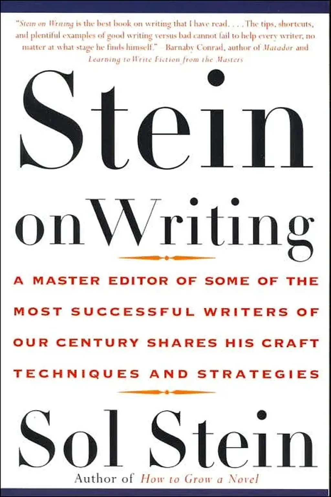

# L’art du premier paragraphe

Je cherche [deux ebooks de Gardner sur l’art d’écrire](livres-lus-ingeres-oublies.md), pour les récupérer j’en télécharge des centaines d’autres sur le même sujet. C’est une avalanche. Plusieurs critiques pointent vers *Stein on Writing*, un essai de [Sol Stein](http://en.wikipedia.org/wiki/Sol_Stein), un des plus fameux éditeurs américains.

Vous vous dites peut-être qu’à mon âge, c’est trop tard. Au contraire. Avec l’âge le corps et le cerveau se transforment. Des choses jadis intuitives deviennent plus difficiles, d’autres au contraire qui paraissaient impossibles deviennent envisageables, à condition de s’entraîner adéquatement. Je me suis donc laissé prendre par Sol Stein.

> When we write, we put down on paper what we think, know, or believe we know and pay little attention to the effect on the reader. That is discourteous in life and unsuccessful in writing. | Quand nous écrivons, nous couchons sur le papier nos pensées, nos connaissances, ou ce que nous croyons connaître, et accordons peu d’importance à l’effet sur le lecteur. Cette attitude discourtoise au quotidien conduit à l’échec dans l’écriture.

Je n’ai pour l’instant rien appris de décisif, mais lu des choses de bon sens dont le rappel ne fait jamais de mal. Mon insomnie cette nuit ne m’a pas mené au-delà du premier chapitre où il est question du premier paragraphe.

> Voici les objectifs du paragraphe d’ouverture. 1/ Éveiller la curiosité du lecteur, de préférence en évoquant un personnage ou une relation entre personnages. 2/ Poser le contexte. 3/ Mettre en résonnance l’histoire.

Sol Stein donne des exemples. En voici deux, made in Crouzet. *[Le Geste qui sauve](../../page/le-geste-qui-sauve)* commence par :

> Mi-mars 2012, je reçois un appel inattendu de Genève : « J’ai rencontré un toubib extraordinaire », me crie mon amie Geneviève. Elle parle haut, l’enthousiasme la déborde, l’émotion étrangle sa voix d’habitude rauque. « C’est incroyable. Il faut que tu écrives sa vie. La reine d’Angleterre l’a fait Commander, mais personne ne le connaît, même chez nous en Suisse. Il est sur la liste des nobélisables pour la Paix. Ce professeur de médecine sauve chaque année des millions de vies. »

J’ai respecté, il me semble, le cahier des charges.

1. Pour éveiller la curiosité, je parle d’un médecin inconnu susceptible d’avoir le nobel de la Paix.
2. Contexte : c’est une histoire médicale contemporaine.
3. Projection : tout au long du récit, il sera question de sauver des millions de vies.

Côté *[Ératosthène](../../page/eratosthene)*, ça donne :

> Aux premières gelées, les étourneaux s’amassent en nuées charbonneuses. Ils volent plein sud, poussés par le vent brumeux au-dessus des steppes de Scythie, des forêts germaniques, des fleuves Rhin et Rhône et des pinèdes de la péninsule italique. Ils franchissent le détroit de Messine, frôlent les remparts de Syracuse, se jettent à la verticale de la mer Intérieure. Lorsqu’ils atteignent Carthage, ils s’échevellent vers l’ouest et la Maurétanie, vers l’est et la Libye où ils s’abattent sur les champs de fenouil, vastes damiers striant la plaine littorale entre le port d’Apollonia et les contreforts des montagnes Vertes.

1. Je ne suis pas sûr d’éveiller la curiosité, sinon par le dépaysement. Même si le roman porte le nom du héros, je ne m’attarde pas sur lui, mais sur un monde (première fausse note par rapport à la classique approche *character-centric*).
2. J’ai fait confiance aux noms anciens pour poser le contexte antique (ce qui exige toutefois de la part des lecteurs un minimum de culture, deuxième fausse note).
3. Je pense atteindre le troisième objectif : la mise en résonnance. Il va être question de grands voyages, de ports, d’un autre temps…

Me suis-je planté ? Si nous suivions tous les mêmes conseils, nous écririons tous les mêmes livres. Sol Stein, comme beaucoup d’auteurs, conseille avant tout la clarté. Dire les choses aussi simplement que possible, aussi brièvement que possible. J’aurais alors dû écrire : « Tout commence en 268 av. J-C, au sud de la Méditerranée, dans l’actuelle Libye. »

Je me suis refusé ce procédé parce que -268 en -268 ça n’a aucun sens, pas plus que la Méditerranée ou notre Libye contemporaine. J’ai au contraire voulu dépeindre de l’intérieur un monde agité, grouillant de vies et de lieux, lointains et étrangers. Pas question pour moi d’intriguer tout de suite avec mon héros. Son père puis son maître apparaissent d’ailleurs avant lui. Et quand il entre en scène, c’est pour ouvrir sur le monde. Car c’est le monde qui m’intéresse. À travers les personnages, parler du monde, de ses transformations, de ses futurs possibles ou interdits. Je suis un auteur *univers-centric*.

Alors ne pas s’oublier en tant qu’auteur, ses passions, ses sensations, ses lumières, cultiver en soi ce qui peut-être n’intéressera pas beaucoup de lecteurs, mais qui, chez certains, vibrera avec une force rare.

Donc, oui, respect pour le lecteur, tout en refusant la possibilité de plaire à tous, car cette séduction généralisée impliquerait de se nier soi-même en tant qu’auteur, en tant qu’homme. Donc respect partagé, pour les autres et pour soi aussi.

Sol Stein demande si notre première phrase décrit une personnalité intéressante ou une action qui éveille notre curiosité. Il nous suggère de rendre notre première phrase plus intrigante, d’introduire quelque chose d’inhabituel, peut-être de choquant ou de surprenant. Tout cela sous prétexte qu’un texte se joue dès cette première phrase.

Imaginez si Proust avait suivi ce conseil. Que serait devenu « Longtemps je me suis couché de bonne heure » ? Stein touche à la limite. Les conseils peuvent faire de nous de bons artisans, mais une fois qu’ils sont intégrés, nous devons les jeter par-dessus bord, à nos risques et périls.

Après tout, il est assez inhabituel de se coucher de bonne heure, tout comme d’observer les nuées charbonneuses des étourneaux. C’est déjà mieux qu’un soleil qui se couche, phénomène toutefois lié au bal des étourneaux.

#netlitterature #dialogue #y2014 #2014-8-19-10h31
