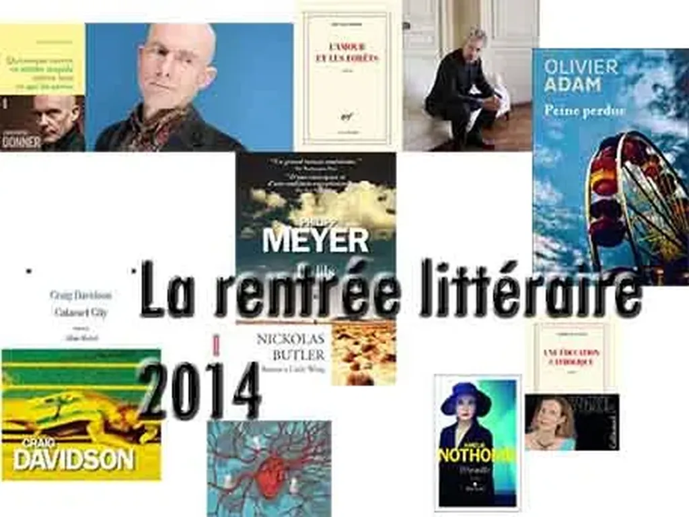

# T’es pas piraté, t’existes pas

C’est ce que je me dis en découvrant un peu partout [les ebooks de la rentrée littéraire 2014](https://www.actualitte.com/usages/la-rentree-litteraire-2014-en-telechargement-pirate-52151.htm) en libre circulation, sauf mon *[Ératosthène](../../page/eratosthene)*. Merde, c’est un affront.

C’est surtout un coup dur pour l’édition électronique. Déjà que les éditeurs français ne sont pas chauds pour le numérique, si vous leur jetez des peaux de bananes dans les pattes, ils ne vont pas changer d’avis de si tôt.

C’est aussi peut-être un juste revers pour eux. À force de vouloir bloquer le marché en pratiquant des prix prohibitifs, ils se prennent une risposte de grande ampleur dans la figure. La déroute risque d’être plus grande dans les jours qui arrivent. Pour quand le pack des 607 romans de la rentrée sur les torrent ?

Vous, les éditeurs, criez que personne ne veut lire en numérique alors qu’en Angleterre 40 % du marché a déjà basculé. Vous croyez sans doute aux prophéties autoréalisatrices ou que les Français forment une race à part, insensible aux avantages du lire en numérique ? Alors je ne dois pas être trop Français, et parfois je préfère me déclarer de Méditerranée.

Et si le basculement s’effectuait sous l’impulsion du piratage. Avec tous ces ouvrages gratuits, à portée de clic, pourquoi ne pas acheter une liseuse. Un bon investissement par les temps de crise. On peut même imaginer un complot d’Amazon. Car qui dispose de tous les livres de la rentrée avant même leur sortie officielle ? Qui sinon un grand acteur du numérique ? Je pose la question, je commence à inventer une histoire à laquelle je ne crois pas un instant.

N’empêche si je suis lecteur, je me pose des questions et je peux me laisser tenter. Surenchère de publications, avec de toute évidence une immense majorité de textes sans intérêt pour moi. Et pour explorer cette pléthore pourquoi ne pas y goûter en numérique avec le risque d’y prendre goût. Dans quelques années, nous verrons peut-être la rentrée 2014 comme celle de tous les changements dans le marché du livre en France. Qui sait ?

Un mot pour les pirates. Retroussez-vous les manches. Traitez tous les auteurs à égalité, ou n’en traitez aucun. Vous êtes sectaires et vous ne vous montrez pour le moment qu’en suiveur de mode, ce n’est pas très encourageant, et ne donne pas une très belle image de vos motivations. Un peu de grandeur, bon sang.

Un mot pour les lecteurs. N’oubliez pas que nous autres auteurs avons besoin de mettre quelques patates dans nos casseroles. Alors, si vous lisez nos livres, si vous les aimez, achetez-les après, en papier, en numérique, mais achetez-les.

#ebook #edition #coup_de_gueule #y2014 #2014-8-29-10h15
