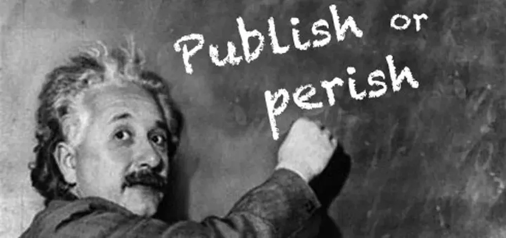

# Autopubliez vos manuscrits, soumettez vos projets

Tu écris durant des mois, des années, puis tu confies le fruit de ton travail à des gens qui te jugeront comme des examinateurs d’auto-école, avec force stylos rouges, et autres simagrées ridicules. Faut avoir une bien piètre idée de soi-même pour se prêter à cette bouffonnerie. Ou être sous l’emprise d’une philosophie quelque peu terrifiante, avec la croyance en des élites toutes-puissantes.

D’autant que, une fois cette étape littéraire franchie, les choses s’aggravent. Tu te heurtes aux commerciaux qui ont souvent le final cut. Ces olibrius ne lisent pas, mais se croient détenteurs d’une espèce de sagesse populaire. Ils ont l’illusion d’avoir du flair. Faut-il donc que des chiens décident ce que je dois publier ou non ?

À l’avenir, je m’en tiendrai donc à deux stratégies complémentaires.

### J’ai un manuscrit

Si j’ai écrit un texte, qui est là tout chaud, et même un peu refroidi, je le publie. Je ne vois pas pourquoi je demanderais l’aval d’un quelconque intermédiaire. Je suis mon intermédiaire. Je peux mettre ce texte à la disposition de tous, en ebook comme en papier, avec la même puissance qu’un petit éditeur.

Rien n’empêche *a posteriori* un éditeur de venir me trouver et de me proposer un contrat. Tout sera négociable, sauf en toute probabilité les droits numériques, car franchement je ne vois pas quel éditeur diffusera mieux que me moi mes textes numériques. Mais pourquoi pas, tout est possible : coéditions, codiffusion, inventons hors du vieux cadre du contrat d’auteur traditionnel.

Dans les semaines qui viennent, j’autopublierai ainsi un petit roman historique grivois, en papier et ebook. Une fois le texte bien en place sur les librairies en ligne, je le diffuserai chapitre après chapitre sur le blog à [la manière de Laurent Margantin avec son *Chenil*](http://oeuvresouvertes.net/spip.php?rubrique147). Les lecteurs qui voudront connaître la suite plus vite, disposer d’une belle édition, n’auront qu’à passer à la caisse (ce sera une façon de me remercier pour un peu de bon temps).

### J’ai un projet

Il m’arrive d’avoir des idées de livres, souvent des essais, parfois des romans, mais je ne m’enflamme pas seul, peut-être un peu intimidé ou par manque de confiance. J’ai besoin d’une équipe, d’un soutien, d’échéances, d’objectifs. J’ai ainsi écrit *[Le peuple des connecteurs](../../page/le-peuple-des-connecteurs)* ou *[J’ai débranché](../../page/jai-debranche)*.

Ces livres ne sont pas moins bons que mes autres livres, au contraire. Simplement, je ne les aurais pas écrits si je n’avais pas su à l’avance qu’ils intéresseraient quelqu’un, et pas n’importe qui, un éditeur, un lecteur particulièrement attentif, lui-même persuadé que d’autres lecteurs le suivront.

> Oui, un éditeur c’est un lecteur persuadé que d’autres lecteurs seront prêts à le suivre.

C’est une vraie motivation pour un auteur d’être dans une telle dynamique. Si bien qu’en ce moment, vu que je n’ai rien d’important sur le grill, je bombarde Sophie chez Fayard d’innombrables idées, un peu à la manière d’un pêcheur à la ligne, en me disant que ça va finir par mordre. Et puis j’ai de la chance, l’océan est grand et les rivières nombreuses.

> Petit conseil aux auteurs, autopubliez vos manuscrits, soumettez vos projets.
> 
> 
> Petit conseil aux éditeurs, n’acceptez plus les manuscrits (vous aiderez les auteurs à se libérer de leurs complexes), lisez les projets, fouinez dans les autopublications à la recherche de pépites et de talents.

OK, certains éditeurs adoptent déjà cette stratégie. Mais gaffe, avec le crowdsourcing, on peut déjà se passer de vous même avec nos projets. Ce sera moins cool sans votre intérêt, sans vos compétences, mais on y arrivera aussi.

#edition #dialogue #y2014 #2014-9-25-14h59
