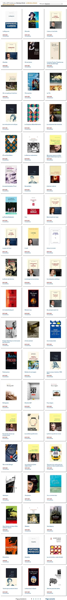

# Ce qu’un auteur seul peut

Aucune couverture média, aucun travail promotionnel de la part de l’éditeur, juste des billets sur mon blog et [ceux de quelques amis](../../page/eratosthene/ertosthene-revue-de-presse), et même d’inconnus, puis des messages sur les réseaux sociaux, et *[Ératosthène](../../page/eratosthene)* se glisse dans le top des ventes Kindle de la rentrée littéraire.

Il faut se contenter de peu, parce que [ces ventes représentent bien peu d’exemplaires](../../page/eratosthene/eratosthene-statistiques), ce qui démontre à quel point le marché du livre numérique est atone (et d’après mes informations celui du livre papier n’est guère plus flamboyant, excepté une anomalie innommable).

#buzz #y2014 #2014-9-8-17h59
