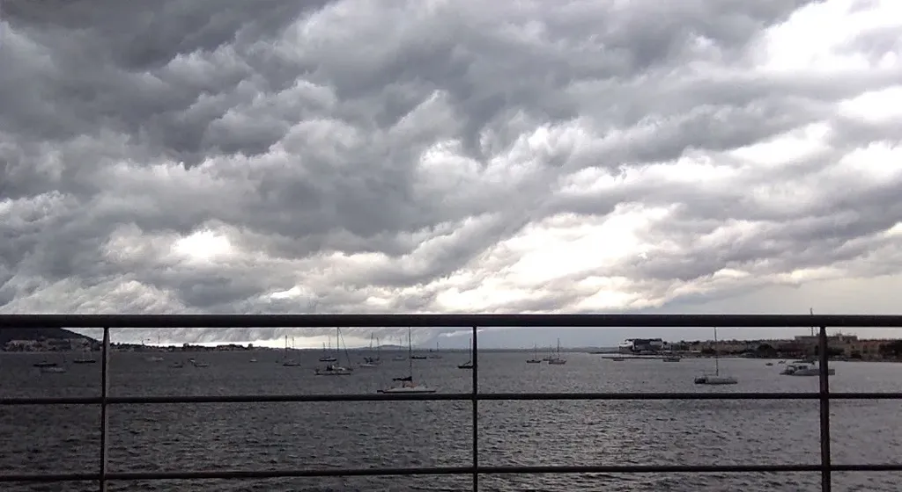

# Comment rivaliser avec un paysage ?

Pourquoi ne pas se contenter de vivre ? S’étendre sur le ponton, fermer les yeux au soleil, se laisser bercer par les voix des baigneurs, certes trop grossières, un brin excessives et pas assez lacives à mon goût.

J’en suis là de ma vie. Avec cette quasi-possibilité de ne rien faire alors qu’un nœud intérieur se resserre. Des idées me traversent, des envies vulgaires, aucune chargée de suffisamment d’énergie pour qu’elle devienne une aventure.

Vivre n’est pas suffisant. Je peux méditer une heure, mais je ne peux pas méditer à longueur de temps. Je ne suis pas de l’espèce des yogis. Ces suicidés vivants au nom d’une chimère métaphysique dont ils sont tombés amoureux.

Cette passion, elle me manque en cet instant. Son absence me pousse à écrire même quand je n’ai pas d’idée. Et d’abord à sortir de chez moi, à bouger dès que je m’avachis. Je sors pour que la vie des autres m’imprègne. Si j’étais à Paris, je serais en terrasse d’un café ou dans un jardin.

Je ne suis qu’en province, dans une station balnéaire après la ruée estivale. Restent les retraités. Ils déambulent, marchent dans l’eau, téléphonent, parce qu’il leur faut parler, ça semble vital pour eux, comme pour moi écrire, mais pas à n’importe quel prix, pas juste pour dévider des mots.

La quantité de phrases erructée chaque jour n’a aucune importance. Dépenser de l’énergie au sens physique ne suffit pas à me satisfaire. Je ne suis heureux dans les mots que quand s’ils trouvent leur place dans un édifice plus grand.

Le vagabondage littéraire est agréable, mais il ne procure qu’un plaisir du moment, avec un potentiel d’infection du lecteur faible. C’est mon plus grand reproche à la forme blog, telle que nous la pratiquons pour la plupart. Nous nous faisons plaisir plus que nous comblons le lecteur.

Certains se glorifient de quelques centaines de visites, vite passées, vite ailleurs, alors que toute la difficulté pour un auteur est de réussir à capter l’attention, de l’enfermer parfois durant des heures dans une autre dimension de l’existence. Et de rivaliser avec un paysage. Avec la rive cubiste du village de Bouzigue sur l’autre rive de l’étang. Les châteaux d’eau perchés au-dessus des pins. Les alignements gris des tables des parcs à huîtres.

L’eau possède cette légèreté propre à septembre, limpide et huileuse, translucide et pur miroir pour le ciel, dont elle amplifie la moindre humeur. Onctueuse aujourd’hui, mélancolique, loin de l’agitation du monde, sans doute inutile, factice, dans cette fuite des vraies questions.

Pourquoi continuer ? Je ne me pose pas assez souvent cette question. Elle fait trop mal. Il est plus simple de foncer, d’être sûr d’avoir quelque chose d’important à faire. Mais à bien y réfléchir, que se passerait-il si je mourais à l’instant ?

Le paysage autour de chez moi serait toujours aussi lumineux, aussi propice à la rêverie. Le Net continuerait de tousser ses millions d’absurdités. En revanche, plus près de mon cœur, Isa serait triste, mes enfants aussi, peut-être quelques amis. Alors oui, pourquoi ne pas me tourner vers eux et que vers eux ? Parce que je leur deviendrais vite ennuyeux à force de les vénérer. C’est assez tordu comme problème. La nécessité d’aller vers les autres et le monde pour être avec les siens.

Une péniche s’est immobilisée au milieu du bleu, en apesanteur. J’imagine des rires et un repas entre proches… et là encore finir par s’assécher. Tout renouveler, tout transformer, tout réinventer sans cesse… ou devenir yogi. Je ne vois pas d’autres possibilités.

Même les éoliennes au sommet des collines de la Moure ne bronchent pas. L’absolu calme après l’orage cataclysmique d’hier soir. Une giclée de bonheur dans les yeux. Une beauté d’égoïste pour égoïste.

[caption id="attachment\_37170" align="aligncenter" width="600"] L’orage avant le calme.[/caption]

#vagabondage #y2014 #2014-9-9-13h44
