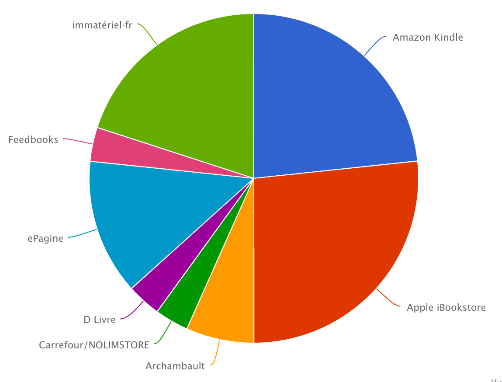
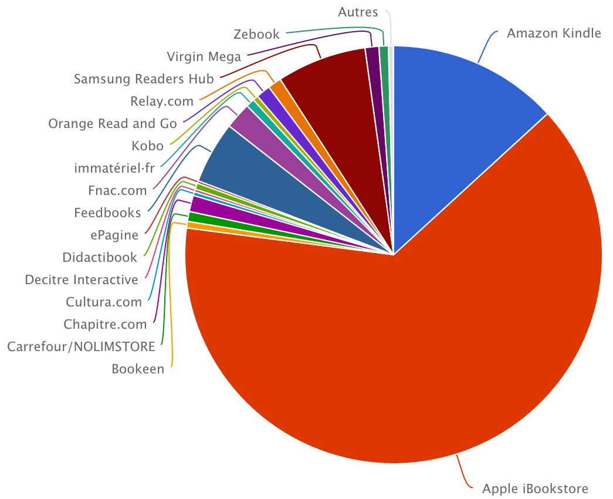
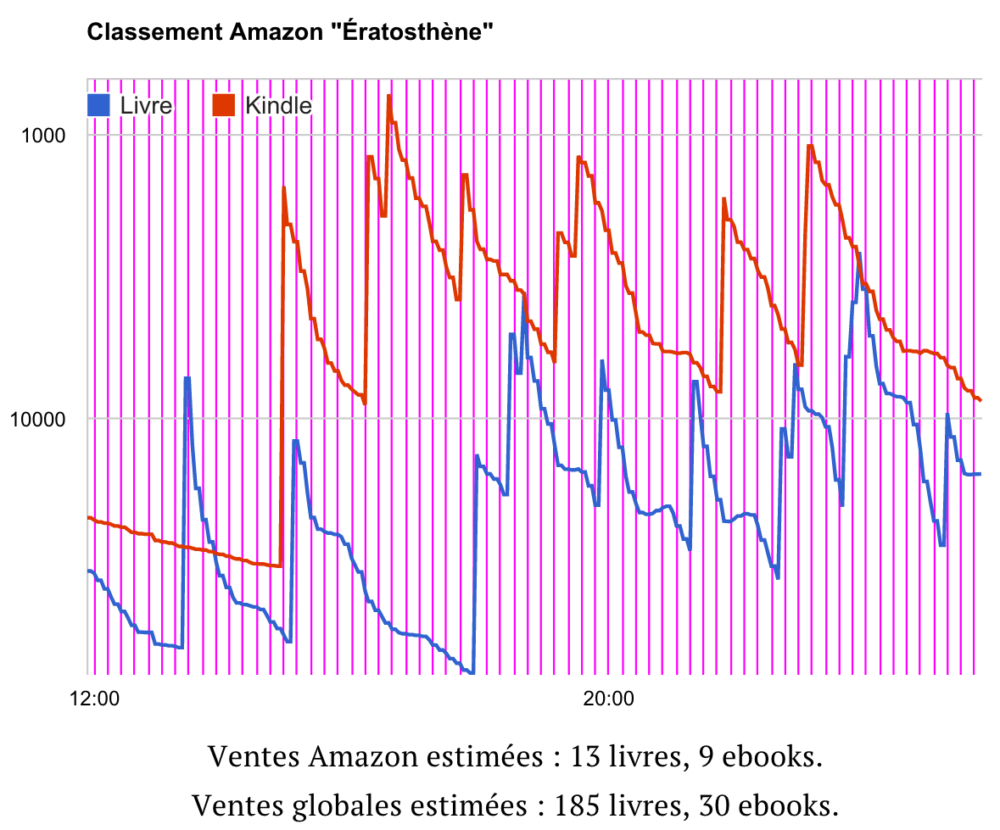
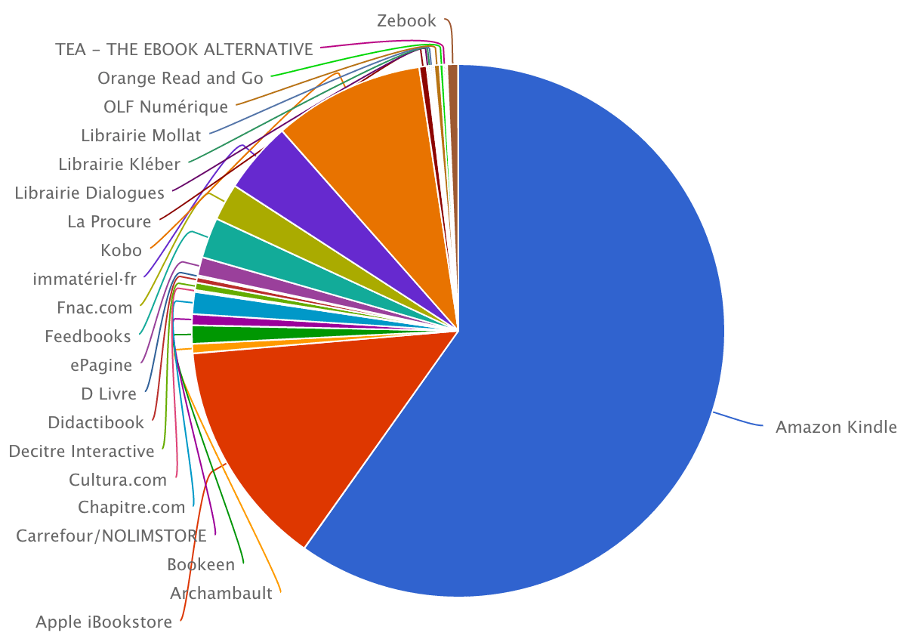

# Derrière Amazon se cache un géant tout-puissant

Souvenez-vous de l’époque où Microsoft devait être abattu à tout prix. Pendant ce temps, Google émergeait. Alors qu’Amazon focalise toutes les attentions négatives, Amazon se range peut-être déjà au profit d’un autre géant. Attention : un train peut en cacher un autre.

D’où je tire ça ? De minces chiffres, il est vrai. *[Ératosthène](../../page/eratosthene)* est sorti depuis une semaine, c’est un bide commercial pour l’instant, on peut voir les choses comme ça. C’est même un bide critique, avec une poignée d’articles à ce jour ([merci à vous, les courageux aventuriers](../../page/eratosthene/ertosthene-revue-de-presse)). Mais j’ai assez de ventes ebooks pour détecter un changement. Amazon représente moins de 25 % du marché.

[caption id="attachment\_37056" align="aligncenter" width="600"] Répartition des 30 premières ventes d’Ératosthène.[/caption]

Chiffres à nuancer. Parce que les rares acheteurs sont mes amis numériques (sinon comment ont-ils connu le roman). Tous avertis des dangers des monopoles, tous surinformés, c’est un signe tout de même.

Quand je regarde l’ensemble de mes ventes numériques depuis deux ans via immateriel.fr, je découvre quelque chose qui m’avait échappé : la surreprésentation d’Apple. La suite n’est pas difficile à imaginer. Le marché du livre en passant du papier au numérique consacrera Apple comme le plus gros libraire de France (analyse qui devra être comparée à celle des autres éditeurs).

[caption id="attachment\_37057" align="aligncenter" width="600"] Amazon pèse beaucoup moins qu’Apple au global.[/caption]

Encore des chiffres. [Amazon détiendrait 11,4% du marché des biens culturels en France.](http://www.lefigaro.fr/medias/2014/02/07/20004-20140207ARTFIG00370-amazon-pourrait-devenir-le-premier-libraire-de-france.php) Combien représente le livre ? Un ami travaillant chez Amazon m’a dit environ 7 %. Ce seul chiffre me permet d’estimer les ventes globales d’*Ératosthène* à partir de celles fournies indirectement par Amazon.

Petite explication. Je construis ce graphique en relevant automatiquement toutes les heures le classement du livre dans le top Amazon. Chaque pic correspond à une vente. La méthode est assez efficace. Pour *[J’ai débranché](../../page/jai-debranche/jai-debranche-statistiques)*, j’obtiens des chiffres très proches de ceux communiqués par Fayard.

Au moins trois intérêts pour un auteur :

1. Avoir des chiffres en temps réel (les éditeurs les fournissent rarement).
2. Avoir une idée du travail effectué par la diffusion physique (est-ce qu’elle sous-performe ou superforme).
3. Mesurer l’effet d’un article, une TV, une radio...

Tout ça peut aussi être très déprimant, et vous faire prendre conscience que vous êtes seul derrière votre clavier à vous battre pour un peu de visibilité. Aujourd’hui, à moins d’être une star, l’auteur doit être un humain à tout faire.

*PS : Bon, je me suis bien planté dans mon analyse de mes ventes globales. En discutant avec [Frédéric Métailié des éditions du même nom](http://editions-metailie.com/), j’ai compris que mon analyse était biaisée. Amazon, semble-t-il, ne remonte pas les chiffres sur les textes gratuits. Donc si je me concentre sur le payant, les parts de marché sont toutes autres. En revanche, je constate sur trois ans une baisse progressive des parts de marché Amazon.*

[caption id="attachment\_37064" align="aligncenter" width="600"] Dans mes ventes globale ebook, Amazon reste dominateur (mais ça change peut-être).[/caption]

#amazon #ebook #edition #dialogue #y2014 #2014-9-4-11h3
