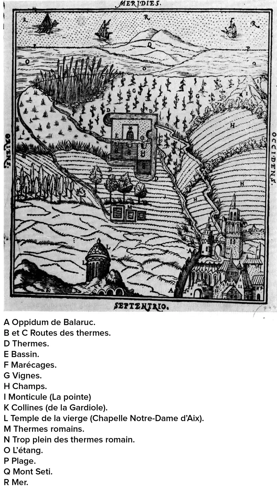

# L’écriture prise par la folie du temps réel

[J’ai lancé l’idée d’écrire un roman historique en trois jours.](un-roman-historique-a-ecrire-en-trois-jours.md) La question est celle du à quoi bon ? Quel intérêt qu’écrire aussi vite ? Je peux donner sans trop réfléchir quatre raisons.
1. Pour gagner sa vie (quand tu vends peu, il faut produire beaucoup).
2. Faire une performance (se lancer un défi même si ça n’amuse personne d’autre que l’auteur, le lecteur se moque bien du temps mis pour écrire).
3. Être incapable d’écrire autrement (c’est peut-être une pathologie dont souffrent certains auteurs).
4. Vouloir se placer dans une temporalité particulière (certaines histoires nécessitent peut-être une immersion et une tension).

Je prends conscience qu’aucune de ces raisons ne me concernent.

1. Même si je vends peu, je ne gagnerai guère plus en produisant plus.
2. J’ai passé l’âge de jouer à celui qui a la plus grosse quéquette.
3. Je sais écrire sur mon blog en brusques giclées tout comme en prenant jusqu’à 14 ans pour mon *[Ératosthène](../../page/eratosthene)*, je suis plutôt malléable.
4. Vivant en famille, donc avec quelques contraintes, je n’ai aucune chance de ne faire qu’écrire (j’ai déjà la chance de ne pas avoir un métier à côté).

Si j’ai décidé décrire un roman historique vite, c’est pour prendre le contre-pied d’*[Ératosthène](../../page/eratosthene)*. Aussi pour produire un texte aussi bref qu’idéalement limpide, sur un sujet qui me tient à cœur depuis longtemps ([je n’ai pas l’intention de me transformer en auteur pulp et de cracher 200 000 mots en trois jours](http://www.ghostwoods.com/2010/05/how-to-write-a-book-in-three-days-1210/)). Je pense que passer trop de temps sur un tel projet ne pourrait que l’alourdir, l’éloigner de la forme *pristine* que j’aimerais lui donner, celle pour moi exemplaire du *La Frontière* de Quignard.

Maintenant, prétendre l’écrire en trois jours était une forfanterie. Après une dizaine de jours, voici où j’en suis du projet.

1. J’ai une bonne idée de la vie connue de Nicolas Dortoman et de son époque, le XVIe siècle.
2. J’ai relu du Montaigne, de la Boétie, du madame Lafayette, beaucoup d’articles sur le Net, une partie du [journal des frères Platter](http://gallica.bnf.fr/ark:/12148/bpt6k1020450/f223.image.r=bpt6k1020450.langFR)…
3. J’ai lu les introductions des deux parties du seul livre écrit par Dortoman (j’attends la suite de la traduction car je ne lis pas le latin).
4. J’ai construit un tableau chronologique détaillé sur Excel.
5. J’ai un plan de mon histoire en dix chapitres qui devraient avoisiner chacun les 7 000 signes (je tiens à cette compacité, écrire beaucoup est paradoxalement facile, surtout avec des dialogues et des cascades, je ne veux ni des uns ni des autres).
6. J’ai passé trois jours immergés dans un colloque où se me suis transformé en éponge pour absorber tout ce qui se disait. J’en suis rentré vidé, incapable d’aligner un mot.
7. J’ai à ce jour écrit les quatre premiers chapitres.
8. Je pense qu’il me faudra encore une bonne semaine pour écrire les 6 suivants.
9. Si tout se passe comme prévu, révision comprises, j’aurais écrit un petit roman historique en moins d’un mois, en m’imposant de ne pas mentir avec les faits avérés.

#clitoria #dialogue #y2014 #2014-9-23-19h33
