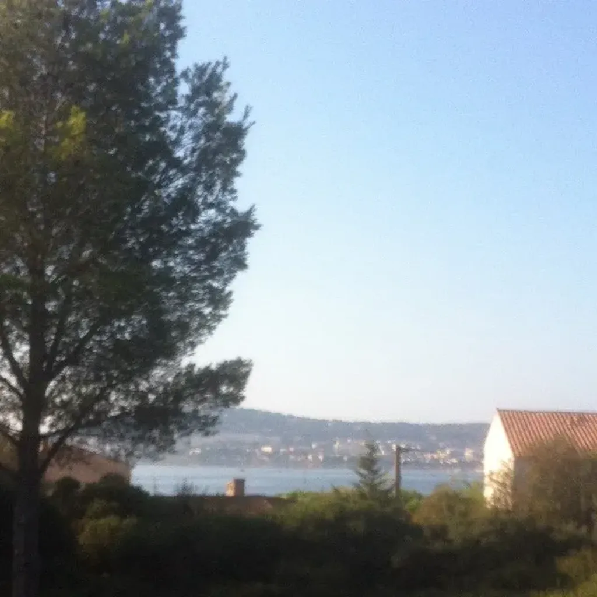

# La Joconde défigurée

Dans mon village subsiste un bout de garrigue avec sa pinède en surplomb de l’étang, ligne éclatante avant les contreforts du mont Saint Clair. La mer se déroule au-delà de cet obstacle. J’en devine le reflet dans le ciel délavé par un effet miroir.

Un politicien a ponctionné une parcelle de cette garrigue préservée pour la transformer en jardin méditerranéen. Quand je parle de décadence, nous y voilà. Par nature, la garrigue est un jardin, fruit de millénaires de labeur.

Dans le sud de la France, ni la flore ni la faune méditerranéenne ne sont natives. Elles ont migré de l’Afrique du Nord en même temps que les bergers déforestaient, puis élevaient leurs moutons et leurs chèvres. Ce paysage est le fruit de l’homme, c’est un jardin méditerranéen qu’un andouille a songé à transformer en jardin méditerranéen.

C’était avant « réaménagement » un paradis d’une biodiversité explosive. Il ne reste plus rien qu’une terre lessivée et couverte d’aiguilles de pin. À la place des asphodèles ont poussé les grilles qui délimitent le jardin dont l’entrée est désormais payante.

Je n’ai plus accès au terrain de jeu de mon enfance. C’est devenu un *no man’s land*. Je comprends l’aigreur de mon père qui a vu son pays ravagé par le béton. Il ne veut plus sortir de chez lui et regrette de ne pas avoir émigré dans une terre dont il n’aurait pas connu l’enfance.

À l’étranger, les paysages et les aménagements urbains me séduisent souvent, aucun souvenir ne ternit ma perception. Dans mon village, chaque détour crie notre incurie collective.

Je ne dis pas que c’était mieux avant. Simplement, nous n’avons pas su préserver ce qui avant tenait du miracle. Une petite bosse couverte d’oliviers sauvages, traversée de sentes aléatoires tracées par les promeneurs. Sous prétexte d’embellir, nous nous sommes contentés de détruire une œuvre d’art. C’est un peu comme si chacun des visiteurs d’un musée se prenait du désir d’apposer sa correction à toutes les œuvres. Imaginez la tronche de la Joconde après 400 ans.

Ma garrigue est une Joconde défigurée. Pas par un Wharol ou un Botero, par les premiers élus venus, persuadés que faire est leur raison d’être, peu importe ce qui sera fait. Oubliant que parfois la meilleure chose à faire est de ne rien faire.

Je n’étais pas monté ici depuis [la veille du début des travaux en 2008](../../2008/3/eau-et-garrigue.md), j’aurais dû me tenir à l’écart de ce qui est devenu une friche. J’y suis revenu parce que je suis moi-même en friche. Je sens comme parachuté dans ma propre vie. La vacuité de toute action, de toute écriture, le désintérêt même de mon éditeur et des critiques pour le travail de ma vie ne m’incite pas à me passionner pour le genre humain. J’ai voulu revenir à ma terre, je la retrouve saccagée elle aussi.

J’ai l’impression que sous moi la civilisation tourne à vide, sans aucun but, portée par la simple inertie, avec pour seul objectif l’anéantissement. Il ne me reste qu’une possibilité. Aller plus loin, chercher le point de vue sur les toits et l’étang, m’étendre et jouir de la dernière fenêtre de beauté.

Le mont Saint Clair avec les cubes blancs des immeubles sur fond de pinède moutonnante. L’étang à ses pieds. Un merveilleux poteau électrique, comme le pylône d’un chapiteau imaginaire, sous-tendu d’un câble noir et éclairé par un lampadaire bleu. De part et d’autre, deux toits de tuiles rouille pour refermer le cadre terminé au premier plan par un enchaînement de buissons de lentisques.

Les épicuriens se réfugiaient dans leur jardin parce qu’ils avaient compris qu’ils n’enrayeraient pas la chute de leur monde. Ils n’avaient plus la force d’éviter le pire. Moi, pas plus qu’eux. Si j’écris, c’est bien par un aveu d’impuissance. Je soulève des idées pour donner des envies aux autres. Et je n’ai aucune chance d’y parvenir si moi-même je reste là, immobile, dans mon fief.

C’est cela la décadence. Quand trop de gens agissent sans raison, et que ceux qui réfléchissent un peu reconnaissent leur impuissance et se contentent de jouir.

L’innovation technologique n’arrive plus à m’illusionner. C’est une forme d’écriture sans but, une sorte d’art pour l’art, un moyen de survivre pour survivre. Où est l’humain, où est le collectif, où est l’exaltation ?

Je ne me plais pas quand je pense à ces choses, j’aimerais les taire, les refuser, mais elles me débordent. Parce que les moineaux se posent sur le câble noir, qu’un TGV passe au loin sur la ligne côtière, que le lampadaire bleu attire à lui le soleil, que l’église sonne la demie de neuf heures, parce que tout cela reste beau malgré mes critiques.

Que faire de la beauté ? La détourner pour en orienter le flot vers ceux qui s’en détournent, les submerger par les ondes de lumière. Je n’ai plus pour ambition que cet ultime attentat.

[caption id="attachment\_37200" align="aligncenter" width="600"] C’est flou parce que mon téléphone est en fin de vie.[/caption]

#vagabondage #y2014 #2014-9-11-10h47
